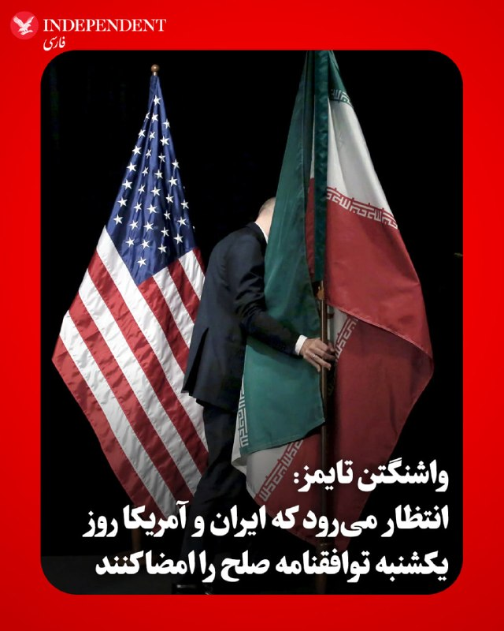
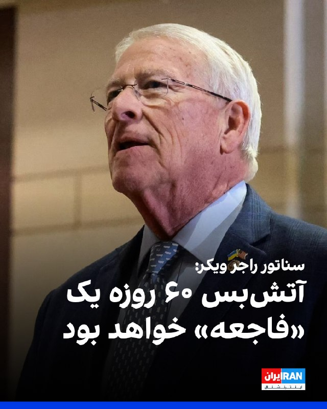
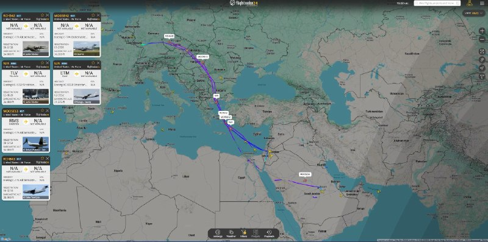
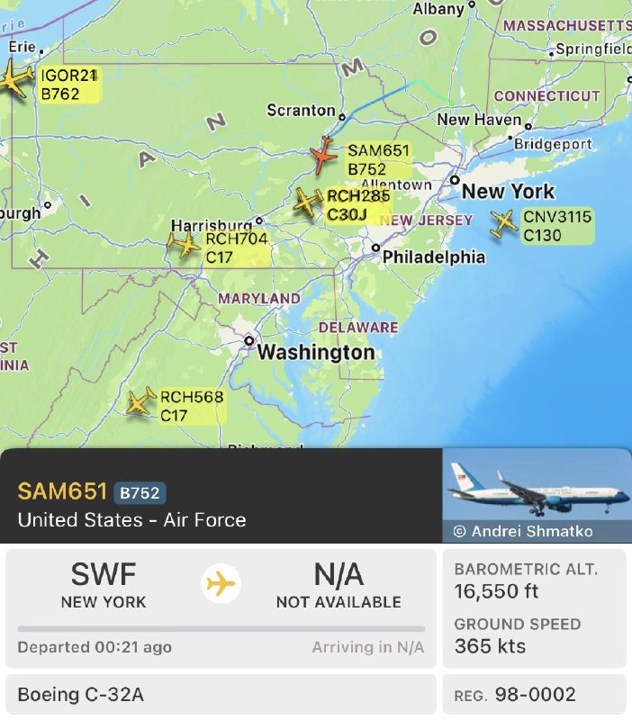
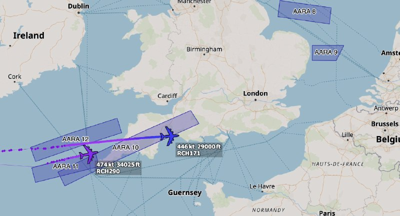
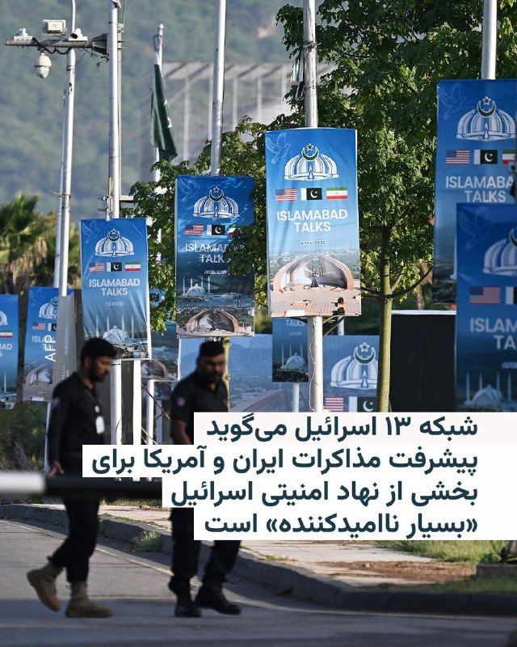
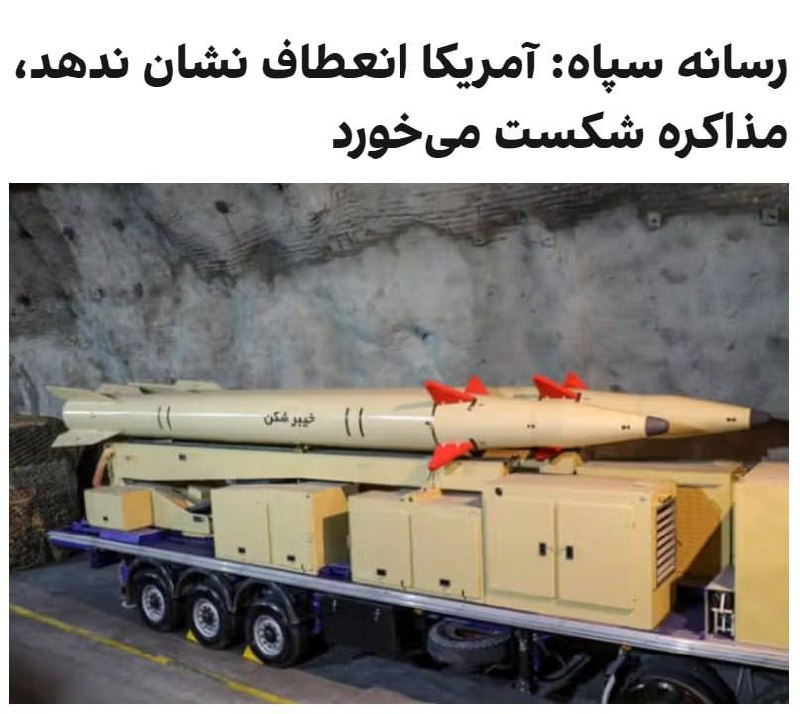
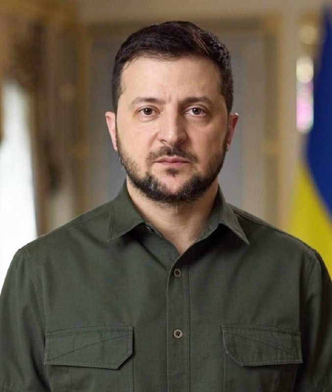
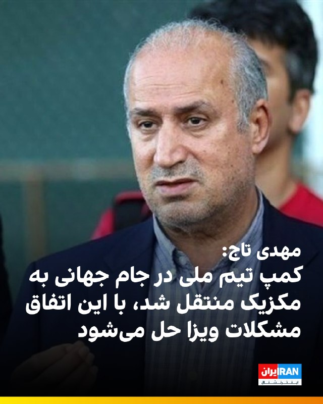
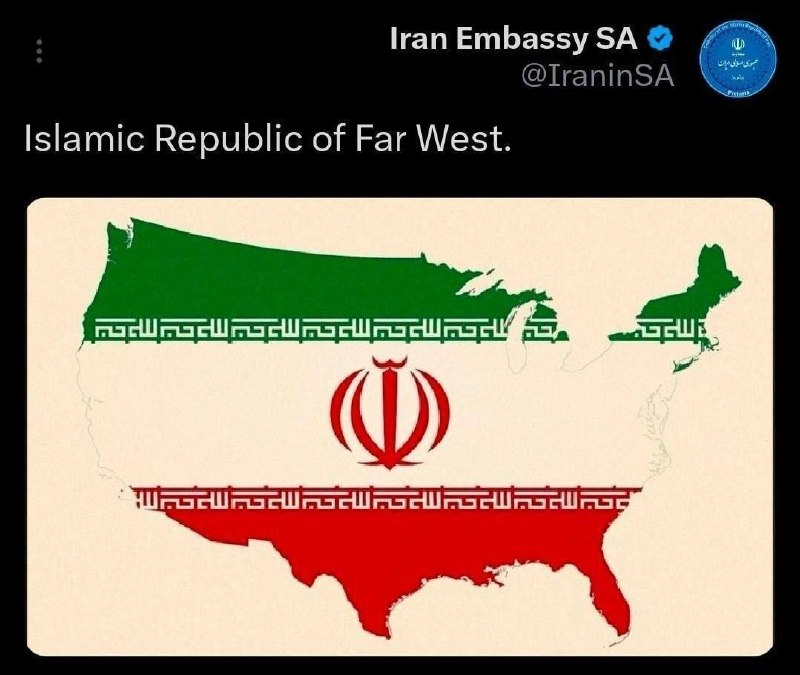

# خواننده تلگرام

<!-- TOP_NAV START -->

<a href="https://github.com/ProAlit/aio-downloader/blob/main/telegram/content/archive_1.md" style="display:inline-block; padding:6px 12px; margin:0 4px; background-color:#2ea44f; color:white; text-decoration:none; border-radius:4px; font-weight:bold;">صفحه بعد</a>

<!-- TOP_NAV END -->

<!-- MSG START -->

---
📅 بروزرسانی: 1405/03/02 22:08
---

## VahidOOnLine — post 241786

  <a href="telegram/content/VahidOOnLine_241786_1779561482.mp4" target="_blank">🎬 Download video</a>

راهپیمایی ایرانیان برلین
‌🏁 🇬🇧 ManotoTV

🤖 @VahidOOnLine

## VahidOOnLine — post 241785

  <a href="telegram/content/VahidOOnLine_241785_1779561484.mp4" target="_blank">🎬 Download video</a>

تصاویر جاویدنامان انقلاب ملی در بوردو فرانسه، دوم خرداد ۱۴۰۵
‌🏁 🇬🇧 ManotoTV

🤖 @VahidOOnLine

## VahidOOnLine — post 241784

  <a href="telegram/content/VahidOOnLine_241784_1779561485.mp4" target="_blank">🎬 Download video</a>

تماسی از ایران؛
«من پر از بغضم از رفتن شما»
‌🏁 🇬🇧 ManotoTV

🤖 @VahidOOnLine

## VahidOOnLine — post 241783

  <a href="telegram/content/VahidOOnLine_241783_1779561487.mp4" target="_blank">🎬 Download video</a>

راهپیمایی ایرانیان استکهلم
‌🏁 🇬🇧 ManotoTV

🤖 @VahidOOnLine

## VahidOOnLine — post 241782

  <a href="telegram/content/VahidOOnLine_241782_1779561489.mp4" target="_blank">🎬 Download video</a>

راهپیمایی ایرانیان لاهه در هلند، دوم خرداد ۱۴۰۵
‌🏁 🇬🇧 ManotoTV

🤖 @VahidOOnLine

## VahidOOnLine — post 241781

  <a href="telegram/content/VahidOOnLine_241781_1779561490.mp4" target="_blank">🎬 Download video</a>

بر پایه گزارش‌ها ترامپ برای تماس گروهی با رهبران عربستان سعودی، امارات متحده عربی، مصر، قطر، اردن، پاکستان و ترکیه وارد اتاق بیضی کاخ سفید شده است. همزمان سناتور لیندسی گراهام به باراک راوید خبرنگار آکسیوس گفت برخی از رهبران منطقه از ترامپ خواسته‌اند به ایران حمله کند تا حکومت تضعیف شود و در نتیجه توافقی با شرایط بهتر به دست آید.
او در مقابل گفت برخی دیگر از رهبران منطقه و همچنین تعدادی از مشاوران ارشد رئیس‌جمهور از او خواسته‌اند همان توافقی را که روی میز است بپذیرد.
راوید در ادامه نوشته به گفته گراهام، این گروه معتقدند تنگه هرمز نمی‌تواند از نفوذ جمهوری‌اسلامی در امان باشد و اگر ایران هدف حمله قرار بگیرد، این توانایی را دارد که بخش قابل توجهی از عملیات نفتی خلیج فارس را نابود کند.
گراهام همچنین گفت: من به‌شدت تردید دارم که نتوان ایران را از تهدید تنگه هرمز بازداشت و نتوان منافع حیاتی منطقه را پس از حملات گسترده به ایران دفاع کرد؛ اگر واقعاً ایران به‌طور کامل نابود شده باشد، نباید بتواند هیچ‌کدام از این کارها را انجام دهد. زمان مشخص خواهد کرد. هنوز امیدوارم نتیجه خوبی به دست بیاید.
‌🏁 🇬🇧 ManotoTV

🤖 @VahidOOnLine

## VahidOOnLine — post 241780

  

♦️ در واکنش به انتشار تصویری در حساب تروث‌سوشال ترامپ که در آن پرچم آمریکا روی سراسر ایران کشیده شده بود، کنسولگری جمهوری اسلامی در حیدرآباد هند، در نوشته‌ای طنزآمیز تصویر شلوارک کوتاهی که منقوش به پرجم آمریکا بود را منتشر کرد و نوشت: «تنها پرچم آمریکایی که داریم این است».

گفته می‌شود که این شلوارک مربوط به بقایای لوازم خلبان آمریکایی است که در ایران سقوط کرده بود. در آن زمان، نیروهای نظامی جمهوری اسلامی، پس از کشف لاشه هواپیمای سقوط کرده، تصاویری از این لوازم را منتشر کرده بودند.
‌🇸🇦 Indypersian

🤖 @VahidOOnLine

## VahidOOnLine — post 241779

  <a href="telegram/content/VahidOOnLine_241779_1779561491.mp4" target="_blank">🎬 Download video</a>

ویدیوهای رسیده به ایران‌اینترنشنال نشان می‌دهند گروهی از ایرانیان مقیم آلمان روز شنبه دوم خرداد، علیه اعدام‌های جمهوری اسلامی و در حمایت از شاهزاده رضا پهلوی، در شهر هانوفر تجمع کردند.
‌🏁 🇬🇧 IranintlTV

🤖 @VahidOOnLine

## VahidOOnLine — post 241778

  <a href="telegram/content/VahidOOnLine_241778_1779561493.mp4" target="_blank">🎬 Download video</a>

♦️سفارت ایالات متحده در کاراکاس، روز شنبه دوم خردادماه، با انتشار ویدیویی از برگزاری یک تمرین نظامی در محوطه سفارت خبر داد؛ تمرینی که با فرود دو هواپیمای عمودپرواز آمریکایی انجام شد.
در توضیحات منتشرشده آمده است که حفظ توان واکنش سریع نیروهای نظامی، بخشی کلیدی از آمادگی مhموریت‌های آمریکا در ونزوئلا و سایر نقاط جهان محسوب می‌شود. سفارت آمریکا همچنین اعلام کرد این اقدامات در چارچوب «برنامه سه‌مرحله‌ای» دولت دونالد ترامپ برای ونزوئلا دنبال می‌شود.
بر اساس گزارش‌ها، این رزمایش با هماهنگی مقام‌های ونزوئلا و با هدف آمادگی برای شرایط اضطراری و عملیات تخلیه احتمالی برگزار شده است.
‌🇸🇦 Indypersian

🤖 @VahidOOnLine

## VahidOOnLine — post 241777

  

♦️ یک مقام امنیتی پاکستان که در جریان جزئیات سفر فرمانده ارتش این کشور به تهران و دیدارهایش با مقامات جمهوری اسلامی قرار گرفته است، روز شنبه دوم خرداد، در گفتگو با رویترز اعلام کرد که «پیش‌نویس یک تفاهم‌نامه (MoU) برای پایان دادن به جنگ میان ایالات متحده و ایران در حال اصلاح و نهایی‌شدن است.»

این مقام امنیتی افزود که سفر فرمانده ارتش به تهران، «پیشرفت چشمگیری» در راستای محورهای تعیین‌شده در «مذاکرات اسلام‌آباد» برای پایان دادن به این جنگ به همراه داشته است. وی جزئیات بیشتری درباره محورهای دقیق گفتگوهای اسلام‌آباد ارائه نکرد.
‌🇸🇦 Indypersian

🤖 @VahidOOnLine

## VahidOOnLine — post 241776

  

امیرحسین ثابتی، نماینده مجلس، در تجمع شبانه حامیان حکومت با تاکید بر قطعی بودن وقوع مجدد جنگ نظامی گفت: «ممکن است یک ساعت دیگر باشد، ممکن است یک روز یا یک سال، اما قطعی است. حتی اگر آمریکا تمام شرایط ما را بپذیرد، امضا کند و تسلیم شود، باز هم جنگ خواهیم داشت.»
‌🏁 🇬🇧 IranintlTV

🤖 @VahidOOnLine

## VahidOOnLine — post 241775

  

♦️ یک منبع نزدیک به مذاکرات، روز شنبه دوم خرداد به واشنگتن تایمز گفت انتظار می‌رود ایالات متحده و جمهوری اسلامی تا بعدازظهر روز یکشنبه، نهایی شدن یک تفاهم صلح برای پایان دادن به درگیری‌ها در تمام جبهه‌ها را اعلام کنند. به گفته این منبع، پیش‌نویس این پیشنهاد در ساعات اولیه روز شنبه مورد موافقت قرار گرفته و انتظار می‌رود ظرف ۲۴ ساعت آینده به‌طور رسمی اعلام شود.

مذاکره‌کنندگان ارشد دو طرف، از جمله محمدباقر قالیباف رئیس مجلس شورای اسلامی، جی‌دی ونس، معاون رئیس‌جمهور آمریکا، استیو ویتکاف و جرد کوشنر داماد ترامپ، این پیش‌نویس را تایید کرده‌اند. نسخه پیش‌نویس این تفاهم‌نامهم صلح اکنون جهت تایید نهایی برای رهبران هر دو کشور ارسال شده است.

در صورت موفقیت، این تفاهم‌نامه آتش‌بس شکننده شش هفته‌ای موجود را به یک صلح پایدار تبدیل خواهد کرد؛ هرچند ترامپ پیش از این اشاره کرده بود که در صورت دست نیافتن به توافق، احتمال حملات جدید وجود دارد.
‌🇸🇦 Indypersian

🤖 @VahidOOnLine

## VahidOOnLine — post 241774

  

سناتور راجر ویکر، رییس کمیته نیروهای مسلح سنای آمریکا، در ایکس نوشت که آتش‌بس ۶۰ روزه با فرض حسن نیت جمهوری اسلامی یک «فاجعه» خواهد بود و دستاوردهای عملیات خشم حماسی را از بین می‌برد.
ویکر روز گذشته نیز در ایکس نوشت: «باید کاری را که آغاز کرده‌ایم، به پایان برسانیم.»
‌🏁 🇬🇧 IranintlTV

🤖 @VahidOOnLine

## VahidOOnLine — post 241773

  

اکسیوس به نقل از لیندسی گراهام، سناتور جمهوری‌خواه نوشت که برخی رهبران منطقه از ترامپ خواسته‌اند برای تضعیف جمهوری اسلامی اقدام نظامی انجام دهد تا توافق بهتری حاصل شود.

گراهام به اکسیوس گفت: «برخی معتقدند در صورت حمله به ایران، این کشور توان آسیب جدی به زیرساخت‌های نفتی خلیج فارس را دارد و امنیت تنگه هرمز قابل تضمین نیست.»

بنا بر این گزارش، برخی دیگر از رهبران منطقه و مشاوران ارشد ترامپ او را به پذیرش توافق فعلی ترغیب کرده‌اند.
‌🏁 🇬🇧 IranintlTV

🤖 @VahidOOnLine

## WithYashar — post 12228

هم اکنون تماس تلفنی نتانیاهو و ترامپ! @withyashar

## WithYashar — post 12227

ترامپ با سران منطقه گفتگو کرد

آکسیوس:
ترامپ روز شنبه با رهبران عربستان سعودی، امارات متحده عربی، قطر، مصر، ترکیه و پاکستان تماس تلفنی داشت.

به گفته منبعی که از جزئیات این تماس مطلع شده، چند تن از این رهبران عرب از ترامپ خواستند که توافق را بپذیرد.
@withyashar

## WithYashar — post 12226

هم اکنون تماس تلفنی نتانیاهو و ترامپ!
@withyashar

## WithYashar — post 12225

## WithYashar — post 12224

هم اکنون جلسه اضطراری امنیت ملی دولت ترامپ در اتاق جنگ کاخ سفید در حال برگزاری است.
@withyashar

## WithYashar — post 12223

## WithYashar — post 12222

به گفته یک مقام آمریکایی که توسط اکسیوس نقل شده است، دونالد ترامپ هنوز تصمیم نهایی خود را در مورد این توافق نگرفته است
@withyashar

## WithYashar — post 12221

من که میدونیم ترامپ کار رو در میاره ولی این رسمش‌ نبود که این کارا رو با ما بکنه 😂
@withyashar

## WithYashar — post 12220

الحدث به نقل از یک منبع عالی‌رتبه: تنها ساعات کمی تا اعلام توافق بین آمریکا و ایران فاصله است
@withyashar

## WithYashar — post 12219

معاون رئیس‌جمهور ونس به کاخ سفید رسید
۱ دقیقه تا تماس تصویری ترامپ با شیوخ کشور های خلیج فارس
@withyashar

## WithYashar — post 12218

## WithYashar — post 12217

یاشار جان خسته نباشی
تو ویس های آخرت احساس ناامیدی کردم والا تو ماشین نشستم گریه میکنم
ما به امید شما امیدواریم
من پدرام مادرم بالای ۸۰ دارن و مریضن و من دیگه نمیتونم برم ایران ببینمشون
به امید ویس و تحلیل های شما تا حالا گذروندم
✌🏼💔

## WithYashar — post 12216

  <a href="telegram/content/WithYashar_12216_1779561497.mp4" target="_blank">🎬 Download video</a>

وزیر جنگ پیتر هگستث: اولین حمله هوایی که هرگز انجام دادم و یک دسته را در وسط شب در بغداد رهبری کردم. ما ۳۶ ساعت برای آماده‌سازی داشتیم و من هر دقیقه از آن ۳۶ ساعت را صرف آماده‌سازی کردم.

وقتی خلبان‌ها ما را چند صد متر در نقطه اشتباهی در وسط یک زمین گل‌آلود فرود آوردند و GPS کار نمی‌کرد.
یک مرد بود که آن دسته به او نگاه می‌کردند و آن مرد من بودم.
@withyashar

## WithYashar — post 12215

## WithYashar — post 12214

## WithYashar — post 12213

## WithYashar — post 12212

## WithYashar — post 12211

## WithYashar — post 12210

انتظار می‌رود ایالات متحده و ایران تا بعدازظهر یکشنبه توافقنامه صلحی را اعلام کنند که هدف آن پایان دادن به درگیری‌ها در تمام جبهه‌ها است، طبق گزارش واشنگتن تایمز.

پیش‌نویس پیشنهادی اوایل شنبه نهایی شد و برای تأیید نهایی به رهبران هر دو کشور ارسال گردید.

شخصیت‌های کلیدی در تأیید این پیش‌نویس شامل محمدباقر قالیباف، رئیس مجلس ایران، معاون رئیس‌جمهور جی‌دی ونس، استیو ویتکاف و جارد کوشنر بودند.
@withyashar

## WithYashar — post 12209

  <a href="telegram/content/WithYashar_12209_1779561499.webm" target="_blank">🎬 Download video</a>

🎬 Video

## mwarmonitor — post 9570

🔴 آکسیوس به نقل از یک منبع مطلع: چند تن از رهبران در جریان تماس تلفنی از ترامپ خواسته‌اند که توافق را بپذیرد.

📌 معاون رئیس‌جمهور از اوهایو و وزیر جنگ از نیویورک به واشنگتن فراخوانده شده‌اند تا برای یک نشست درباره توافق حضور پیدا کنند.

@mwarmonitor

## mwarmonitor — post 9569

🔴ایالات متحده و ایران در آستانه توافقی برای پایان دادن به جنگ؛ یک مقام مسئول خبر داد 📝باراک راوید AXIOS 🔰یک مقام آمریکایی که در جریان مذاکرات قرار گرفته است، روز شنبه اعلام کرد که دولت ترامپ و ایران به توافقی برای پایان دادن به جنگ نزدیک شده‌اند و اختلافات…

## mwarmonitor — post 9568

🔴ایالات متحده و ایران در آستانه توافقی برای پایان دادن به جنگ؛ یک مقام مسئول خبر داد

📝باراک راوید AXIOS

🔰یک مقام آمریکایی که در جریان مذاکرات قرار گرفته است، روز شنبه اعلام کرد که دولت ترامپ و ایران به توافقی برای پایان دادن به جنگ نزدیک شده‌اند و اختلافات باقی‌مانده عمدتاً بر سر «لحن و عبارات» چند بند متمرکز است.

🔹چرا این موضوع اهمیت دارد؟
این اتفاق یکی از قوی‌ترین نشانه‌ها تا به امروز است که نشان می‌دهد این جنگِ تقریباً سه ماهه، ممکن است به پایان خود نزدیک شده باشد.

🔸نکات کلیدی
این مقام مسئول تاکید کرد که هنوز هیچ تصمیم نهایی از سوی پرزیدنت ترامپ در خصوص این توافق اتخاذ نشده است.

📌ارزیابی واقع‌بینانه: ترامپ و مشاورانش در مراحل قبلی این جنگ نیز چندین بار تصور می‌کردند که به توافق نزدیک شده‌اند، اما در نهایت هیچ‌کدام از آن‌ها به نتیجه نرسید.

@mwarmonitor

## mwarmonitor — post 9567

🚨 یک مقام آمریکایی مطلع از مذاکرات به من گفت دولت ترامپ و ایران به توافقی برای پایان دادن به جنگ نزدیک شده‌اند و اشاره کرد که اختلافات باقی‌مانده بیشتر بر سر «نحوه بیان» چند بند است. باراک راوید

@mwarmonitor

## mwarmonitor — post 9566

🔴سناتور لیندسی گراهام ؛ اگر توافقی برای پایان دادن به درگیری ایران حاصل شود، به این دلیل که باور بر این است که تنگه هرمز نمی‌تواند از «تروریسم ایران» محافظت شود و ایران همچنان توانایی نابود کردن زیرساخت‌های اصلی نفتی خلیج فارس را دارد، در این صورت ایران به‌عنوان یک قدرت مسلط تلقی خواهد شد که نیازمند یک راه‌حل دیپلماتیک است.

🔹این ترکیب از این تصور که ایران توانایی تهدید دائمی تنگه هرمز را دارد و همچنین توانایی وارد کردن خسارت گسترده به زیرساخت‌های نفتی خلیج فارس، یک تغییر مهم در توازن قدرت در منطقه محسوب می‌شود و در طول زمان می‌تواند برای اسرائیل یک کابوس باشد.

🔸همچنین این سؤال را ایجاد می‌کند که اگر این برداشت‌ها درست باشد، اصلاً چرا این جنگ آغاز شد؟ شخصاً من نسبت به این ایده که ایران را نمی‌توان از توانایی تهدید تنگه هرمز محروم کرد و اینکه منطقه قادر به محافظت از خود در برابر توان نظامی ایران نیست، تردید دارم.

🔸مهم است که در این مورد به نتیجه‌گیری درستی برسیم.

@mwarmonitor

## mwarmonitor — post 9565

🔴کان نیوز: اسرائیل سطح آماده‌باش بالایی را که در طول تعطیلات به دلیل نگرانی از احتمال حمله به ایران برقرار کرده بود، کاهش داده است. در این مرحله، مقام‌های اسرائیلی از هیچ حمله احتمالی آمریکا به ایران اطلاع ندارند.

@mwarmonitor

## mwarmonitor — post 9564

  

✈️در حال حاضر تعداد قابل توجهی پرواز خروجی از خاورمیانه در جریان است. در حالی که در حال حاضر هیچ پرواز ورودیِ قابل ردیابی (که سیگنال ترنسپاندر فعال داشته باشد) دیده نمی‌شود، به جز شاید MOOSE56. MOOSE48 و MOOSE58 (هر دو در شرق امارات متحده عربی به نظر می‌رسد)…

## mwarmonitor — post 9563

  

✈️در حال حاضر تعداد قابل توجهی پرواز خروجی از خاورمیانه در جریان است. در حالی که در حال حاضر هیچ پرواز ورودیِ قابل ردیابی (که سیگنال ترنسپاندر فعال داشته باشد) دیده نمی‌شود، به جز شاید MOOSE56.

MOOSE48 و MOOSE58 (هر دو در شرق امارات متحده عربی به نظر می‌رسد) نیز در حال ترک منطقه هستند، اما اختلال در سیگنال‌ها (spoofing) شدید شده است.

بوئینگ C-17A گلوب‌مستر III:

RCH643 - 10-0218
RCH542 - 06-6158
RCH445 - 08-8195
MOOSE53 - 06-6164
MOOSE42 - 01-0191
MOOSE57 - 06-6168
MOOSE56 - 00-0177
MOOSE48 - 07-7170
MOOSE58 - 07-7174
بوئینگ KC-135R استراتوتانکر:
NA - 63-8028
NA - 62-3552

@mwarmonitor

## mwarmonitor — post 9562

  

🔸وزیر جنگ، هگست در حال بازگشت به واشنگتن دی‌سی است.

@mwarmonitor

## mwarmonitor — post 9561

  

✈️نیروی هوایی ایالات متحده (USAF)

۲ فروند سوخت رسان بوئینگ KC-135 استراتوتانکر:

AE036A 63-7985 — پرواز REACH 171
AE0656 58-0102 — پرواز REACH 290

✈️پروازهای REACH 171 و REACH 290 امشب در حال ورود به پایگاه RAF Mildenhall هستند، که از پایگاه Bangor Air National Guard برخاسته‌اند.

@mwarmonitor

## mwarmonitor — post 9560

🔴 مارک لوین ؛ شما یک متحدی را که در یک عملیات نظامی بزرگ در کنار شما جنگیده، کنار نمی‌گذارید. یا این فقط یکی دیگر از مجموعه طولانیِ بدنام‌سازی‌ها علیه نتانیاهو است—کسی که نیویورک تایمز و جروزالم پستِ بی‌اعتبار از او بیزارند—یا یک اشتباه استراتژیک بسیار بزرگ.

@mwarmonitor

## mwarmonitor — post 9559

🔴راجر ویکر رئیس کمیته نیروهای مسلح در سنا «آتش‌بس ۶۰ روزه‌ی شایعه‌شده — با این باور که ایران هرگز با حسن نیت وارد تعامل نخواهد شد — یک فاجعه خواهد بود. تمام دستاوردهایی که در جریان عملیات «Epic Fury» به دست آمده، هدر خواهد رفت!»

@mwarmonitor

## mwarmonitor — post 9558

🚨 ترامپ اذعان کرد که «برخی افراد ترجیح می‌دهند توافقی انجام شود و برخی دیگر ترجیح می‌دهند جنگ از سر گرفته شود»، اما این ایده را رد کرد که نتانیاهو «نگران» است که او ممکن است توافقی نامطلوب انجام دهد.
🚨 ترامپ نتانیاهو را «دو دل» توصیف کرد. مقام‌های اسرائیلی می‌گویند نخست‌وزیر به‌شدت نگران توافق در حال بررسی است و از ترامپ خواسته است دور جدیدی از حملات را آغاز کند. باراک راوید

@mwarmonitor

## mwarmonitor — post 9557

🔴سناتور لیندسی گراهام ؛ به من گفت که برخی رهبران منطقه، رئیس‌جمهور ترامپ را تشویق کرده‌اند به ایران حمله کند تا رژیم تضعیف شود و بتوان به توافقی با شروط بهتر دست یافت.

🚨 از سوی دیگر، او گفت که برخی دیگر از رهبران منطقه و تعدادی از مشاوران ارشد رئیس‌جمهور، ترامپ را ترغیب کرده‌اند که توافقی را که اکنون روی میز است بپذیرد.

🚨 به گفته او، این گروه معتقدند که تنگه هرمز را نمی‌توان از نفوذ ایران کاملاً امن کرد و اگر به ایران حمله شود، این کشور توانایی تخریب بخش قابل‌توجهی از عملیات نفتی خلیج فارس را دارد.

🚨 او افزود: «مرا در شمار کسانی بگذارید که به‌شدت تردید دارند ایران نتواند از ایجاد ناامنی در تنگه هرمز بازداشته شود و این‌که ما پس از حملات گسترده علیه ایران نتوانیم از منافع حیاتی خود در منطقه دفاع کنیم. اگر آن‌ها واقعاً به‌طور کامل نابود شده باشند، نباید قادر به انجام هیچ‌کدام از این کارها باشند. زمان همه‌چیز را مشخص خواهد کرد. من همچنان امیدوار به یک نتیجه خوب هستم.» باراک راوید

@mwarmonitor

## mwarmonitor — post 9556

🔴ترامپ در سوشال تروث

ممنونم رئیس‌جمهور اردوغان!

«رئیس‌جمهور ترامپ رهبری است که جهان قرن‌هاست در انتظار او بوده است — او فقط از قدرت صحبت نمی‌کند — او خودِ مظهر قدرت است.»

@mwarmonitor

## mwarmonitor — post 9555

🔴بر اساس گزارش The Washington Times به نقل از منبعی نزدیک به مذاکرات، انتظار می‌رود آمریکا و ایران ظرف ۲۴ ساعت آینده نهایی‌شدن یک توافق صلح را اعلام کنند؛ این پس از آن است که مذاکره‌کنندگان پیش‌نویس پیشنهادی برای پایان دادن به درگیری‌ها در همه جبهه‌ها را تأیید کرده‌اند. این توافق همچنان به تأیید نهایی هر دو دولت نیاز دارد.

@mwarmonitor

## FoxNewsTwitter — post 342165

  

Fox News (Twitter/X)

RT @foxnewspolitics: Nine minutes after the AG announced murder charges against Raúl Castro, a pre-produced rapid-response campaign launched across multiple U.S. organizations defending the Cuban dictator. @FoxNews Digital's @AsraNomani reports DOJ and Treasury investigators probe whether that synchronized activation reveals a foreign influence operation directed by Havana — with 145 nonprofits with $1 billion in combined revenue under scrutiny.

## pm_afshaa — post 91305

🔴هم اکنون جلسه اضطراری امنیت ملی دولت ترامپ در اتاق جنگ کاخ سفید در حال برگزاریه

💧 Rainbet.com the #1 Non-KYC Crypto Casino & Sportsbook @rainbetcom

😁 @Pm_Afshaa

## pm_afshaa — post 91304

🔴مقامات ارشد در اسرائیل: ویتکاف تلاش می‌کند به هر قیمتی توافقی با ایران به دست آورد، او کسی است که به ترامپ فشار می‌آورد تا به جنگ بازنگردد

💧 Rainbet.com the #1 Non-KYC Crypto Casino & Sportsbook @rainbetcom

😁 @Pm_Afshaa

## pm_afshaa — post 91303

🔴کانال 13 اسرائیل:نیروهای دفاعی اسرائیل در حالت آماده‌باش کامل به‌دلیل احتمال شکست مذاکرات و از سرگیری درگیری‌ها هستن

💧 Rainbet.com the #1 Non-KYC Crypto Casino & Sportsbook @rainbetcom

😁 @Pm_Afshaa

## pm_afshaa — post 91302

⚡️ فایتر رادار | Fighter Radar ⚡️

🌍 اخبار فوری نظامی و تحولات جهان
🛰 پوشش جنگ‌ها و تحلیل‌های نظامی

اگه میخوای از اخبار جا نمونی
و اطلاعات نظامیت بالا بره 👇

https://t.me/+9C1ENi5qn6hhZjk0
https://t.me/+9C1ENi5qn6hhZjk0

حتما عضو کانال فایتر رادار بشید

## DEJradio — post 4888

  <a href="telegram/content/DEJradio_4888_1779561503.mp4" target="_blank">🎬 Download video</a>

🚨
🔸 خبر ۲۱
شنبه ۲ خرداد ۱۴۰۵

#خبر۲۱
@DEJradio

## VahidOnline — post 75658

  

شبکه ۱۳ اسرائیل در گزارشی از روند گفت‌وگوهای ایران و آمریکا گفت مقام‌های اسرائیلی معتقدند ایالات متحده و ایران به دستیابی به توافق احتمالی نزدیک‌تر شده‌اند و گزارش‌های اخیر و اطلاعاتی که دریافت می‌شود، «در اورشلیم به‌طور فزاینده‌ای معتبر تلقی می‌شود».

بر اساس گزارش این شبکه، مقام‌های ارشد اسرائیلی گفته‌اند پیشرفت در مذاکرات برای بخشی از نهاد امنیتی اسرائیل «بسیار ناامیدکننده» است، به‌ویژه در شرایطی که به نظر می‌رسد تلاش واشینگتن برای رسیدن به توافق در حال تشدید شدن است.

این مقام‌ها همچنین معتقدند فشار برخی مشاوران رئیس‌جمهور ترامپ در روزهای اخیر افزایش یافته و انتظار می‌رود بنیامین نتانیاهو، نخست‌وزیر اسرائیل، در پی این تحولات، نشست‌هایی مشورتی با وزیران ارشد و مقام‌های امنیتی برگزار کند.
نهادها و مقامات رسمی اسرائیل هنوز این گزارش را رد یا تأیید نکرده‌اند.

ارزیابی اسرائیل در دو هفتهٔ گذشته این بود که ترامپ خواهان توافق است، اما در نهایت به دلیل اختلاف بر سر مسائل کلیدی، موفق به دستیابی به آن نخواهد شد. با این حال، مقام‌های اسرائیلی اکنون معتقدند روند کنونی ظاهراً برخلاف چیزی است که اسرائیل در هفته‌های اخیر برای آن تلاش کرده بود.

این گزارش همچنین می‌گوید چارچوبی که دربارهٔ آن گفت‌وگو می‌شود، شامل یک توافق موقت ۶۰ روزه خواهد بود که ممکن است بعداً در حالی که مذاکرات درباره توافقی گسترده‌تر ادامه دارد، تمدید شود.

روز شنبه مقامات ایران و آمریکا و همچنین پاکستان که نقش میانجی را بین دو طرف بر عهده دارد، اعلام کردند که در مذاکرات برای پایان دادن به جنگ پیشرفت حاصل شده است.

روز شنبه، روزنامه اسرائیل هیوم نیز در گزارشی ادعا کرد پیش‌نویس توافقی که روی میز قرار دارد، شامل تعهد اولیه ایران به خودداری از توسعه سلاح هسته‌ای و تعلیق بلندمدت غنی‌سازی اورانیوم است و سایر مسائل، از جمله سرنوشت ذخایر کنونی اورانیوم غنی‌شده ایران، در مذاکرات بعدی در دورهٔ آتش‌بس بررسی خواهد شد.

این روزنامه همچنین به‌نقل از منابع آگاه که نام‌شان را نیاورده، ادعا کرد «رهبری سیاسی ایران پیش‌تر با تحویل اورانیوم غنی‌شده موافقت کرده بود، اما فرماندهان سپاه پاسداران با این اقدام مخالفت کردند و تصمیم‌گیری دربارهٔ این موضوع اکنون به تأیید رهبر جمهوری اسلامی بستگی دارد».
@VahidHeadline

📡 @VahidOnline

## kianmeli1 — post 87611

  

🔴خلاصه تمام خبرهای امروز

آمریکا و ایران به توافق برای پایان دادن به جنگ نزدیک شده‌اند و اختلافات باقی‌مانده بر سر نحوه نگارش چندین نکته کلیدی است - اکسیوس

ممکن است ظرف ۲۴ ساعت آینده توافق صلح اعلام شود.

انتظار می‌رود ترامپ امشب با نتانیاهو در مورد توافق مورد انتظار با ایران صحبت کند، اگرچه به احتمال زیاد نتانیاهو تلاش خواهد کرد ترامپ را متقاعد کند که به جای آن به ایران حمله کند.
https://t.me/kianmeli1

## kianmeli1 — post 87610

🔴گزارش رویترز:

طرح پیشنهادی توافق بین ایران و آمریکا قرار است در سه مرحله پیش برود - پایان رسمی جنگ، حل بحران تنگه هرمز و باز شدن پنجره زمانی 30 روزه برای مذاکره درباره توافقی گسترده‌تر، البته با امکان تمدید مدت زمانی
https://t.me/kianmeli1

## kianmeli1 — post 87609

‏🔴سلمان اسحاقی، سخنگوی کمیسیون بهداشت مجلس، گفت: کشور با کمبود نزدیک به هزار قلم دارو روبه‌رو است
https://t.me/kianmeli1

## kianmeli1 — post 87608

🔴هم اکنون جلسه اضطراری امنیت ملی دولت ترامپ در اتاق جنگ کاخ سفید در حال برگزاری است
https://t.me/kianmeli1

## kianmeli1 — post 87607

🔴آکسیوس: طبق گفته یک منبع مطلع ترامپ قرار است امشب با نتانیاهو گفتگو کند تا درباره توافق در حال شکل‌گیری با ایران بحث کنند.
https://t.me/kianmeli1

## kianmeli1 — post 87606

🔴به گزارش خبرگزاری دولتی عربستان سعودی، العربیه، به نقل از یک منبع ارشد: «چند ساعت تا اعلام توافق بین ایران و ایالات متحده فاصله داریم.»
https://t.me/kianmeli1

## kianmeli1 — post 87605

  

🔴آتش بس ۶۰ روزه پیروزی ایران است / مارک دوبوویتز، مدیر اندیشکده مهم FDD:

اگر رئیس جمهور ترامپ بر اساس وعده‌های مبهم ایران برای «بحث» در مورد مسائل هسته‌ای، با تمدید آتش‌بس ۶۰ روزه موافقت کند، بازی تمام است. این امر بحران را به اواخر ژوئیه یا اوایل اوت سوق می‌دهد، زمانی که احتمال عملیات نظامی عمده پیش از انتخابات میان‌دوره‌ای بسیار کمتر می‌شود.

هنگامی که اهرم نظامی از بین برود، امتیازات هسته‌ای معنادار نیز با آن از بین می‌روند. محدودیت‌های موشک‌های بالستیک وجود نخواهد داشت. ایران میلیاردها دلار از تخفیف تحریم‌ها دریافت خواهد کرد - در حالی که بارها از تنگه هرمز به عنوان ابزاری برای باج‌گیری استفاده می‌کند.

تهران آنچه را که در میدان نبرد از دست داده بود، در میز مذاکره به دست آورده است.
https://t.me/kianmeli1

## kianmeli1 — post 87604

  <a href="telegram/content/kianmeli1_87604_1779561507.mp4" target="_blank">🎬 Download video</a>

🔴وضعیت امشب یکی از میادین مملکت

کشور دست مداحان است نه سرداران
https://t.me/kianmeli1

## kianmeli1 — post 87603

🔴یک شب قبل کشتن خامنه ای خبر توافق تیتر تمام خبرگزاری ها بود

دقیقا مشخص نیست آیا توافق واقعی است یا خیر
https://t.me/kianmeli1

## kianmeli1 — post 87602

‏🔴الحدث به نقل از یک «منبع عالی‌رنبه» نوشت: «تنها چند ساعت تا اعلام توافق بین واشینگتن و تهران فاصله داریم»
https://t.me/kianmeli1

## kianmeli1 — post 87601

  <a href="telegram/content/kianmeli1_87601_1779561508.mp4" target="_blank">🎬 Download video</a>

🔴نیروهای واکنش سریع آمریکا برای مقابله با نیروهای نیابتی ایران به خاورمیانه اعزام می‌شوند

پیت هگست:

ما از نیروهای هوابرد و واکنش سریع خود خواسته‌ایم که در هر لحظه آماده اعزام به خاورمیانه باشند؛ تا همچون سپری آهنین از پایگاه‌ها و جان آمریکایی‌ها در برابر نیروهای نیابتی ایران محافظت کنند.

این شامل یگان‌های ارتش آمریکا می‌شود که با استفاده از سامانه‌های هیمارس (HIMARS) برای غرق کردن نیروی دریایی ایران کمک می‌کنند.

من می‌دانم که ارتش عاشق غرق کردن نیروهای دریایی است. این تنها نیروی دریایی است که در حال حاضر اجازه دارید غرق کنید.
https://t.me/kianmeli1

## kianmeli1 — post 87600

  

🔴دوم خرداد سالروز تولد مهدی حسنی که توسط جمهوری اسلامی اعدام شد

به مهدی حسنی در زندان گفته بودند اگر اعتراف نکنی به پسر کوچکت تجاوز میکنیم
https://t.me/kianmeli1

## kianmeli1 — post 87599

  <a href="telegram/content/kianmeli1_87599_1779561510.mp4" target="_blank">🎬 Download video</a>

🔴پاسخ به صدای دانش‌آموزان: باتوم و اشک‌آور!

دانش‌آموزان خرم‌آباد در اعتراض به شرایط آموزشی و اختلالات گسترده، مقابل آموزش‌وپرورش تجمع کردند.
آن‌ها از کیفیت پایین آموزش، اینترنت ضعیف و بی‌عدالتی در امتحانات گلایه داشتند.
این تجمع با برخورد نیروهای امنیتی و استفاده از گاز اشک‌آور و باتوم به تنش کشیده شد.
https://t.me/kianmeli1

## kianmeli1 — post 87598

  <a href="telegram/content/kianmeli1_87598_1779561511.mp4" target="_blank">🎬 Download video</a>

🔴ثابتی: جنگ نظامی مجدد قطعی است حتی اگر آمریکا تسلیم شود

امیرحسین ثابتی نماینده تهران در تجمعات شبانه مردم امشب (۲ خرداد) با تأکید بر قطعی بودن وقوع مجدد جنگ نظامی گفت: ممکن است یک ساعت دیگر باشد، ممکن است یک روز یا یک سال، اما قطعاً قطعی است.

وی افزود: حتی اگر آمریکا تمام شرایط ما را بپذیرد امضا کند و تسلیم شود، باز هم جنگ خواهیم داشت.

ثابتی تأکید کرد: حتی اگر تیتر همه رسانه‌های غربی درباره نزدیک بودن مذاکره و توافق درست باشد، من بازگشت جنگ را تضمین می‌کنم.
https://t.me/kianmeli1

## kianmeli1 — post 87597

  

🔴تهدید امریکا توسط سپاه

توافق نکنید ٫ مذاکره شکست میخورد

(حرف های شبیه ترامپ میزنند).
https://t.me/kianmeli1

## kianmeli1 — post 87596

  

🔴سفارت آمریکا در کی‌یف هشدار فوری در مورد حمله‌ای جدی که می‌تواند هر لحظه طی ۲۴ ساعت آینده اوکراین را هدف قرار دهد، صادر کرده است.

انتظار می‌رود روسیه از انواع مختلف سلاح، از جمله موشک‌های بالستیک قاره‌پیما، استفاده کند.

زلنسکی از شهروندان خواسته است که فوراً به پناهگاه بروند.
https://t.me/kianmeli1

## kianmeli1 — post 87595

🔴ترامپ: یکشنبه ظهر تصمیم نهایی برای حمله یا توافق را می گیرم https://t.me/kianmeli1

## kianmeli1 — post 87594

‏🔴سناتور راجر ویکر در شبکه ایکس نوشت: آتش‌بس ۶۰ روزه با فرض حسن نیت جمهوری اسلامی یک «فاجعه» خواهد بود و دستاوردهای عملیات خشم حماسی را از بین می‌برد
https://t.me/kianmeli1

## kianmeli1 — post 87593

🔴ترامپ: یکشنبه ظهر تصمیم نهایی برای حمله یا توافق را می گیرم
https://t.me/kianmeli1

## kianmeli1 — post 87592

🔴نتانیاهو روسای فراکسیون های ائتلاف و همینطور روسای اپوزسیون را برای یک جلسه در مورد تحولات مربوط به ایران دعوت کرده است.
https://t.me/kianmeli1

## IranIntlTV — post 338647

  

اکسیوس به نقل از یک مقام آمریکایی گزارش داد: «ترامپ هنوز هیچ تصمیم نهایی در مورد توافق با جمهوری اسلامی نگرفته است.»

اکسیوس نوشت که ترامپ و مشاورانش در مراحل قبلی جنگ نیز چندین بار تصور می‌کردند به توافق نزدیک شده‌اند، اما هیچ‌یک به نتیجه نرسید.
https://iranintl.com/202605230532

## IranIntlTV — post 338646

  

🔻مهدی تاج، رییس فدراسیون فوتبال، خبر داد کمپ تیم ملی فوتبال از آریزونای آمریکا به کمپی در شهر تیخوانا مکزیک منتقل شده است.

🔹او به سایت فدراسیون فوتبال گفت: «با این تغییر، مساله ویزا تا اندازه زیادی حل می‌شود. می‌توانیم با پرواز ایران‌ایر به مکزیک برویم و برگشت هم از همان‌جا بیاییم.»

🔹تیخوانا شهری مرزی در شمال غربی مکزیک، در ایالت باخا کالیفرنیا، است و در نزدیکی مرز ایالات متحده و شهر سن‌دیگو قرار دارد.

🔹رسانه‌های ایران امروز گزارش دادند سفارت آمریکا در آنکارا برای تعدادی از بازیکنان تیم ملی، از جمله مهدی طارمی، شجاع خلیل‌زاده و احسان حاج‌صفی، ویزا صادر نکرده است.

🔹از سوی دیگر، فدراسیون فوتبال اصرار دارد با پرواز ایران‌ایر به آمریکا سفر کند؛ تصمیمی که با توجه به تحریم‌های این شرکت هواپیمایی، امکان‌پذیر نیست.

🔹مهدی تاج توضیحی نداد که تکلیف ویزای ورود به آمریکا برای برگزاری مسابقات تیم ملی چه می‌شود.

🔹از سوی دیگر به نظر می‌رسد این تصمیم فدراسیون فوتبال برای دور ماندن تیم ملی از تقابل با ایرانیان مقیم آمریکا باشد.

@iranintltvsport

## IranIntlTV — post 338645

دانش‌آموزان در ایران در مناطق مختلف کشور در اعتراض به وضع موجود آموزشی تجمع کردند. آن‌ها به وضعیت بلاتکلیف آموزشی، فشارهای معیشتی و تصمیم مسئولان درباره امتحانات نهایی اعتراض کردند.

گفت‌وگو با مهرداد قاسمفر، روزنامه‌نگار و تحلیل‌گر مسائل ایران
@iranintltv

## IranIntlTV — post 338644

  <a href="telegram/content/IranIntlTV_338644_1779561515.mp4" target="_blank">🎬 Download video</a>

ویدیوهای رسیده به ایران‌اینترنشنال نشان می‌دهند گروهی از ایرانیان مقیم آلمان روز شنبه دوم خرداد، علیه اعدام‌های جمهوری اسلامی و در حمایت از شاهزاده رضا پهلوی، در شهر هانوفر تجمع کردند.

## IranIntlTV — post 338643

  <a href="telegram/content/IranIntlTV_338643_1779561517.mp4" target="_blank">🎬 Download video</a>

مهدی مهدوی‌آزاد در برنامه «چشم‌انداز» می‌گوید علی خامنه‌ای در خاطراتش به‌صراحت از تاثیرپذیری خود از سید قطب و نواب صفوی گفته است؛ افرادی که به گفته او در شکل‌گیری جریان‌های اسلام‌گرای رادیکال نقش داشتند. مهدوی‌آزاد در ادامه می‌گوید بر اساس برخی منابع آمریکایی، مجتبی خامنه‌ای نیز در نگاه سیاسی خود تحت تاثیر اسامه بن‌لادن قرار دارد.
@iranintltv

## IranIntlTV — post 338642

  

امیرحسین ثابتی، نماینده مجلس، در تجمع شبانه حامیان حکومت با تاکید بر قطعی بودن وقوع مجدد جنگ نظامی گفت: «ممکن است یک ساعت دیگر باشد، ممکن است یک روز یا یک سال، اما قطعی است. حتی اگر آمریکا تمام شرایط ما را بپذیرد، امضا کند و تسلیم شود، باز هم جنگ خواهیم داشت.»
https://iranintl.com/202605233406

## IranIntlTV — post 338641

گرچه در ساعات گذشته بحث توافق اولیه یا تمدید آتش‌بس بین جمهوری اسلامی و آمریکا مطرح شده، اما آن‌‌طور که سی‌بی‌اس گزارش داده، ارتش و نهادهای اطلاعاتی آمریکا برنامه حمله احتمالی به ایران را آماده و این برنامه را به دونالد ترامپ هم ارائه کرده‌اند. برنامه‌ای که شامل اهداف مختلفی در داخل ایران می‌شود. براساس گزارش‌ها، بسیاری از مقام‌های ارشد اطلاعاتی و نظامی آمریکا هم برنامه‌های آخر هفته‌ خود را تغییر داده و مرخصی‌های‌شان را لغو کرده‌اند.

@iranintltv

## IranIntlTV — post 338640

  

سناتور راجر ویکر، رییس کمیته نیروهای مسلح سنای آمریکا، در ایکس نوشت که آتش‌بس ۶۰ روزه با فرض حسن نیت جمهوری اسلامی یک «فاجعه» خواهد بود و دستاوردهای عملیات خشم حماسی را از بین می‌برد.
ویکر روز گذشته نیز در ایکس نوشت: «باید کاری را که آغاز کرده‌ایم، به پایان برسانیم.»
https://iranintl.com/202605232378

## IranIntlTV — post 338639

  <a href="telegram/content/IranIntlTV_338639_1779561520.mp4" target="_blank">🎬 Download video</a>

دونالد ترامپ گفت شانس دستیابی به توافق با تهران یا حمله و نابودی، «پنجاه‌پنجاه» است.

رییس‌جمهوری آمریکا همچنین به اکسیوس گفت اواخر امروز برای بررسی آخرین پیشنهاد جمهوری اسلامی با مشاورانش دیدار می‌کند و احتمالا تا فردا درباره از سرگیری جنگ تصمیم خواهد گرفت.

گفت‌وگو با فرشته پزشک، کارشناس روابط بین‌الملل، و جمشید برزگر، روزنامه‌نگار و تحلیل‌گر سیاسی
@iranintltv

## IranIntlTV — post 338638

  <a href="telegram/content/IranIntlTV_338638_1779561523.mp4" target="_blank">🎬 Download video</a>

پنتاگون ده‌ها فایل و ویدیو از پدیده‌های ناشناس هوایی منتشر کرده؛ از جمله تصاویری نزدیک ایران که بیش از پاسخ، پرسش می‌سازند: بشقاب‌پرنده یا خطای دید؟

آرین ریسباف گزارش می‌دهد.
@iranintltv

## IranIntlTV — post 338637

  

اکسیوس به نقل از لیندسی گراهام، سناتور جمهوری‌خواه نوشت که برخی رهبران منطقه از ترامپ خواسته‌اند برای تضعیف جمهوری اسلامی اقدام نظامی انجام دهد تا توافق بهتری حاصل شود.

گراهام به اکسیوس گفت: «برخی معتقدند در صورت حمله به ایران، این کشور توان آسیب جدی به زیرساخت‌های نفتی خلیج فارس را دارد و امنیت تنگه هرمز قابل تضمین نیست.»

بنا بر این گزارش، برخی دیگر از رهبران منطقه و مشاوران ارشد ترامپ او را به پذیرش توافق فعلی ترغیب کرده‌اند.
https://iranintl.com/202605238770

## IranIntlTV — post 338636

  <a href="telegram/content/IranIntlTV_338636_1779561524.mp4" target="_blank">🎬 Download video</a>

محمدباقر قالیباف، اسماعیل بقایی، سخنگوی وزارت امور خارجه، را به‌عنوان سخنگوی هیات مذاکره‌کننده جمهوری اسلامی منصوب کرد. قالیباف پس از جنگ به ریاست این هیات منصوب شده و هفته گذشته نیز به‌عنوان نماینده ویژه جمهوری اسلامی در امور چین معرفی شد. وب‌سایت المانیتور در گزارشی این انتخاب‌ها را نشانه‌ای از تقویت جایگاه سیاسی او دلنست.

گفت‌وگو با ایمان آقایاری، تحلیل‌گر سیاسی
@iranintltv

## ManotoTV — post 105780

  <a href="telegram/content/ManotoTV_105780_1779561526.mp4" target="_blank">🎬 Download video</a>

راهپیمایی ایرانیان برلین

## ManotoTV — post 105779

  <a href="telegram/content/ManotoTV_105779_1779561527.mp4" target="_blank">🎬 Download video</a>

تصاویر جاویدنامان انقلاب ملی در بوردو فرانسه، دوم خرداد ۱۴۰۵

## ManotoTV — post 105778

  

به دنبال اعلام توقف پخش ماهواری‌ای و کانال یوتیوب منوتو، شماری از بینندگان با ارسال پیام‌هایی، از سال‌ها فعالیت منوتو و همراهی آن با مخاطبان قدردانی کردند.
یکی از بینندگان در پیام خود نوشته است:
«راستش هنوز باورم نمی‌شود که داریم درباره پایان منوتو صحبت می‌کنیم. من به عنوان نسلی که با منوتو بزرگ شد، بخشی از خاطرات زندگی‌ام با منوتو ورق خورد.»

در پیام دیگری آمده است:
«شما فقط یک شبکه نبودید، نوری بودید در میان سایه تیره فراموشی و وارونه‌نمایی حقیقت.»

## ManotoTV — post 105777

  <a href="telegram/content/ManotoTV_105777_1779561529.mp4" target="_blank">🎬 Download video</a>

تماسی از ایران؛
«من پر از بغضم از رفتن شما»

## ManotoTV — post 105776

  <a href="telegram/content/ManotoTV_105776_1779561531.mp4" target="_blank">🎬 Download video</a>

راهپیمایی ایرانیان استکهلم

## ManotoTV — post 105775

  <a href="telegram/content/ManotoTV_105775_1779561532.mp4" target="_blank">🎬 Download video</a>

راهپیمایی ایرانیان لاهه در هلند، دوم خرداد ۱۴۰۵

## ManotoTV — post 105774

  <a href="telegram/content/ManotoTV_105774_1779561534.mp4" target="_blank">🎬 Download video</a>

بر پایه گزارش‌ها ترامپ برای تماس گروهی با رهبران عربستان سعودی، امارات متحده عربی، مصر، قطر، اردن، پاکستان و ترکیه وارد اتاق بیضی کاخ سفید شده است. همزمان سناتور لیندسی گراهام به باراک راوید خبرنگار آکسیوس گفت برخی از رهبران منطقه از ترامپ خواسته‌اند به ایران حمله کند تا حکومت تضعیف شود و در نتیجه توافقی با شرایط بهتر به دست آید.
او در مقابل گفت برخی دیگر از رهبران منطقه و همچنین تعدادی از مشاوران ارشد رئیس‌جمهور از او خواسته‌اند همان توافقی را که روی میز است بپذیرد.
راوید در ادامه نوشته به گفته گراهام، این گروه معتقدند تنگه هرمز نمی‌تواند از نفوذ جمهوری‌اسلامی در امان باشد و اگر ایران هدف حمله قرار بگیرد، این توانایی را دارد که بخش قابل توجهی از عملیات نفتی خلیج فارس را نابود کند.
گراهام همچنین گفت: من به‌شدت تردید دارم که نتوان ایران را از تهدید تنگه هرمز بازداشت و نتوان منافع حیاتی منطقه را پس از حملات گسترده به ایران دفاع کرد؛ اگر واقعاً ایران به‌طور کامل نابود شده باشد، نباید بتواند هیچ‌کدام از این کارها را انجام دهد. زمان مشخص خواهد کرد. هنوز امیدوارم نتیجه خوبی به دست بیاید.

## FarsiVOA — post 218465

اروپا در مسیر بدون بازگشت؛ حرکت به سوی پایان وابستگی به انرژی روسیه

## FarsiVOA — post 218464

در گفت‌وگو با کیانوش رزاقی، وکیل مهاجرت در مریلند، به تصمیم جدید دولت پرزیدنت ترامپ درباره الزام ثبت درخواست گرین کارت از خارج خاک آمریکا پرداختیم و پیامدهای حقوقی و عملی آن را برای دانشجویان، نیروهای متخصص و متقاضیانی که با محدودیت‌های کنسولی در کشور خود روبه‌رو هستند بررسی کردیم.

## FarsiVOA — post 218460

اسپیس‌ایکس اعلام کرد «استارشیپ وی۳»، برای نخستین بار به پرواز درآمده است.

استارشیپ بزرگ‌ترین و قدرتمندترین فضاپیمای ساخته‌شده توسط اسپیس‌ایکس است.

@FarsiVOA

## FarsiVOA — post 218459

گزارش‌ها از موج تازه کمبود و گرانی در بازار دیجیتال ایران خبر می‌دهند؛ جایی که به‌دنبال تنش‌ها میان جمهوری اسلامی و امارات و اختلال در مسیر واردات، بازار موبایل، لپ‌تاپ و قطعات کامپیوتری با بحران تأمین کالا روبه‌رو شده است.

## FarsiVOA — post 218458

  <a href="telegram/content/FarsiVOA_218458_1779561535.mp4" target="_blank">🎬 Download video</a>

وزیر امور خارجه ایالات متحده که در نخستین سفر خود به هند به‌سر می‌برد با تکرار مواضع رسمی و قطعی آمریکا در مذاکرات جاری با رژیم ایران گفت: «در مذاکرات با جمهوری اسلامی پیشرفت‌هایی حاصل شده، اما آمریکا از خطوط قرمز پرزیدنت ترامپ کوتاه نخواهد آمد.»

## FarsiVOA — post 218457

🔺افزایش نشانه‌ها از توافق آمریکا و رژیم ایران؛ پرزیدنت ترامپ: «بسیار نزدیک» است

▪️همزمان با پایان سفر فرمانده ارتش پاکستان به ایران به عنوان میانجی گفتگوها، رسانه‌ها از افزایش احتمال دستیابی تهران و واشنگتن به توافق خبر دادند. همزمان رئیس‌جمهوری آمریکا به سی‌بی‌اس نیوز گفت که دو کشور به توافق نهایی «بسیار نزدیک‌تر» شده‌اند.

⬇️ بیشتر بخوانید:

https://ir.voanews.com/a/iran-trump-us-negotiations-hormuz-persian-gulf/8153056.html/?nocach=1

## FarsiVOA — post 218456

🔺درگذشت پرویز قلیچ‌خانی، ستاره سال‌های دور فوتبال ایران

▪️پرویز قلیچ‌خانی، ستاره فوتبال ایران در دهه‌های ۴۰ و ۵۰ خورشیدی، پس از ماه‌ها تحمل بیماری، روز شنبه ۲ خرداد در بیمارستانی در حومه پاریس فرانسه درگذشت.

⬇️ بیشتر بخوانید:

https://ir.voanews.com/a/iran-soccor-footbal-parviz-ghalichkhani-legendary/8153050.html

## DW_Farsi — post 125062

🔶 ترامپ قصد دارد با چند تن از رهبران خاورمیانه تلفنی گفت‌وگو کند

به گفته یک منبع آگاه، دونالد ترامپ، رئیس جمهور آمریکا، قصد دارد با چند تن از سران کشورها و دولت‌های منطقه خاورمیانه تلفنی گفت‌وگو کند.

یک مقام دولتی عرب به خبرگزاری رویترز گفت که قرار است این تماس‌ها با رهبران عربستان سعودی، قطر، امارات متحده عربی، مصر، ترکیه و پاکستان انجام شود.

بر اساس یک گزارش رسانه‌ای، دونالد ترامپ احتمال دستیابی به یک توافق احتمالی، و از نگاه آمریکا "خوب"، در جنگ ایران را "پنجاه به پنجاه" ارزیابی کرده است.

پرتال اکسیوس همچنین از قول رئیس جمهور آمریکا نوشت: «فکر می‌کنم یکی از این دو اتفاق خواهد افتاد: یا آنها را شدیدتر از هر زمان دیگری هدف قرار خواهم داد، یا یک توافق خوب امضا خواهیم کرد.»

اکسیوس همچنین به نقل از این گفت‌وگو گزارش داد که ترامپ قرار است همین روز شنبه با استیو ویتکاف و جرد کوشنر، مذاکره‌کنندگان خود، دیدار کند تا پیشنهاد تازه جمهوری اسلامی را بررسی کند.

در ادامه این گزارش آمده است که ترامپ احتمالا تا روز یکشنبه تصمیم خواهد گرفت که آیا جنگ از سر گرفته خواهد شد یا نه.

@dw_farsi

## DW_Farsi — post 125061

🔶 بقائی: چارچوب مذاکرات ایران و آمریکا تقریبا نهایی شده است

به گفته مقام‌های جمهوری اسلامی، چارچوب ادامه گفت‌وگوها میان تهران و واشنگتن در آستانه نهایی شدن است.

با این حال، به گفته اسماعیل بقائی، سخنگوی وزارت امور خارجه جمهوری اسلامی، اینکه در پایان توافقی حاصل شود، هم "بسیار نزدیک" است و هم "بسیار دور".

او در تلویزیون دولتی گفت: «در حال حاضر در مرحله نهایی تدوین یک یادداشت تفاهم هستیم.»

بر اساس گزارش‌های همسو در رسانه‌های آمریکایی، واشنگتن و تهران با میانجی‌گری طرف‌های واسطه در حال کار بر روی یک یادداشت تفاهم ۱۴ ماده‌ای هستند. این سند قرار است چارچوبی برای مذاکرات ایجاد کند و به طور رسمی به جنگ پایان دهد.

بقائی اکنون گفت محور این یادداشت تفاهم، پایان دادن به جنگ، لغو محاصره آمریکایی در تنگه هرمز و نیز آزادسازی کلی دارایی‌های مسدودشده ایران در خارج از کشور است.

به گفته بقائی، قرار است در ۳۰ تا ۶۰ روز آینده، در چارچوب همین یادداشت تفاهم ۱۴ ماده‌ای، جزئیات بیشتری مذاکره شود تا در نهایت توافقی نهایی حاصل شود.

بر این اساس، اختلاف بر سر برنامه هسته‌ای جمهوری اسلامی و نیز روند فنی لغو تحریم‌های اعمال‌شده علیه تهران و آزادسازی حساب‌های ایرانی در خارج از کشور نیز در همین مرحله بررسی خواهد شد.

او افزود که آمریکا در جریان روند مذاکرات تا کنون چند بار مواضعی متناقض اتخاذ کرده و دیدگاه‌های خود را تغییر داده است. به همین دلیل، تهران نمی‌تواند مطمئن باشد که این وضعیت بار دیگر تکرار نخواهد شد.

بقائی هم‌زمان از "نزدیک شدن مواضع" سخن گفت، بدون آنکه جزئیات بیشتری ارائه کند.

@dw_farsi

## Persian_Trend_Official — post 14750

🔴ادعای اکسیوس:

«ترامپ هنوز تصمیم نهایی خود را درباره توافق با ایران اتخاذ نکرده است.»

🫆:Tony

📌 @persian_trend_official
پرشین ترند | متفاوت‌ترین کانال نظامی

## Persian_Trend_Official — post 14749

💢ادعای الحدث به نقل از یک منبع عالی‌رتبه:

💢تنها ساعات کمی تا اعلام توافق بین آمریکا و ایران فاصله است.

🫆:Tony

📌 @persian_trend_official
پرشین ترند | متفاوت‌ترین کانال نظامی

## Persian_Trend_Official — post 14748

  <a href="telegram/content/Persian_Trend_Official_14748_1779561535.mp4" target="_blank">🎬 Download video</a>

🔴مارکو روبیو می‌گوید ممکن است امروز درباره مذاکرات ایران «خبر» اعلام شود، اما خودش هم هیچ چیز قطعی ندارد. به‌زبان ساده: احتمال پیشرفت هست، ولی تضمینی نیست.

ممکن است امروز، فردا یا چند روز آینده نتیجه‌ای اعلام شود.
💢هنوز کارها در جریان است «کمی پیشرفت» وجود داشته
اما موضوع هنوز حل نشده.

▪️ایران نباید سلاح هسته‌ای
داشته باشد.

▪️مسئله غنی‌سازی باید حل شود.
اورانیوم غنی‌شده (خصوصاً سطح بالا) باید تحویل داده شود.

▪️باید درباره دسترسی و کنترل غنی‌سازی توافق شود.

▪️تنگه‌ها (احتمالاً اشاره به هرمز) باید بدون محدودیت باز بمانند.

🫆:Tony

📌 @persian_trend_official
پرشین ترند | متفاوت‌ترین کانال نظامی

## Persian_Trend_Official — post 14747

  

♦️یک نظامی ارتش اسراییل توسط حزب الله لبنان کشته شد.

🫆:Tony

📌 @persian_trend_official
پرشین ترند | متفاوت‌ترین کانال نظامی

## Persian_Trend_Official — post 14746

  <a href="telegram/content/Persian_Trend_Official_14746_1779561537.webm" target="_blank">🎬 Download video</a>

🔴 لیندزی گراهام: برخی رهبران منطقه از ترامپ خواسته بودند به ایران حمله کند

لیندزی گراهام، سناتور آمریکایی، به آکسیوس گفت برخی رهبران منطقه‌ای از دونالد ترامپ خواسته بودند برای تضعیف حکومت ایران و وادار کردن تهران به پذیرش توافقی با شرایط سخت‌تر، حملات نظامی علیه ایران انجام دهد.

بر اساس این گزارش:

▪️ در مقابل، گروهی دیگر از رهبران منطقه به همراه برخی مشاوران ارشد ترامپ، خواستار پذیرش توافق فعلی با ایران شده‌اند
▪️ این افراد هشدار داده‌اند در صورت حمله، ایران همچنان توان تهدید تنگه هرمز و زیرساخت‌های اصلی نفتی خلیج فارس را خواهد داشت
▪️ نگرانی اصلی آن‌ها، اختلال در صادرات انرژی و گسترش جنگ در منطقه بوده است
♦️گراهام اما گفت:
▪️ نسبت به این هشدارها تردید دارد
▪️ اگر ایران در یک حمله گسترده «واقعاً نابود» شود، دیگر نباید توان تهدید هرمز یا منافع حیاتی منطقه را داشته باشد

🫆:Tony

📌 @persian_trend_official
پرشین ترند | متفاوت‌ترین کانال نظامی

## Persian_Trend_Official — post 14745

  <a href="telegram/content/Persian_Trend_Official_14745_1779561538.mp4" target="_blank">🎬 Download video</a>

وزیر جنگ آمریکا: نیروهوایی ما برای اعزام به خاورمیانه آماده‌باش هستند

▪️پیت هگست:

♦️نیروهای ما برای همه‌چیز باید آماده باشند، زیرا دنیا در حال پیچیده‌تر شدن است.

💢فقط به آنچه که سربازان ما در چند ماه گذشته انجام داده‌اند نگاه کنید. ما از آن‌ها خواستیم که از نیروی هوایی واکنش سریع، در هر لحظه، برای اعزام به خاورمیانه آماده باشند.

💢ما از نیروهای ویژه‌مان خواسته‌ایم که مأموریت‌های سخت و بسیار مخفیانه‌ای را در منطقه جنوبی آمریکا انجام دهند؛ به‌عنوان نمونه، یک عملیات کوچک در ونزوئلا

🫆:Tony

📌 @persian_trend_official
پرشین ترند | متفاوت‌ترین کانال نظامی

## RadioFarda — post 157499

  <a href="https://t.me/radiofarda/157499" target="_blank">📎 Download file</a>

📻بشنوید: ایستگاه ۱۹ با رادیوفردا، دوم خرداد ۱۴۰۵

@RadioFarda

## RadioFarda — post 157498

  <a href="https://t.me/radiofarda/157498" target="_blank">📎 Download file</a>

تهران، واشینگتن و میانجی‌ها؛ آیا زمان توافق فرا رسیده است؟

🔸پس از ۲۴ ساعت مذاکرات فشرده میان ایران و پاکستان با واسطهٔ پاسکتان، حضور نمایندگانی از قطر در تهران و تماس‌های عباس عراقچی با وزیران خارجه کشورهای منطقه، مقام‌های ایرانی، آمریکایی و پاکستانی از «پیشرفت‌های امیدوارکننده» در گفت‌وگوها خبر دادند.

🔸مقام‌های ایرانی می‌گویند تمرکز کنونی بر نهایی‌کردن یک «تفاهم‌نامه» است، اما اختلاف‌ها همچنان بر سر موضوع‌هایی چون برنامه هسته‌ای، بازگشایی تنگه هرمز، سرنوشت ذخایر اورانیوم غنی‌شده و تضمین عدم حمله دوباره آمریکا ادامه دارد. هم‌زمان، واشینگتن نیز از پیشرفت در مذاکرات سخن گفته، اما بر شروط خود درباره برنامه هسته‌ای و تنگه هرمز تأکید کرده است.

🔸فرشته پزشک، کارشناس روابط بین‌الملل، به این پرسش پاسخ داده که آیا این نشانه‌ها از نزدیکی به توافق حکایت دارد یا بیشتر تلاشی برای مدیریت فضای سیاسی و رسانه‌ای است؟

@RadioFarda

## RadioFarda — post 157497

🔸شبکه ۱۳ اسرائیل در گزارشی از روند گفت‌وگوهای ایران و آمریکا گفت مقام‌های اسرائیلی معتقدند ایالات متحده و ایران به دستیابی به توافق احتمالی نزدیک‌تر شده‌اند و گزارش‌های اخیر و اطلاعاتی که دریافت می‌شود، «در اورشلیم به‌طور فزاینده‌ای معتبر تلقی می‌شود». 🔸بر…

## RadioFarda — post 157496

  

🔸شبکه ۱۳ اسرائیل در گزارشی از روند گفت‌وگوهای ایران و آمریکا گفت مقام‌های اسرائیلی معتقدند ایالات متحده و ایران به دستیابی به توافق احتمالی نزدیک‌تر شده‌اند و گزارش‌های اخیر و اطلاعاتی که دریافت می‌شود، «در اورشلیم به‌طور فزاینده‌ای معتبر تلقی می‌شود».

🔸بر اساس گزارش این شبکه، مقام‌های ارشد اسرائیلی گفته‌اند پیشرفت در مذاکرات برای بخشی از نهاد امنیتی اسرائیل «بسیار ناامیدکننده» است، به‌ویژه در شرایطی که به نظر می‌رسد تلاش واشینگتن برای رسیدن به توافق در حال تشدید شدن است.

🔸این مقام‌ها همچنین معتقدند فشار برخی مشاوران رئیس‌جمهور ترامپ در روزهای اخیر افزایش یافته و انتظار می‌رود بنیامین نتانیاهو، نخست‌وزیر اسرائیل، در پی این تحولات، نشست‌هایی مشورتی با وزیران ارشد و مقام‌های امنیتی برگزار کند.

🔸نهادها و مقامات رسمی اسرائیل هنوز این گزارش را رد یا تأیید نکرده‌اند.

@RadioFarda

## RadioFarda — post 157495

🔸کانال شورای تشکل‌های صنفی فرهنگیان می‌گوید مدیرکل آموزش و پرورش استان لرستان در واکنش به تجمعات اعتراضی دانش‌آموزان این استان اعلام کرد آزمون‌های نوبت دوم دانش‌آموزان این استان نیز همانند سایر استان‌ها به‌صورت مجازی برگزار خواهد شد. 🔸روز شنبه دوم خرداد،…

## RadioFarda — post 157493

  <a href="telegram/content/RadioFarda_157493_1779561541.mp4" target="_blank">🎬 Download video</a>

🔸کانال شورای تشکل‌های صنفی فرهنگیان می‌گوید مدیرکل آموزش و پرورش استان لرستان در واکنش به تجمعات اعتراضی دانش‌آموزان این استان اعلام کرد آزمون‌های نوبت دوم دانش‌آموزان این استان نیز همانند سایر استان‌ها به‌صورت مجازی برگزار خواهد شد.

🔸روز شنبه دوم خرداد، ویدئوهایی از تجمع اعتراضی گستردهٔ دانش‌آموزان در مقابل آموزش و پرورش لرستان منتشر شد.

🔸بر اساس شعارهای ویدئوها و توضیحات برخی کانال‌های خبری، دانش‌آموزان می‌گویند آموزش آنلاین از طریق سامانهٔ «شاد»، به‌دلیل اینترنت ملی ضعیف و اختلال، با مشکلات جدی همراه بوده و به همین دلیل انتظار دارند بین نوع آموزش و شیوهٔ ارزیابی تناسب وجود داشته باشد.

🔸در ویدئویی که عصر شنبه منتشر شد، مدیر آموزش و پرورش در جمع معترضان اعلام می‌کند که تمامی امتحانات پایه‌های هفتم تا دهم در استان لرستان نیز به‌صورت مجازی برگزار خواهد شد.

@RadioFarda

## IranianMinds — post 20626

🔴سناتور راجر ویکر، رئیس کمیته نیروهای مسلح سنای آمریکا در ایکس نوشت:

آتش‌بس ۶۰ روزه با فرض حسن‌نیت جمهوری اسلامی، یک فاجعه خواهد بود و دستاوردهای خشم حماسی را از بین می‌برد.

ویکر روز گذشته نیز در ایکس نوشت :
باید کاری را که آغاز کرده‌ایم، به پایان رسانیم.

@IranianMinds

## IranianMinds — post 20625

🔴 ترامپ :

اگه توافقمون برای اسرائیل خوب نباشه ، قبولش نمیکنم !

@IranianMinds

## IranianMinds — post 20624

  

😂😂😂

@IranianMinds

## BBCPersian — post 281893

  <a href="https://t.me/bbcpersian/281893" target="_blank">📎 Download file</a>

پادکست رادیویی جام جهان‌نما شنبه ۲  خرداد ۱۴۰۵ 
در پی تحولات اخیر ایران و قطع و اختلال در اینترنت که امکان دسترسی مخاطبان در ایران به رسانه‌ها را با مشکل مواجه کرده است، بی‌بی‌سی فارسی از ۱۵ بهمن پخش رادیویی برنامه‌های خود را دوباره آغاز کرده است.

برنامه‌ جام جهان‌نما از این پس همه روزه از ساعت ۱۶:۳۰ گرینویچ (۲۰:۰۰ ایران) روی موج متوسط ۷۰۲ کیلوهرتز و موج کوتاه ۹۴۶۵ کیلوهرتز پخش می‌شود.

تکرار این برنامه از ساعت ۱۸:۰۰ گرینویچ (۲۱:۳۰ ایران) روی موج متوسط ۷۰۲ کیلوهرتز و موج کوتاه ۵۹۳۵ کیلوهرتز پخش می‌شود.
@BBCPersian

## Dirty_Kids — post 390031

  

دمش گرم 😂😂
اِسمایلی «ت» براش گذاشته

@Dirty_Kids 👻

## Dirty_Kids — post 390030

  

من چرا با ریتم خوندم چت اینارو 😐😂

@Dirty_Kids 👻

## Dirty_Kids — post 390029

  

واشنگتن پست :
احتمالاً آمریکا و ایران تا عصر فردا یه توافق صلح اعلام کنن که هدفش تموم کردن درگیری‌ها تو همه جبهه‌هاست.

متن اولیه توافق، صبح امروز نهایی شده و فرستادنش واسه تأیید نهایی دست رهبران دو کشور.
تو روند تأیید این توافق هم اسم قالیباف، جی‌دی ونس، استیو ویتکاف و جرد کوشنر مطرح شده.

@Dirty_Kids 👻

## Hranews — post 113121

دست‌کم ۳ تجمع اعتراضی برگزار شد

❗️
❗️
❗️
❗️
❗️– امروز شنبه ۲ خردادماه، جمعی از رانندگان استیجاری از استان‌های مختلف در مقابل نهاد ریاست جمهوری در تهران، گروهی از کارکنان شرکت‌های تعاونی سهام عدالت مقابل وزارت اقتصاد در تهران و شماری از #کارگران اپراتور برق فشار قوی در کرمانشاه، با برگزاری تجمعات اعتراضی خواستار رسیدگی به مطالبات خود شدند.

ادامه مطلب

↘️
@hranews_bot تماس ✉️ - @Hranews کانال هرانا 🆑

## Hranews — post 113120

اجرای حکم اعدام یک زندانی زن در اردبیل/ رهایی ۳ زندانی از چوبه دار

❗️
❗️
❗️
❗️
❗️– سحرگاه روز چهارشنبه ۳۰ اردیبهشت‌ماه، حکم یک زندانی زن که پیشتر از بابت اتهام قتل به #اعدام محکوم شده بود، در زندان اردبیل اجرا شد. از سوی دیگر، سه زندانی محکوم به اعدام در استان‌های مختلف از جمله خوزستان و کرمان، با کسب رضایت اولیای دم از چوبه دار رهایی یافتند.

ادامه مطلب

#اسما_زارعی

↘️
@hranews_bot تماس ✉️ - @Hranews کانال هرانا 🆑

## manototv — post 105780

  <a href="telegram/content/manototv_105780_1779561544.mp4" target="_blank">🎬 Download video</a>

راهپیمایی ایرانیان برلین

## manototv — post 105779

  <a href="telegram/content/manototv_105779_1779561546.mp4" target="_blank">🎬 Download video</a>

تصاویر جاویدنامان انقلاب ملی در بوردو فرانسه، دوم خرداد ۱۴۰۵

## manototv — post 105778

  

به دنبال اعلام توقف پخش ماهواری‌ای و کانال یوتیوب منوتو، شماری از بینندگان با ارسال پیام‌هایی، از سال‌ها فعالیت منوتو و همراهی آن با مخاطبان قدردانی کردند.
یکی از بینندگان در پیام خود نوشته است:
«راستش هنوز باورم نمی‌شود که داریم درباره پایان منوتو صحبت می‌کنیم. من به عنوان نسلی که با منوتو بزرگ شد، بخشی از خاطرات زندگی‌ام با منوتو ورق خورد.»

در پیام دیگری آمده است:
«شما فقط یک شبکه نبودید، نوری بودید در میان سایه تیره فراموشی و وارونه‌نمایی حقیقت.»

## manototv — post 105777

  <a href="telegram/content/manototv_105777_1779561548.mp4" target="_blank">🎬 Download video</a>

تماسی از ایران؛
«من پر از بغضم از رفتن شما»

## manototv — post 105776

  <a href="telegram/content/manototv_105776_1779561549.mp4" target="_blank">🎬 Download video</a>

راهپیمایی ایرانیان استکهلم

## manototv — post 105775

  <a href="telegram/content/manototv_105775_1779561551.mp4" target="_blank">🎬 Download video</a>

راهپیمایی ایرانیان لاهه در هلند، دوم خرداد ۱۴۰۵

## manototv — post 105774

  <a href="telegram/content/manototv_105774_1779561552.mp4" target="_blank">🎬 Download video</a>

بر پایه گزارش‌ها ترامپ برای تماس گروهی با رهبران عربستان سعودی، امارات متحده عربی، مصر، قطر، اردن، پاکستان و ترکیه وارد اتاق بیضی کاخ سفید شده است. همزمان سناتور لیندسی گراهام به باراک راوید خبرنگار آکسیوس گفت برخی از رهبران منطقه از ترامپ خواسته‌اند به ایران حمله کند تا حکومت تضعیف شود و در نتیجه توافقی با شرایط بهتر به دست آید.
او در مقابل گفت برخی دیگر از رهبران منطقه و همچنین تعدادی از مشاوران ارشد رئیس‌جمهور از او خواسته‌اند همان توافقی را که روی میز است بپذیرد.
راوید در ادامه نوشته به گفته گراهام، این گروه معتقدند تنگه هرمز نمی‌تواند از نفوذ جمهوری‌اسلامی در امان باشد و اگر ایران هدف حمله قرار بگیرد، این توانایی را دارد که بخش قابل توجهی از عملیات نفتی خلیج فارس را نابود کند.
گراهام همچنین گفت: من به‌شدت تردید دارم که نتوان ایران را از تهدید تنگه هرمز بازداشت و نتوان منافع حیاتی منطقه را پس از حملات گسترده به ایران دفاع کرد؛ اگر واقعاً ایران به‌طور کامل نابود شده باشد، نباید بتواند هیچ‌کدام از این کارها را انجام دهد. زمان مشخص خواهد کرد. هنوز امیدوارم نتیجه خوبی به دست بیاید.

## alonews — post 122144

  <a href="telegram/content/alonews_122144_1779561553.webm" target="_blank">🎬 Download video</a>

👈دو منبع پاکستانی به رویترز: انتظار می‌رود پاسخ آمریکا به پیشنهاد توافق فردا یکشنبه اعلام شود

✅ @AloNews خبر جنگ

## alonews — post 122143

  <a href="telegram/content/alonews_122143_1779561553.webm" target="_blank">🎬 Download video</a>

👈ترامپ با سران منطقه ( رهبران عربستان، قطر، امارات، مصر، ترکیه و پاکستان) گفتگو کرد

✅ @AloNews خبر جنگ

## alonews — post 122142

  <a href="telegram/content/alonews_122142_1779561553.webm" target="_blank">🎬 Download video</a>

👈ادعای کانال ۱۴ اسرائیل: چند منبع معتبر تأیید می‌کنند که ایران با برخی از درخواست‌های کلیدی ایالات متحده موافقت کرده است و کمتر از ۲۴ ساعت دیگر اعلام توافق انجام خواهد شد که به تهران چند ماه فرصت می‌دهد تا کاملاً تسلیم شود

✅ @AloNews خبر جنگ

## alonews — post 122141

  <a href="telegram/content/alonews_122141_1779561553.webm" target="_blank">🎬 Download video</a>

👈بلومبرگ: ایران و پاکستان پیشنهاد بازنگری‌شده‌ای را به ایالات متحده برای پایان دادن به درگیری و بازگشایی تنگه هرمز ارسال کرده‌اند؛ دو منبع پاکستانی آگاه از مذاکرات این موضوع را به بلومبرگ گفته‌اند.

✅ @AloNews خبر جنگ

## alonews — post 122140

  <a href="telegram/content/alonews_122140_1779561554.webm" target="_blank">🎬 Download video</a>

👈خبرنگار الجزيرة: ۳ حمله هوایی اسرائیل به شهر دیر قانون النهر در منطقه صور در جنوب لبنان

✅ @AloNews خبر جنگ

## alonews — post 122139

  <a href="telegram/content/alonews_122139_1779561554.webm" target="_blank">🎬 Download video</a>

👈هم اکنون تماس تلفنی نتانیاهو و ترامپ!

✅ @AloNews خبر جنگ

## alonews — post 122138

  <a href="telegram/content/alonews_122138_1779561554.webm" target="_blank">🎬 Download video</a>

👈آکسیوس به گفته یک مقام آگاه آمریکایی: ترامپ هنوز تصمیم نهایی در مورد توافق با ایران نگرفته است

✅ @AloNews خبر جنگ

## alonews — post 122137

  <a href="telegram/content/alonews_122137_1779561554.webm" target="_blank">🎬 Download video</a>

🔴فوری / هم اکنون جلسه اضطراری امنیت ملی دولت ترامپ در اتاق جنگ کاخ سفید در حال برگزاری است.

✅ @AloNews خبر جنگ

## alonews — post 122136

  <a href="telegram/content/alonews_122136_1779561554.webm" target="_blank">🎬 Download video</a>

👈ارتش اسرائیل: کشته شدن یک سرباز و زخمی شدن ۲ نفر در انفجار پهپاد در جنوب لبنان

✅ @AloNews خبر جنگ

## alonews — post 122135

  <a href="telegram/content/alonews_122135_1779561555.webm" target="_blank">🎬 Download video</a>

👈رویترز به نقل از یک مقام پاکستانی: نمی توان این موضوع را تمام شده دانست مگر اینکه توافق نهایی شود

✅ @AloNews خبر جنگ

## alonews — post 122134

  <a href="telegram/content/alonews_122134_1779561555.webm" target="_blank">🎬 Download video</a>

👈رئیس ستاد مشترک ارتش آمریکا، ژنرال دن کین هم اکنون تو کاخ سفید حضور داره

✅ @AloNews خبر جنگ

## alonews — post 122133

  <a href="telegram/content/alonews_122133_1779561555.webm" target="_blank">🎬 Download video</a>

👈شب قبل از حمله تقریباً تمام تیتر خبرها درباره توافق بود و حتی خود ترامپ هم از عالی پیش رفتن مذاکرات و نزدیک بودن توافق صحبت می‌کرد!

🔴حالا باید دید این‌بار واقعاً توافقی در کار هست یا باز هم فقط بازی رسانه‌ایه.

✅ @AloNews خبر جنگ

## alonews — post 122132

  <a href="telegram/content/alonews_122132_1779561555.webm" target="_blank">🎬 Download video</a>

👈اکسیوس : مقام آمریکایی که تو جریان مذاکره‌هاست به من گفته دولت ترامپ و ایران خیلی نزدیک شدن به یه توافق برای تموم کردن جنگ

🔴گفته اختلاف‌های باقی‌مونده فقط سر «اینکه چند تا بند چطور نوشته بشه» هست

✅ @AloNews خبر جنگ

## alonews — post 122131

  <a href="telegram/content/alonews_122131_1779561555.webm" target="_blank">🎬 Download video</a>

👈قطر: تماس امیر قطر با محمد بن سلمان

✅ @AloNews خبر جنگ

## alonews — post 122130

  <a href="telegram/content/alonews_122130_1779561556.webm" target="_blank">🎬 Download video</a>

🔴فوری / الحدث به نقل از یک منبع عالی‌رتبه: تنها ساعات کمی تا اعلام توافق بین آمریکا و ایران فاصله است

✅ @AloNews خبر جنگ

## alonews — post 122129

  <a href="telegram/content/alonews_122129_1779561556.mp4" target="_blank">🎬 Download video</a>

👈نتیجه همنشینی روبیو با ترامپ😂

🔴روبیو: ممکنه امروز بعدا خبری بشه الان خبری برات ندارم ولی ممکنه یه خبری باشه یکم دیگه امیدوارم که باشه ولی ممکنه هم نباشه، ولی هنوز مطمئن نیستم.

✅ @AloNews خبر جنگ

## alonews — post 122128

  <a href="telegram/content/alonews_122128_1779561557.webm" target="_blank">🎬 Download video</a>

👈ترامپ در مصاحبه با کانال ۱۲ اسرائیل: اگر توافقی برای اسرائیل خوب نباشد، آن را امضا نخواهم کرد

✅ @AloNews خبر جنگ

## alonews — post 122127

  <a href="telegram/content/alonews_122127_1779561557.mp4" target="_blank">🎬 Download video</a>

👈 وزیر جنگ پیتر هگستث: اولین حمله هوایی که هرگز انجام دادم و یک دسته را در وسط شب در بغداد رهبری کردم. ما ۳۶ ساعت برای آماده‌سازی داشتیم و من هر دقیقه از آن ۳۶ ساعت را صرف آماده‌سازی کردم.

🔴وقتی خلبان‌ها ما را چند صد متر در نقطه اشتباهی در وسط یک زمین گل‌آلود فرود آوردند و GPS کار نمی‌کرد.

🔴یک مرد بود که آن دسته به او نگاه می‌کردند و آن مرد من بودم.

✅ @AloNews خبر جنگ

## alonews — post 122126

  <a href="telegram/content/alonews_122126_1779561559.webm" target="_blank">🎬 Download video</a>

👈ادعای سازمان رادیو و تلویزیون عبری: اسرائیل سطح آماده‌باش را کاهش داده و برآوردها حاکی از عدم وقوع حمله قریب‌الوقوع به ایران است.

✅ @AloNews خبر جنگ

## alonews — post 122125

  

قیمت استثنایی گیگی
9️⃣
8️⃣
1️⃣

تحویل زیر یک دقیقه
✅
دارای لینک سابسکریشن جهت دیدن حجم و کنترل مصرف
✅
بدون قطعی 
✅
بدون محدودیت کاربر و زمان
✅
جمینایو چت جی بی تی و... کامل اوکیه با سرورامون
✅

🏪پشتیبانی کامل
✅
شروع فعالیت از سال 2022 
✅
پرداخت ریالی
✅

ضریب و این چیزا ندارن و تا آخرین مگابایت برای پشتیبانیش درختمتیم
🥂

💤این تخفیف فقط تا ۱۲ شب فعاله
💤

⭐️ @Napsternetiran_bot
〰️〰️〰️〰️〰️〰️〰️

🔶 @Napsternetvirani

---
📅 بروزرسانی: 1405/03/02 20:44
---

## VahidOOnLine — post 241772

  <a href="telegram/content/VahidOOnLine_241772_1779556451.mp4" target="_blank">🎬 Download video</a>

ترامپ می‌گوید آمریکا و جمهوری‌اسلامی «خیلی به توافق نزدیک‌تر شده‌اند»
دونالد ترامپ، رئیس‌جمهور آمریکا، به شبکه سی‌بی‌اس نیوز گفته است که واشنگتن و تهران «روزبه‌روز به نهایی‌کردن یک توافق نزدیک‌تر می‌شوند».
او گفت: «هر روز بهتر و بهتر می‌شود.»
ترامپ همچنین افزود که در صورت رسیدن به توافق احتمالی، اورانیوم غنی‌شده ایران «به‌طور رضایت‌بخش مدیریت خواهد شد»، اما جزئیات بیشتری ارائه نکرد.
او تأکید کرد: «من فقط توافقی را امضا می‌کنم که در آن همه چیزهایی که می‌خواهیم را به دست آوریم.»
‌🏁 🇬🇧 ManotoTV

🤖 @VahidOOnLine

## VahidOOnLine — post 241771

  <a href="telegram/content/VahidOOnLine_241771_1779556451.mp4" target="_blank">🎬 Download video</a>

ایرانیان آلمان روز شنبه در شهرهای کاسل و دوسلدورف برای حمایت از انقلاب ملی تجمع کرده و پرفورمنس هنری به یاد جاویدنامان انقلاب ملی برگزار کردند. در شهر کاسل ایرانیان شعار «کینگ رضا پهلوی» سر دادند.
‌🏁 🇬🇧 IranintlTV

🤖 @VahidOOnLine

## VahidOOnLine — post 241770

  

دونالد ترامپ، رییس‌جمهوری آمریکا، به کانال ۱۲ اسرائیل گفت که یا به توافق می‌رسیم یا جمهوری اسلامی را برای همیشه نابود خواهم کرد. او افزود: «هیچ توافقی بدون در نظر گرفتن منافع اسرائیل انجام نخواهد شد و موضوعات هسته‌ای در آن خواهد بود.»

رییس‌جمهوری آمریکا گفت: «فکر نمی‌کنم نتانیاهو نگران باشد. اگر برای اسرائیل خوب نبود، من توافق نمی‌کردم.»
‌🏁 🇬🇧 IranintlTV

🤖 @VahidOOnLine

## VahidOOnLine — post 241769

  <a href="telegram/content/VahidOOnLine_241769_1779556453.mp4" target="_blank">🎬 Download video</a>

♦️وزارت جنگ ایالات متحده با انتشار ویدیویی در شبکه اجتماعی ایکس، لحظه پایانی مراسم فارغ‌التحصیلی دانشجویان دانشکده افسری نیروی زمینی آمریکا وست پوینت (West Point) در سال ۲۰۲۶ را به نمایش گذاشت؛ جایی که طبق سنتی قدیمی، فارغ‌التحصیلان کلاه‌های خود را به هوا پرتاب کردند.
این مراسم با حضور پیت هگست، وزیر جنگ آمریکا، برگزار شد. او در سخنانی خطاب به فارغ‌التحصیلان گفت: «به کلاس ۲۰۲۶ تبریک می‌گویم. مشتاقم در کنار شما خدمت کنم و شما را در میدان ببینم.»
هگست در پایان با آرزوی موفقیت برای این دانشجویان، گفت: «خداوند شما را، ارتش ایالات متحده و جمهوری بزرگ آمریکا را حفظ کند.»
‌🇸🇦 Indypersian

🤖 @VahidOOnLine

## VahidOOnLine — post 241768

  

♦️ دونالد ترامپ، رئیس‌جمهوری آمریکا، روز شنبه دوم خرداد در گفتگو با شبکه سی‌بی‌اس نیوز اعلام کرد که جمهوری اسلامی و ایالات متحده به نهایی کردن یک توافق «بسیار نزدیک‌تر» شده‌اند. ترامپ از ارائه جزئیات بیشتر خودداری کرد اما گفت: «هر روز اوضاع بهتر و بهتر می‌شود.»

منابع آگاه به سی‌بی‌اس نیوز گفتند که آخرین پیشنهاد شامل فرآیندی برای بازگشایی تنگه هرمز، آزادسازی برخی از دارایی‌های مسدودشده ایران در بانک‌های خارجی و تداوم مذاکرات است. ترامپ تاکید کرد که توافق نهایی مانع از دستیابی ایران به سلاح هسته‌ای خواهد شد و مسئله اورانیوم غنی‌شده ایران نیز به شکلی «رضایت‌بخش مدیریت می‌شود.» او افزود: «اگر غیر از این بود، من حتی درباره آن صحبت هم نمی‌کردم.»

با این حال، منابع مطلع اشاره کردند که ترامپ هنوز تصمیم نهایی را نگرفته و در حال بررسی پیشنهادها و رایزنی با مشاوران و رهبران خارجی، از جمله مقامات عربستان سعودی و دیگر کشورهای حوزه خلیج فارس است.

ترامپ در پایان تصریح کرد: «من تنها توافقی را امضا خواهم کرد که در آن به هر آنچه می‌خواهیم، برسیم.»
‌🇸🇦 Indypersian

🤖 @VahidOOnLine

## VahidOOnLine — post 241767

  <a href="telegram/content/VahidOOnLine_241767_1779556455.mp4" target="_blank">🎬 Download video</a>

برخی رسانه‌ها از قول منابع منطقه‌ای گزارش داده‌اند قرار است دونالد ترامپ امروز ساعت ۱ بعدازظهر به وقت شرق آمریکا با رهبران عربستان سعودی، امارات متحده عربی، مصر، قطر، اردن، پاکستان و ترکیه، درباره ایران تماس گروهی داشته باشد. این تماس برابر است با ساعت ۸:۳۰ شب به وقت تهران
‌🏁 🇬🇧 ManotoTV

🤖 @VahidOOnLine

## VahidOOnLine — post 241766

  

اکسیوس به نقل از مقام‌های اسرائیلی گزارش داد که بنیامین نتانیاهو، نخست‌وزیر اسرائیل، از دونالد ترامپ، رییس‌جمهوری ایالات متحده، خواست تا حملات علیه جمهوری اسلامی را از سر بگیرد.

بر اساس این گزارش، نتانیاهو نگران پیش‌نویس توافقی است که در حال حاضر بین ایالات متحده و جمهوری اسلامی روی میز است.
‌🏁 🇬🇧 IranintlTV

🤖 @VahidOOnLine

## VahidOOnLine — post 241765

  

♦️ سه منبع آگاه به شبکه سی‌بی‌اس نیوز اعلام کردند که دونالد ترامپ، رئیس‌جمهور آمریکا، قرار است بعدازظهر روز شنبه، دوم خرداد، در یک نشست تلفنی با رهبران کشورهای حوزه خلیج فارس و دیگر کشورها گفتگو کند. مقامات آمریکایی هدف از این تماس را بحث و تبادل‌نظر درباره مذاکرات جاری با ایران عنوان کرده‌اند.

به گفته منابع سی‌بی‌اس، ترامپ هنوز در حال بررسی پیشنهادهاست و تصمیم نهایی خود را نگرفته است؛ یک مقام منطقه‌ای نیز اشاره کرد که برخی از رهبران خاورمیانه هنوز نمی‌دانند ترامپ به کدام گزینه تمایل بیشتری دارد.

این رایزنی‌های فشرده در حالی انجام می‌شود که ترامپ پیشتر در روز شنبه در گفتگو با آکسیوس هشدار داده بود که اگر ایالات متحده و جمهوری اسلامی به توافق نرسند، «شاهد وضعیتی خواهیم بود که در آن، هیچ کشوری در تاریخ به سختی ضربه‌ای که آن‌ها [ایران] قرار است بخورند، آسیب ندیده است.»
‌🇸🇦 Indypersian

🤖 @VahidOOnLine

## VahidOOnLine — post 241764

  

الحدث گزارش داد که عاصم منیر، رییس ستاد کل ارتش پاکستان، در سفر به تهران، با فرماندهان سپاه پاسداران دیدار کرده و از مواضع آنها شوکه شده است.

بر اساس این گزارش، رییس ستاد کل ارتش پاکستان «خطوط قرمز» جمهوری اسلامی را به آمریکا ابلاغ کرده است.
‌🏁 🇬🇧 IranintlTV

🤖 @VahidOOnLine

## VahidOOnLine — post 241763

  

♦️ روزنامه نیویورک تایمز روز شنبه دوم خرداد به نقل از دو مقام دفاعی اسرائیل گزارش داد که دولت دونالد ترامپ، تل‌آویو را به طور کامل از روند گفتگوهای آتش‌بس میان ایالات متحده و ایران کنار گذاشته است، به طوری که رهبران اسرائیل تقریبا هیچ اطلاعی از جزئیات این مذاکرات ندارند.

این مقامات که به شرط ناشناس ماندن گفتگو کرده‌اند، فاش ساختند که اسرائیل به دلیل قطع جریان اطلاعات از سوی بزرگ‌ترین متحد خود، مجبور شده است اخبار مربوط به رفت‌وآمدهای دیپلماتیک میان واشنگتن و تهران را از طریق روابط خود با رهبران و دیپلمات‌های منطقه و همچنین از طریق جاسوسی و نفوذ در رژیم ایران جمع‌آوری کند.

این انزوای اطلاعاتی، ضربه سختی به بنیامین نتانیاهو، نخست‌وزیر اسرائیل، محسوب می‌شود که همواره خود را به عنوان شخصیتی نزدیک به ترامپ معرفی کرده و در ابتدای جنگ گفته بود «تقریبا هر روز» با او گفتگو و «با هم تصمیم‌گیری» می‌کنند.

مقامات اسرائیلی اکنون نگرانند که به دلیل حذف آن‌ها از میز مذاکره، موضوع موشک‌های بالستیک ایران از توافق احتمالی کنار گذاشته شده باشد؛ موضوعی که نتانیاهو در سال ۲۰۱۵ نیز به خاطر آن به برجام تاخته بود.
‌🇸🇦 Indypersian

🤖 @VahidOOnLine

## VahidOOnLine — post 241762

  

♦️پس از حضور تیم‌های مذاکره‌کننده پاکستان و قطر در تهران برای میانجی‌گری میان ایران و ایالات متحده، رایزنی‌های دیپلماتیک در سطح منطقه افزایش یافته است.

عباس عراقچی، وزیر امور خارجه جمهوری اسلامی، عصر روز شنبه دوم خرداد در تماس‌های تلفنی جداگانه با همتایان قطری و مصری خود، درباره آخرین تلاش‌ها و ابتکارات دیپلماتیک جهت جلوگیری از تشدید تنش‌ها و پایان دادن به جنگ گفتگو کرد.

از سوی دیگر شیخ محمد بن عبدالرحمن آل ثانی، نخست‌وزیر و وزیر امور خارجه قطر، در تماسی تلفنی با شیخ طحنون بن زاید آل نهیان، مشاور امنیت ملی امارات متحده عربی، تلفنی گفتگو کرد. محور اصلی این گفتگو، بررسی تلاش‌های میانجی‌گرانه پاکستان میان تهران و واشنگتن و همچنین تقویت امنیت منطقه‌ای اعلام شده است؛ گامی که نشان‌دهنده تلاش دوحه برای همراه کردن سایر بازیگران کلیدی خلیج فارس با روند توافق احتمالی است.
‌🇸🇦 Indypersian

🤖 @VahidOOnLine

## VahidOOnLine — post 241761

  

خبرگزاری فارس، وابسته به سپاه پاسداران، به نقل از یک منبع آگاه و نزدیک به تیم مذاکره‌کننده، با تاکید بر اینکه اگر آمریکا انعطاف نشان ندهد، مذاکره شکست می‌خورد نوشت که موضوع هسته‌ای، پول‌های بلوکه‌شده و کنترل جمهوری اسلامی بر تنگه هرمز، سه موضوع اختلاف جدی در مذاکرات است.

فارس نوشت که تهران اعلام کرده که در این دوره وارد مذاکره درباره موضوع هسته‌ای نمی‌شود. تنها در صورتی که طرف مقابل شرایط اعتمادساز را اجرا کند، در دور بعد درباره مسائل هسته‌ای صحبت خواهد شد.

رسانه سپاه به نقل از این منبع نوشت: «پول‌‌های بلوکه‌شده باید واریز شود؛ شرط دوم و اساسی برای ورود تهران به مذاکره این است که پول‌های بلوکه‌شده ابتدا واریز و آزاد شوند. بدون این اتفاق، اساسا وارد مذاکره نمی‌شویم.»

در ادامه آمده است: «اختلاف دیگر بر سر نحوه عبور کشتی‌ها در تنگه هرمز است. آمریکا تاکید دارد که تنگه باید کاملا به شرایط پیشین بازگردد، اما تهران می‌گوید فقط خود را متعهد می‌کند که تعداد کشتی‌ها به وضعیت قبل بازگردد. معنای این حرف آن است که حکومت ایران با مدل خود، تعداد کشتی‌های مجاز برای عبور را تعیین می‌کند.»
‌🏁 🇬🇧 IranintlTV

🤖 @VahidOOnLine

## VahidOOnLine — post 241760

⭕️عربستان سعودی میزبان ۱.۵">۱.۵ میلیون زائر می‌شود

📌حدود ۳۰ هزار زائر ایرانی امسال در مراسم حج در عربستان سعودی حضور دارند. این رقم به میزان قابل‌توجهی کمتر از تعداد معمول زائران ایرانی است، زیرا ایران در شرایط عادی می‌تواند نزدیک به ۸۷ هزار نفر را برای حج اعزام کند

♦️عربستان سعودی امسال در شرایطی مراسم سالانه حج را برگزار می‌کند که وضعیت منطقه با تنش‌های امنیتی همراه است. به گزارش دویچه وله، مراسم حج امسال از ۲۵ تا ۲۹ مه برگزار می‌شود و انتظار می‌رود حدود ۱.۵">۱.۵ میلیون زائر وارد عربستان سعودی شوند. 
در سه سال گذشته، تعداد شرکت‌کنندگان بین ۱.۷ تا ۱.۸ میلیون نفر بوده است. در طول بیش از ۱۴ قرن، مراسم حج فقط حدود ۴۰ بار لغو یا محدود شده است. آخرین نمونه در دوران همه‌گیری کرونا در سال ۲۰۲۰ بود.

بیشتر بخوانید...
‌🇸🇦 Indypersian

🤖 @VahidOOnLine

## VahidOOnLine — post 241759

  

دونالد ترامپ، رییس جمهوری ایالات متحده به «سی‌بی‌اس» گفت که آمریکا و جمهوری اسلامی «به توافق بسیار نزدیک‌تر» شده‌اند و هر روز شرایط بهتر می‌شود. او افزود: «پیشنهاد جدید شامل بازگشایی تنگه هرمز، آزادسازی بخشی از دارایی‌های مسدودشده جمهوری اسلامی و ۳۰ روز ادامه مذاکرات است.»

دونالد ترامپ گفت: «توافق نهایی باید مانع دستیابی جمهوری اسلامی به سلاح هسته‌ای شود و درباره اورانیوم غنی‌شده نیز تصمیم‌گیری خواهد شد.»

سی‌بی‌اس گزارش داد که ترامپ هنوز درباره پیشنهادها تصمیم نهایی نگرفته و با مشاوران و رهبران منطقه در حال رایزنی است.
‌🏁 🇬🇧 IranintlTV

🤖 @VahidOOnLine

## VahidOOnLine — post 241758

  <a href="telegram/content/VahidOOnLine_241758_1779556459.mp4" target="_blank">🎬 Download video</a>

ویدیوی رسیده به ایران اینترنشنال نشان می‌دهد ایرانیان دانمارک روز شنبه در حمایت از انقلاب ملی روز شنبه در کپنهاگ تجمع کردند.
‌🏁 🇬🇧 IranintlTV

🤖 @VahidOOnLine

## VahidOOnLine — post 241757

  

♦️ دونالد ترامپ، رئیس‌جمهوری ایالات متحده روز شنبه دوم خرداد در گفتگو با آکسیوس اعلام کرد که تا پایان روز جلسه‌ای با استیو ویتکاف و جرد کوشنر، نمایندگان واشنگتن در مذاکرات با تهران و جی‌دی ونس، معاون ریاست جمهوری که ریاست تیم مذاکره‌کننده با تهران را بر عهده دارد، برگزار خواهد کرد. ترامپ احتمال دستیابی به توافق یا از سرگیری جنگ و «نابودی ایران» را یک «۵۰-۵۰ محکم» توصیف کرد و اعلام کرد که پس از این جلسه، احتمالا تا روز یکشنبه تصمیم نهایی خود را درباره از سر گیری جنگ، اتخاذ خواهد کرد.

ترامپ با تاکید بر ضرورت تعیین تکلیف برنامه هسته‌ای و ذخیره اورانیوم با غنای بالای ایران، گفت: «فکر می‌کنم یکی از این دو اتفاق رخ خواهد داد: یا ضربه‌ای به آن‌ها می‌زنم که سخت‌تر از تمام ضرباتی باشد که تا به حال خورده‌اند، یا اینکه توافقی را امضا خواهیم کرد که توافق خوبی باشد.»
‌🇸🇦 Indypersian

🤖 @VahidOOnLine

## VahidOOnLine — post 241756

  <a href="telegram/content/VahidOOnLine_241756_1779556461.mp4" target="_blank">🎬 Download video</a>

دونالد ترامپ اعلام کرد شنبه با تیم مذاکره‌کننده‌اش درباره آخرین پیشنهاد جمهوری‌اسلامی دیدار می‌کند و احتمالاً تا روز یکشنبه درباره ادامه مذاکرات یا ازسرگیری جنگ تصمیم خواهد گرفت.
ترامپ در گفت‌وگو با آکسیوس گفت شانس رسیدن به توافق با ایران «پنجاه-پنجاه» است و تأکید کرد یا به «توافقی خوب» می‌رسند یا «ایران را شدیدتر از همیشه هدف قرار می‌دهد».
او قرار است با استیو ویتکاف، جرد کوشنر و همچنین معاونش جی‌دی ونس جلسه‌ای برگزار کند. هم‌زمان، عاصم منیر، فرمانده ارتش پاکستان که نقش میانجی میان تهران و واشینگتن را برعهده داشته، پس از دیدار با مقام‌های جمهوری‌اسلامی تهران را ترک کرده است. پاکستان از «پیشرفت امیدوارکننده» در مسیر توافق نهایی خبر داده، اما هنوز توافقی نهایی نشده است.
بر اساس پیش‌نویس تفاهم‌نامه‌ای که در مذاکرات جمهوری‌اسلامی و پاکستان شکل گرفته، دو طرف احتمالاً ابتدا بر سر توقف جنگ توافق می‌کنند و سپس وارد ۳۰ روز مذاکرات فشرده درباره مسائل اصلی، از جمله غنی‌سازی اورانیوم و ذخایر هسته‌ای ایران، خواهند شد.
ترامپ گفته هر توافقی باید شامل محدودیت بر برنامه هسته‌ای ایران باشد. با این حال، اختلاف‌های اصلی میان تهران و واشنگتن، از جمله بر سر اورانیوم غنی‌شده و وضعیت تنگه هرمز، همچنان حل‌نشده باقی مانده است.
مارکو روبیو، وزیر خارجه آمریکا، نیز از «پیشرفت‌هایی» در مذاکرات خبر داده و گفته احتمال دارد تا پایان شنبه اخبار تازه‌ای منتشر شود.
‌🏁 🇬🇧 ManotoTV

🤖 @VahidOOnLine

## VahidOOnLine — post 241755

  <a href="telegram/content/VahidOOnLine_241755_1779556462.mp4" target="_blank">🎬 Download video</a>

گردهمایی ایرانیان دنهاخ
‌🏁 🇬🇧 ManotoTV

🤖 @VahidOOnLine

## VahidOOnLine — post 241754

  

♦️ دونالد ترامپ، رئیس‌جمهوری ایالات متحده روز شنبه دوم خرداد در گفتگو با آکسیوس بار دیگر تاکید کرد که پرونده هسته‌ای جمهوری اسلامی یکی از خط قرمزهای اصلی اوست و توافقی که مسئله غنی‌سازی و سرنوشت ذخایر اورانیوم با غنای بالا را در بر نگیرد، نخواهد پذیرفت.

این در حالی است که اسماعیل بقایی، سخنگوی وزارت امور خارجه، روز شنبه و پس از برگزاری دیدارهای مقام‌های جمهوری اسلامی با عاصم منیر، فرمانده کل ارتش پاکستان که برای مذاکره درباره تفاهم‌نامه میان تهران و واشنگتن به ایران سفر کرده بود، اعلام کرد که تهران تحت هیچ شرایطی نمی‌پذیرد که پرونده هسته‌ای در این تفاهم‌نامه مطرح شود. الجزیره نیز به نقل از یک مقام آگاه در تهران، گزارش داد که تفاهم‌نامه مورد تایید جمهوری اسلامی، شامل غنی‌سازی اورانیوم و پرونده هسته‌ای نبوده است.
‌🇸🇦 Indypersian

🤖 @VahidOOnLine

## VahidOOnLine — post 241753

  

دونالد ترامپ، رییس‌جمهوری آمریکا، به اکسیوس گفت که قرار است امروز با مذاکره‌کنندگان خود دیدار کند تا آخرین پیشنهاد تهران را بررسی کند و احتمالا تا روز یکشنبه درباره از سرگیری جنگ تصمیم‌گیری خواهد کرد.

رییس‌جمهوری آمریکا به اکسیوس گفت شانس دستیابی به توافق با جمهوری اسلامی یا «زدن ضربه‌ای بی‌سابقه» به این کشور «۵۰-۵۰» است.

او افزود تنها توافقی را می‌پذیرد که موضوعاتی مانند غنی‌سازی اورانیوم و سرنوشت ذخایر فعلی ایران را در بر بگیرد.
‌🏁 🇬🇧 IranintlTV

🤖 @VahidOOnLine

## WithYashar — post 12195

کانال ۱۲ اسرائیل: استیو ویتکوف، نماینده آمریکا، در تلاش است تا به هر قیمتی به یک توافق دست یابد و بر رئیس‌جمهور ترامپ فشار می‌آورد که به جنگ با ایران بازنگردد.
@withyashar

## WithYashar — post 12194

  

ترفند جهانی ترامپ: چگونه حمله به ایران و ونزوئلا به بازگشت اقتصادی آمریکا و مهار چین دامن می‌زند…

این مقاله ادعا می‌کند که سیاست‌های خارجی دونالد ترامپ در سال ۲۰۲۶—از جمله فشار بر ایران و ونزوئلا—باعث تغییر در بازار جهانی انرژی، تضعیف تأمین نفت ارزان برای چین و تقویت اقتصاد آمریکا شده است.

به گفته نویسنده:

سرمایه‌گذاری خارجی در آمریکا افزایش یافته
ارزش و استفاده جهانی از دلار بیشتر شده
شرکت‌های بزرگ در حال انتقال تولید به آمریکا هستند
چین مجبور شده نفت را با قیمت بالاتر بخرد
و آمریکا در رقابت ژئوپلیتیکی با چین دست بالا را پیدا کرده است

در مجموع، متن نتیجه می‌گیرد که این سیاست‌ها باعث «تقویت اقتصاد و قدرت جهانی آمریکا» شده، هرچند منتقدان آن را پرریسک و تنش‌زا می‌دانند
@withyashar

## WithYashar — post 12193

وضعیت ما بعد از حمله ، به زودی

## WithYashar — post 12192

## WithYashar — post 12191

وضعیت ما مردم ایران الان

## WithYashar — post 12190

  <a href="telegram/content/WithYashar_12190_1779556465.webm" target="_blank">🎬 Download video</a>

🎬 Video

## WithYashar — post 12189

آکسیوس به نقل از منابع: تماس ویدیو کنفرانس بین ترامپ و رهبران کشورهای عربی در مورد پیش نویس توافق با ایران ساعت ۵ بعد از ظهر به وقت گرینویچ انجام خواهد شد
@withyashar

## WithYashar — post 12188

ترامپ به کانال 12 اسرائیل :

به نتانیاهو گفتم نگران نباش چون من توافقی که به نفع اسرائیل نباشه نمیکنم ، نتانیاهو نباید نگران باشه ، بعضیا خواهان توافقن و بعضی جنگ و نتانیاهو مابین این دو گیر کرده
@withyashar

## WithYashar — post 12187

رویترز از شکست مذاکرات در تهران خبر داد،
تهران هیچ امتیاز بیشتری در مذاکرات نداده و این امر منجر به شکست مذاکرات و بازگشت هیئت های پاکستانی و قطری از تهران شد.
@withyashar

## WithYashar — post 12186

سی‌بی‌اس در گفتگو با ترامپ: من پیش‌نویس یک توافق با ایران را دیده‌ام که برای من ارسال شده است.

او می‌گوید: «نمی‌توانم به رسانه‌ها بگویم که آیا با آن موافقت کرده‌ام یا نه، قبل از اینکه ایران را در جریان بگذارم.»
@withyashar

## WithYashar — post 12185

ترامپ به آکسیوس: برخی ترجیح میدهند توافق را منعقد کنند ، برخی دیگر ترجیح میدهند جنگ را از سر بگیرند‌‌
@withyashar

## WithYashar — post 12184

هگست، وزیر جنگ آمریکا: ارتش ما عاشق غرق کردن نیروی دریایی دشمنه و من بهشون گفتم که تنها نیروی دریایی‌ای که درحال حاضر می‌تونید غرق کنید، نیروی دریایی ایرانه
@withyashar

## WithYashar — post 12183

ترامپ به اکسیوس:
شانس توافق یا جنگ 50/50 است. بعد از دیدار با نمایندگانم تصمیم میگیرم!

امروز با نمایندگان خود دیدار خواهم کرد و تا فردا(یکشنبه) تصمیم خواهم گرفت!

تنها توافقی را در رابطه با غنی سازی اورانیوم و سرنوشت ذخایر آن است را میپذیرم‌‌

یا چنان محکم‌تر از همیشه به آنها حمله نظامی می کنم که تا حالا مثل آن را ندیده‌اند، یا توافقی خوب را امضا می‌کنیم
@withyashar

## mwarmonitor — post 9554

🚨 دونالد ترامپ به CBS News گفت که آمریکا «خیلی به رسیدن به یک توافق» با ایران نزدیک‌تر شده است.

@mwarmonitor

## mwarmonitor — post 9553

🚨 دونالد ترامپ گفته است که فکر نمی‌کند بنیامین نتانیاهو نگران یک توافق احتمالی میان آمریکا و ایران باشد. باراک راوید

@mwarmonitor

## mwarmonitor — post 9552

🔴 رویترز به نقل از یک مقام امنیتی پاکستانی گزارش داد: در حال نهایی‌سازی یادداشت تفاهمی برای پایان دادن به جنگ میان واشنگتن و تهران هستند.

@mwarmonitor

## mwarmonitor — post 9551

🚨 دونالد ترامپ قرار است ساعت ۸ امشب به وقت اسرائیل، یک تماس ویدئویی با رهبران عرب برگزار کند تا پیش‌نویس توافق با ایران را بررسی کرده و نظر آن‌ها را بشنود؛ این خبر به نقل از دو منبع آگاه از جزئیات منتشر شده است. باراک راوید @mwarmonitor

## mwarmonitor — post 9550

🚨 دونالد ترامپ قرار است ساعت ۸ امشب به وقت اسرائیل، یک تماس ویدئویی با رهبران عرب برگزار کند تا پیش‌نویس توافق با ایران را بررسی کرده و نظر آن‌ها را بشنود؛ این خبر به نقل از دو منبع آگاه از جزئیات منتشر شده است. باراک راوید

@mwarmonitor

## mwarmonitor — post 9549

📌مقام‌های اسرائیلی به Axios گفتند که بنیامین نتانیاهو، دونالد ترامپ را به ازسرگیری حملات علیه ایران ترغیب کرده است.

@mwarmonitor

## mwarmonitor — post 9548

🔴به گفته مقام‌های اسرائیلی، فرستاده آمریکا Steve Witkoff در تلاش است «به هر قیمتی» یک توافق را نهایی کند و او کسی است که برای ازسرنگرفتن درگیری‌ها به ترامپ فشار می‌آورد؛ این خبر را کانال 12 اسرائیل گزارش داده است.

@mwarmonitor

## FoxNewsTwitter — post 342164

  <a href="telegram/content/FoxNewsTwitter_342164_1779556465.mp4" target="_blank">🎬 Download video</a>

Fox News (Twitter/X)

“We gave up our yesterdays for your tomorrows.”

98-year-old World War II veteran David Yoho delivered an emotional message at the WWII Memorial in Washington, D.C. as Americans gathered to honor the more than 400,000 U.S. service members who died during the war.

Standing before the crowd in the rain, Yoho urged younger generations to remember the sacrifices made by veterans and to keep telling their stories long after they’re gone.

“Tell them it was a 16-year-old boy in the hearts and mind and body of a 98-year-old veteran of World War II.”

## FoxNewsTwitter — post 342163

‌Fox News (Twitter/X)

Read more:

## FoxNewsTwitter — post 342162

  

Fox News (Twitter/X)

BREAKING NEWS: NASCAR legend Kyle Busch's family released a statement saying a medical evaluation concluded that "severe pneumonia progressed into sepsis," causing "rapid and overwhelming complications" that led to his death.

## pm_afshaa — post 91301

🔴شبکه 12 اسرائیل : نتانیاهو امشب با رهبران ائتلاف دولتیش یه جلسه برگزار می‌کنه

💧 Rainbet.com the #1 Non-KYC Crypto Casino & Sportsbook @rainbetcom

😁 @Pm_Afshaa

## pm_afshaa — post 91300

  <a href="telegram/content/pm_afshaa_91300_1779556467.webm" target="_blank">🎬 Download video</a>

🔴کانال 13 اسرائیل:
اسرائیل اطلاعاتی دریافت کرده که توافق با ایران ممکن شده.

💧 Rainbet.com the #1 Non-KYC Crypto Casino & Sportsbook @rainbetcom

😁 @Pm_Afshaa

## pm_afshaa — post 91299

  <a href="telegram/content/pm_afshaa_91299_1779556468.webm" target="_blank">🎬 Download video</a>

🔴آکسیوس به نقل از مقامات اسرائیلی:
نتانیاهو عمیقاً نگران توافق مورد بحث است؛ نتانیاهو از ترامپ خواست تا دور جدیدی از حملات به ایران رو آغاز کنه.

💧 Rainbet.com the #1 Non-KYC Crypto Casino & Sportsbook @rainbetcom

😁 @Pm_Afshaa

## pm_afshaa — post 91298

  <a href="telegram/content/pm_afshaa_91298_1779556468.webm" target="_blank">🎬 Download video</a>

🔴ترامپ به اکسیوس: شانس توافق یا جنگ 50/50 است. بعد از دیدار با نمایندگانم تصمیم میگیرم! امروز با نمایندگان خود دیدار خواهم کرد و تا فردا تصمیم خواهم گرفت! 
💧 Rainbet.com the #1 Non-KYC Crypto Casino & Sportsbook @rainbetcom 
😁 @Pm_Afshaa

## pm_afshaa — post 91297

  <a href="telegram/content/pm_afshaa_91297_1779556469.webm" target="_blank">🎬 Download video</a>

🔴الحدث:
عاصم مانیر با فرماندهان سپاه پاسداران دیدار کرده و از مواضع اونا شوکه شده.

💧 Rainbet.com the #1 Non-KYC Crypto Casino & Sportsbook @rainbetcom

😁 @Pm_Afshaa

## pm_afshaa — post 91296

🔴ترامپ به اکسیوس: شانس توافق یا جنگ 50/50 است. بعد از دیدار با نمایندگانم تصمیم میگیرم! امروز با نمایندگان خود دیدار خواهم کرد و تا فردا تصمیم خواهم گرفت! 
💧 Rainbet.com the #1 Non-KYC Crypto Casino & Sportsbook @rainbetcom 
😁 @Pm_Afshaa

## pm_afshaa — post 91295

🔴رژیم در حال تخلیه نهادهای حکومتی مهم در تهران است همچون فراجا و ناجا

💧 Rainbet.com the #1 Non-KYC Crypto Casino & Sportsbook @rainbetcom

😁 @Pm_Afshaa

## pm_afshaa — post 91294

🔴ترامپ به آکسیوس: یا چنان محکم‌تر از همیشه به آنها حمله نظامی می کنم که تا حالا مثل آن را ندیده‌اند، یا توافقی خوب را امضا می‌کنیم

💧 Rainbet.com the #1 Non-KYC Crypto Casino & Sportsbook @rainbetcom

😁 @Pm_Afshaa

## pm_afshaa — post 91293

🔴هگست، وزیر جنگ آمریکا: ارتش ما عاشق غرق کردن نیروی دریایی دشمنه و من بهشون گفتم که تنها نیروی دریایی‌ای که درحال حاضر می‌تونید غرق کنید، نیروی دریایی ایرانه

💧 Rainbet.com the #1 Non-KYC Crypto Casino & Sportsbook @rainbetcom

😁 @Pm_Afshaa

## DEJradio — post 4887

  <a href="telegram/content/DEJradio_4887_1779556469.mp4" target="_blank">🎬 Download video</a>

🚨🎥 مانور کماندوهای آمریکایی در کاراکاس؛ هلی‌برن نیروها در سفارت آمریکا

#جنگ #کاراکاس
@DEJradio

## DEJradio — post 4886

⭕️ فرماندهٔ ارتش پاکستان ایران را ترک کرد

فیلد مارشال عاصم منیر، فرماندهٔ کل ارتش و نیروهای مسلح پاکستان، پس از سفری یک‌روزه تهران را ترک کرد.
بنا به گزارش خبرگزاری‌های داخل کشور، عاصم منیر به همراه محسن نقوی، وزیر کشور پاکستان، که از هفتهٔ پیشین در تهران حضور داشت، ایران را ترک کرد.
فرماندهٔ ارتش پاکستان در این سفر با مسعود پزشکیان، محمدباقر قالیباف و عباس عراقچی دیدار و گفت‌وگو کرد.
جزئیات رسمی این مذاکرات منتشر نشده است. رسانه‌ها محور گفت‌وگوها را تلاش برای جلوگیری از تشدید تنش و پیشبرد مذاکره میان جمهوری اسلامی و آمریکا عنوان کردند.
این دومین سفر عاصم منیر به تهران در چند هفتهٔ اخیر به شمار می‌رود.
پاکستان در هفته‌های اخیر نقش میانجی اصلی را در مذاکره میان تهران و واشینگتن بر عهده گرفته است.

#مذاکرات #پاکستان
@DEJradio

## DEJradio — post 4885

⭕️ قلیچ‌خانی کاپیتان پیشین تیم ملی درگذشت

پرویز قلیچ‌خانی، کاپیتان پیشین تیم ملی فوتبال ایران و از چهره‌های سیاسی مخالف جمهوری اسلامی، در ۸۱ سالگی در حومهٔ پاریس درگذشت.
جمهوری اسلامی بارها تلاش کرده بود او را به دست‌کشیدن از مخالفت با حکومت و بازگشت به ایران در پناه رژیم، مجاب کند، اما قلیچ‌خانی همچنان به مبارزه ادامه داد.
قلیچ‌خانی به بیماری سرطان معده و آلزایمر مبتلا بود.
قلیچ‌خانی تنها بازیکن تاریخ فوتبال ایران است که سه بار همراه تیم ملی قهرمان جام ملت‌های آسیا شد.
پرویز قلیچ‌خانی پیش از انقلاب در تیم‌های تاج، پرسپولیس و پاس بازی کرد و سال‌ها بازوبند کاپیتانی تیم ملی ایران را بر بازو داشت.

#پرویز_قلیچ_خانی
@DEJradio

## VahidOnline — post 75657

  

خبرگزاری فارس، وابسته به سپاه پاسداران، به نقل از یک منبع آگاه و نزدیک به تیم مذاکره‌کننده، با تاکید بر اینکه اگر آمریکا انعطاف نشان ندهد، مذاکره شکست می‌خورد نوشت که موضوع هسته‌ای، پول‌های بلوکه‌شده و کنترل جمهوری اسلامی بر تنگه هرمز، سه موضوع اختلاف جدی در مذاکرات است.

فارس نوشت که تهران اعلام کرده که در این دوره وارد مذاکره درباره موضوع هسته‌ای نمی‌شود. تنها در صورتی که طرف مقابل شرایط اعتمادساز را اجرا کند، در دور بعد درباره مسائل هسته‌ای صحبت خواهد شد.

رسانه سپاه به نقل از این منبع نوشت: «پول‌‌های بلوکه‌شده باید واریز شود؛ شرط دوم و اساسی برای ورود تهران به مذاکره این است که پول‌های بلوکه‌شده ابتدا واریز و آزاد شوند. بدون این اتفاق، اساسا وارد مذاکره نمی‌شویم.»

در ادامه آمده است: «اختلاف دیگر بر سر نحوه عبور کشتی‌ها در تنگه هرمز است. آمریکا تاکید دارد که تنگه باید کاملا به شرایط پیشین بازگردد، اما تهران می‌گوید فقط خود را متعهد می‌کند که تعداد کشتی‌ها به وضعیت قبل بازگردد. معنای این حرف آن است که حکومت ایران با مدل خود، تعداد کشتی‌های مجاز برای عبور را تعیین می‌کند.»
@VahidOOnLine

📡 @VahidOnline

## VahidOnline — post 75656

  

ترامپ: به توافق بسیار نزدیک‌تر شده‌ایم

ترجمه ماشین:
پرزیدنت ترامپ به شبکه سی‌بی‌اس نیوز گفت مذاکره‌کنندگان ایالات متحده و ایران برای نهایی کردن توافقی که به جنگ میان دو کشور پایان دهد، «بسیار به هم نزدیک‌تر شده‌اند».

منابع آگاه از مذاکرات به سی‌بی‌اس نیوز گفتند تازه‌ترین پیشنهاد شامل روندی برای بازگشایی تنگه هرمز، آزادسازی بخشی از دارایی‌های ایران که در بانک‌های خارجی نگهداری می‌شود، و ادامه مذاکرات است.

آقای ترامپ از ارائه جزئیات درباره این توافق خودداری کرد، اما گفت که «هر روز بهتر و بهتر می‌شود.»

آقای ترامپ در یک مصاحبه تلفنی به سی‌بی‌اس نیوز گفت: «نمی‌توانم قبل از اینکه به خودشان بگویم، به شما بگویم، درست است؟»

👈 آقای ترامپ گفت معتقد است توافق نهایی مانع دستیابی ایران به سلاح هسته‌ای خواهد شد و افزود که در غیر این صورت «اصلاً درباره آن صحبت هم نمی‌کرد».

👈 او همچنین گفت این توافق باعث خواهد شد اورانیوم غنی‌شده ایران «به شکل رضایت‌بخشی مدیریت شود.»

👈او گفت: «من فقط توافقی را امضا می‌کنم که در آن به هر چیزی که می‌خواهیم برسیم.»

منابع به سی‌بی‌اس نیوز گفتند آقای ترامپ هنوز در حال بررسی پیشنهادهاست و هنوز تصمیم نهایی خود را نگرفته است. این منابع گفتند او با مشاوران خود رایزنی می‌کند و با رهبران خارجی، از جمله رهبران عربستان سعودی و دیگر کشورهای حوزه خلیج فارس، گفت‌وگو دارد.

آقای ترامپ گفت اگر آمریکا و ایران به توافق نرسند، «با وضعیتی روبه‌رو خواهیم شد که هیچ کشوری هرگز به اندازه ضربه‌ای که آن‌ها در آستانه دریافتش هستند، ضربه نخورده باشد.»

آقای ترامپ پیش‌تر ایران را تهدید کرده بود؛ او پیش از آغاز آتش‌بسی که در ماه آوریل آغاز شد، گفته بود بدون توافق «یک تمدن کامل نابود خواهد شد» و اخیراً نیز به این کشور هشدار داده بود که «ساعت در حال تیک‌تاک است.»

مارکو روبیو، وزیر خارجه آمریکا، نیز روز شنبه گفت ممکن است «بعداً امروز خبری» درباره وضعیت مذاکرات میان ایران و آمریکا منتشر شود.

روبیو پیش از یک شام رسمی در سفارت آمریکا در دهلی‌نو، هند، گفت: «پیشرفت‌هایی حاصل شده، همین حالا هم که با شما صحبت می‌کنم، کارهایی در حال انجام است. این احتمال وجود دارد که چه بعداً امروز، چه فردا، چه ظرف چند روز آینده، چیزی برای گفتن داشته باشیم؛ اما همان‌طور که رئیس‌جمهور گفت، این موضوع باید به یک شکل یا شکل دیگر حل شود.»
CBSNews

📡 @VahidOnline

## VahidOnline — post 75655

  

دونالد ترامپ، رئیس‌جمهوری آمریکا، روز شنبه دوم خرداد در گفتگو با آکسیوس اعلام کرد که اواخر امروز با تیم مذاکره‌کننده خود دیدار می‌کند تا آخرین پیشنهاد ایران را بررسی کند. او افزود که احتمالا تا روز یکشنبه درباره پذیرش توافق یا از سرگیری جنگ تصمیم‌گیری خواهد کرد.

ترامپ شانس دستیابی به یک توافق «خوب» یا در غیر این صورت، «نابود کردن کامل آن‌ها» را یک «۵۰-۵۰ محکم» توصیف کرد. به گفته او، قرار است اواخر روز شنبه نشستی با حضور استیو ویتکاف، جرد کوشنر و جی‌دی ونس، معاون رئیس‌جمهور، برای بررسی پاسخ اخیر جمهوری اسلامی برگزار شود.
@VahidOOnLine

📡 @VahidOnline

## kianmeli1 — post 87585

🔴مملکت توسط ۱۲۰ مداح با سیرک و مسخره بازی شبانه اداره میشود
تمام سران +جانشینان شان کشته شده اند

خلأ قدرت از شب کشته شدن خامنه ای در اوج است

باید از اپوزسیون پرسید:
برنامه تان برای مداحان چیست
خامنه ای که رفت
حتی شما برای مداحان برنامه ندارید

۱۶۰ هزار نیرو ریزشی تان چرا قدرت را دست نمیگیرند
https://t.me/kianmeli1

## kianmeli1 — post 87584

🔴اساسا چرا باید حمله کند!
اگر بناست به براندازی٫ کار بزرگ را کردند

تا قبل کشتن خامنه ای ، همه میگفتند با حذف خامنه ای کار تمام میشود
حال می گویند منتظریم خامنه ای دوم حذف شود کار را تمام میکنیم

به این حضرات که ۲۴ ساعت در تلویزیون ها نشسته اند تحت عناوین تحلیل گر و مشاور باید گفت اگر شما سازماندهی داشتید٫ همان شب ۱۸-۱۹ دی کار تمام میشد

با حذف خامنه ای دوم٫ چه چیزی تغییر میکند؟
برنامه تان چیست؟
ساز و برگ جنگ تان چیست؟
در این چندماهه پس از دی٫ چند قاضی را ادب کرده اید که حکم اعدام صادر کرده اند
https://t.me/kianmeli1

## kianmeli1 — post 87583

ترامپ و دار و دسته عرب خلیج فارس خایه جنگ نداره مث سگ ترسیدن

## IranIntlTV — post 338635

  <a href="telegram/content/IranIntlTV_338635_1779556472.mp4" target="_blank">🎬 Download video</a>

ایرانیان آلمان روز شنبه در شهرهای کاسل و دوسلدورف برای حمایت از انقلاب ملی تجمع کرده و پرفورمنس هنری به یاد جاویدنامان انقلاب ملی برگزار کردند. در شهر کاسل ایرانیان شعار «کینگ رضا پهلوی» سر دادند.

## IranIntlTV — post 338634

  

دونالد ترامپ، رییس‌جمهوری آمریکا، به کانال ۱۲ اسرائیل گفت که یا به توافق می‌رسیم یا جمهوری اسلامی را برای همیشه نابود خواهم کرد. او افزود: «هیچ توافقی بدون در نظر گرفتن منافع اسرائیل انجام نخواهد شد و موضوعات هسته‌ای در آن خواهد بود.»

رییس‌جمهوری آمریکا گفت: «فکر نمی‌کنم نتانیاهو نگران باشد. اگر برای اسرائیل خوب نبود، من توافق نمی‌کردم.»
https://iranintl.com/202605236595

## IranIntlTV — post 338633

  <a href="https://t.me/IranintlTV/338633" target="_blank">📎 Download file</a>

🎧نسخه صوتی اخبار شبانگاهی | شنبه ۲ خرداد
@iranintlTV

## IranIntlTV — post 338632

  

اکسیوس به نقل از مقام‌های اسرائیلی گزارش داد که بنیامین نتانیاهو، نخست‌وزیر اسرائیل، از دونالد ترامپ، رییس‌جمهوری ایالات متحده، خواست تا حملات علیه جمهوری اسلامی را از سر بگیرد.

بر اساس این گزارش، نتانیاهو نگران پیش‌نویس توافقی است که در حال حاضر بین ایالات متحده و جمهوری اسلامی روی میز است.
https://iranintl.com/202605232747

## IranIntlTV — post 338631

  <a href="telegram/content/IranIntlTV_338631_1779556474.mp4" target="_blank">🎬 Download video</a>

تیتر اول با نیوشا صارمی، شنبه ۲ خرداد
@iranintltv

## IranIntlTV — post 338630

  

الحدث گزارش داد که عاصم منیر، رییس ستاد کل ارتش پاکستان، در سفر به تهران، با فرماندهان سپاه پاسداران دیدار کرده و از مواضع آنها شوکه شده است.

بر اساس این گزارش، رییس ستاد کل ارتش پاکستان «خطوط قرمز» جمهوری اسلامی را به آمریکا ابلاغ کرده است.
https://iranintl.com/202605237183

## IranIntlTV — post 338628

  <a href="telegram/content/IranIntlTV_338628_1779556476.mp4" target="_blank">🎬 Download video</a>

پرویز قلیچ‌خانی، کاپیتان پیشین تیم ملی فوتبال ایران، در ۸۱ سالگی در حومه پاریس درگذشت. او تنها بازیکنی بود که سه بار با تیم ملی، قهرمان جام ملت‌های آسیا شد. قلیچ‌خانی پس از انقلاب به فعالیت سیاسی و روزنامه‌نگاری در خارج از کشور روی آورد.

گفت‌وگو با مهدی اصلانی، نویسنده و زندانی سیاسی دهه ۶۰
@iranintltv

## IranIntlTV — post 338627

  

خبرگزاری فارس، وابسته به سپاه پاسداران، به نقل از یک منبع آگاه و نزدیک به تیم مذاکره‌کننده، با تاکید بر اینکه اگر آمریکا انعطاف نشان ندهد، مذاکره شکست می‌خورد نوشت که موضوع هسته‌ای، پول‌های بلوکه‌شده و کنترل جمهوری اسلامی بر تنگه هرمز، سه موضوع اختلاف جدی در مذاکرات است.

فارس نوشت که تهران اعلام کرده که در این دوره وارد مذاکره درباره موضوع هسته‌ای نمی‌شود. تنها در صورتی که طرف مقابل شرایط اعتمادساز را اجرا کند، در دور بعد درباره مسائل هسته‌ای صحبت خواهد شد.

رسانه سپاه به نقل از این منبع نوشت: «پول‌‌های بلوکه‌شده باید واریز شود؛ شرط دوم و اساسی برای ورود تهران به مذاکره این است که پول‌های بلوکه‌شده ابتدا واریز و آزاد شوند. بدون این اتفاق، اساسا وارد مذاکره نمی‌شویم.»

در ادامه آمده است: «اختلاف دیگر بر سر نحوه عبور کشتی‌ها در تنگه هرمز است. آمریکا تاکید دارد که تنگه باید کاملا به شرایط پیشین بازگردد، اما تهران می‌گوید فقط خود را متعهد می‌کند که تعداد کشتی‌ها به وضعیت قبل بازگردد. معنای این حرف آن است که حکومت ایران با مدل خود، تعداد کشتی‌های مجاز برای عبور را تعیین می‌کند.»
https://iranintl.com/202605237557

## IranIntlTV — post 338626

  <a href="telegram/content/IranIntlTV_338626_1779556478.mp4" target="_blank">🎬 Download video</a>

پس از دیدار فرمانده ارتش پاکستان با مقام‌های ارشد جمهوری اسلامی، سخنگوی وزارت خارجه گفت طرفین به مرحله نهایی‌سازی یادداشت تفاهم رسیدند. همزمان وزیر خارجه آمریکا با اشاره به اینکه مذاکرات «قدری» پیشرفت کرده گفت تهران باید ذخیره اورانیوم‌اش را تحویل دهد.

گزارشی از مجتبا پورمحسن
@iranintltv

## IranIntlTV — post 338625

  

دونالد ترامپ، رییس جمهوری ایالات متحده به «سی‌بی‌اس» گفت که آمریکا و جمهوری اسلامی «به توافق بسیار نزدیک‌تر» شده‌اند و هر روز شرایط بهتر می‌شود. او افزود: «پیشنهاد جدید شامل بازگشایی تنگه هرمز، آزادسازی بخشی از دارایی‌های مسدودشده جمهوری اسلامی و ۳۰ روز ادامه مذاکرات است.»

دونالد ترامپ گفت: «توافق نهایی باید مانع دستیابی جمهوری اسلامی به سلاح هسته‌ای شود و درباره اورانیوم غنی‌شده نیز تصمیم‌گیری خواهد شد.»

سی‌بی‌اس گزارش داد که ترامپ هنوز درباره پیشنهادها تصمیم نهایی نگرفته و با مشاوران و رهبران منطقه در حال رایزنی است.
https://iranintl.com/202605230241

## IranIntlTV — post 338624

  <a href="telegram/content/IranIntlTV_338624_1779556480.mp4" target="_blank">🎬 Download video</a>

ویدیوی رسیده به ایران اینترنشنال نشان می‌دهد ایرانیان دانمارک روز شنبه در حمایت از انقلاب ملی روز شنبه در کپنهاگ تجمع کردند.

## IranIntlTV — post 338623

  <a href="telegram/content/IranIntlTV_338623_1779556481.mp4" target="_blank">🎬 Download video</a>

تجمعات دانش‌آموزی در اعتراض به بلاتکلیفی تحصیلی در شرایط جنگی و حضوری شدن امتحانات که از شهرکرد آغاز شده بود، به شهرهای دیگر نیز کشیده شد. این تجمع‌ها نخستین اعتراضات گسترده پس از انقلاب ملی ایرانیان و جنگ به شمار می‌رود.

گفت‌وگو با نجات بهرامی، تحلیل‌گر سیاسی
@iranintltv

## IranIntlTV — post 338622

  <a href="telegram/content/IranIntlTV_338622_1779556482.mp4" target="_blank">🎬 Download video</a>

یکی از شرکت‌کنندگان در تجمع برلین در گفت‌وگو با احمد صمدی، خبرنگار ایران‌اینترنشنال، گفت:« مردم داخل ایران را تنها نمی‌گذاریم و تا روز آزادی در کنارشان هستیم.»

@iranintltv

## IranIntlTV — post 338621

  

دونالد ترامپ، رییس‌جمهوری آمریکا، به اکسیوس گفت که قرار است امروز با مذاکره‌کنندگان خود دیدار کند تا آخرین پیشنهاد تهران را بررسی کند و احتمالا تا روز یکشنبه درباره از سرگیری جنگ تصمیم‌گیری خواهد کرد.

رییس‌جمهوری آمریکا به اکسیوس گفت شانس دستیابی به توافق با جمهوری اسلامی یا «زدن ضربه‌ای بی‌سابقه» به این کشور «۵۰-۵۰» است.

او افزود تنها توافقی را می‌پذیرد که موضوعاتی مانند غنی‌سازی اورانیوم و سرنوشت ذخایر فعلی ایران را در بر بگیرد.
https://iranintl.com/202605235280

## Shin_Persian — post 6167

  

Shin ✓ @hey_itsmyturn
Sat, 23 May 2026 16:59:26 UTC

President Trump @POTUS:
"Trump’s Global Gambit: How Strikes On Iran And Venezuela Are Fueling America’s Economic Comeback And Checking China: https://loomered.com/2026/04/28/trumps-global-gambit-how-strikes-on-iran-and-venezuela-are-fueling-americas-economic-comeback-and-checking-china/"

فارسی

رئیس‌جمهور ترامپ @POTUS:
«قمار جهانی ترامپ: چگونه حملات به ایران و ونزوئلا در حال تقویت بازگشت اقتصادی آمریکا و مهار چین است: https://loomered.com/2026/04/28/trumps-global-gambit-how-strikes-on-iran-and-venezuela-are-fueling-americas-economic-comeback-and-checking-china/»

𝕏 · @shin_persian

## Shin_Persian — post 6166

Hiba Nasr ✓ @HibaNasr
Sat, 23 May 2026 15:38:36 UTC

‼️ Regional sources: President Trump is supposed to have a call with leaders of Saudi Arabia, UAE, Egypt, Qatar, Jordan, Pakistan and Turkey later today at 01:00 PM ET.

@AsharqNews

فارسی

‼️ منابع منطقه‌ای: انتظار می‌رود رئیس‌جمهور ترامپ اواخر امروز ساعت ۰۱:۰۰ بعد از ظهر به وقت منطقه زمانی شرقی (۱۸۰۰ زولو / ۲۱:۳۰ به وقت تهران) با رهبران عربستان سعودی، امارات متحده عربی، مصر، قطر، اردن، پاکستان و ترکیه تماس تلفنی داشته باشد.

@AsharqNews

𝕏 · @shin_persian

## Shin_Persian — post 6165

Barak Ravid ✓ @BarakRavid
Sat, 23 May 2026 15:35:31 UTC

🚨🚨הנשיא טראמפ אמר לי בשיחת טלפון כי הוא "50:50" בכל הנוגע להסכם עם איראן או חידוש המלחמה. "או שנגיע לעסקה טובה או שאפוצץ אותם לאלף עזאזל", הוא אמר. טראמפ אמר לי שייפגש היום עם יועציו הבכירים כדי לדון בפרטי הטיוטה המעודכנת וייתכן שיקבל החלטה עד מחר

English

🚨🚨 President Trump told me in a phone call that he is "50:50" regarding an agreement with Iran or a resumption of the war. "Either we reach a good deal or I will blow them to hell," he said. Trump told me he would meet today with his senior advisors to discuss the details of the updated draft and may reach a decision by tomorrow.

فارسی

🚨🚨 پرزیدنت ترامپ در یک تماس تلفنی به من گفت که در مورد توافق با ایران یا از سرگیری جنگ در وضعیت «۵۰:۵۰» قرار دارد. او گفت: «یا به یک توافق خوب می‌رسیم یا آن‌ها را به درک واصل می‌کنم (منفجر می‌کنم).» ترامپ به من گفت که امروز با مشاوران ارشد خود برای بررسی جزئیات پیش‌نویس به‌روزشده دیدار خواهد کرد و احتمالاً تا فردا تصمیمی اتخاذ خواهد کرد.

𝕏 · @shin_persian

## ManotoTV — post 105773

  <a href="telegram/content/ManotoTV_105773_1779556485.mp4" target="_blank">🎬 Download video</a>

ترامپ می‌گوید آمریکا و جمهوری‌اسلامی «خیلی به توافق نزدیک‌تر شده‌اند»
دونالد ترامپ، رئیس‌جمهور آمریکا، به شبکه سی‌بی‌اس نیوز گفته است که واشنگتن و تهران «روزبه‌روز به نهایی‌کردن یک توافق نزدیک‌تر می‌شوند».
او گفت: «هر روز بهتر و بهتر می‌شود.»
ترامپ همچنین افزود که در صورت رسیدن به توافق احتمالی، اورانیوم غنی‌شده ایران «به‌طور رضایت‌بخش مدیریت خواهد شد»، اما جزئیات بیشتری ارائه نکرد.
او تأکید کرد: «من فقط توافقی را امضا می‌کنم که در آن همه چیزهایی که می‌خواهیم را به دست آوریم.»

## ManotoTV — post 105772

  <a href="telegram/content/ManotoTV_105772_1779556485.mp4" target="_blank">🎬 Download video</a>

برخی رسانه‌ها از قول منابع منطقه‌ای گزارش داده‌اند قرار است دونالد ترامپ امروز ساعت ۱ بعدازظهر به وقت شرق آمریکا با رهبران عربستان سعودی، امارات متحده عربی، مصر، قطر، اردن، پاکستان و ترکیه، درباره ایران تماس گروهی داشته باشد. این تماس برابر است با ساعت ۸:۳۰ شب به وقت تهران

## ManotoTV — post 105771

  <a href="telegram/content/ManotoTV_105771_1779556486.mp4" target="_blank">🎬 Download video</a>

دونالد ترامپ اعلام کرد شنبه با تیم مذاکره‌کننده‌اش درباره آخرین پیشنهاد جمهوری‌اسلامی دیدار می‌کند و احتمالاً تا روز یکشنبه درباره ادامه مذاکرات یا ازسرگیری جنگ تصمیم خواهد گرفت.
ترامپ در گفت‌وگو با آکسیوس گفت شانس رسیدن به توافق با ایران «پنجاه-پنجاه» است و تأکید کرد یا به «توافقی خوب» می‌رسند یا «ایران را شدیدتر از همیشه هدف قرار می‌دهد».
او قرار است با استیو ویتکاف، جرد کوشنر و همچنین معاونش جی‌دی ونس جلسه‌ای برگزار کند. هم‌زمان، عاصم منیر، فرمانده ارتش پاکستان که نقش میانجی میان تهران و واشینگتن را برعهده داشته، پس از دیدار با مقام‌های جمهوری‌اسلامی تهران را ترک کرده است. پاکستان از «پیشرفت امیدوارکننده» در مسیر توافق نهایی خبر داده، اما هنوز توافقی نهایی نشده است.
بر اساس پیش‌نویس تفاهم‌نامه‌ای که در مذاکرات جمهوری‌اسلامی و پاکستان شکل گرفته، دو طرف احتمالاً ابتدا بر سر توقف جنگ توافق می‌کنند و سپس وارد ۳۰ روز مذاکرات فشرده درباره مسائل اصلی، از جمله غنی‌سازی اورانیوم و ذخایر هسته‌ای ایران، خواهند شد.
ترامپ گفته هر توافقی باید شامل محدودیت بر برنامه هسته‌ای ایران باشد. با این حال، اختلاف‌های اصلی میان تهران و واشنگتن، از جمله بر سر اورانیوم غنی‌شده و وضعیت تنگه هرمز، همچنان حل‌نشده باقی مانده است.
مارکو روبیو، وزیر خارجه آمریکا، نیز از «پیشرفت‌هایی» در مذاکرات خبر داده و گفته احتمال دارد تا پایان شنبه اخبار تازه‌ای منتشر شود.

## ManotoTV — post 105770

  <a href="telegram/content/ManotoTV_105770_1779556487.mp4" target="_blank">🎬 Download video</a>

گردهمایی ایرانیان دنهاخ

## FarsiVOA — post 218454

در حالی که محدودیت گسترده اینترنت بین‌الملل در ایران وارد هشتاد و پنجمین روز شده، داده‌های نت‌بلاکس نشان می‌دهد میزان «انزوای دیجیتال» ایران از جهان از مرز ۲۰۱۶ ساعت گذشته است.

بر اساس اعلام این نهاد ناظر بر اینترنت، قطع یا محدودیت شدید دسترسی به اینترنت جهانی اکنون وارد هفته سیزدهم شده و زندگی روزمره، کار، آموزش، ارتباطات و دسترسی به اطلاعات را برای میلیون‌ها شهروند ایرانی مختل کرده است.

نت‌بلاکس می‌گوید این سطح از قطع ارتباط، شهروندان را از فرصت‌ها و اطلاعاتی محروم کرده که در بسیاری از کشورها در چند ثانیه در دسترس است.

این گزارش در حالی منتشر می‌شود که مقام‌های جمهوری اسلامی همچنان زمان روشنی برای بازگشایی اینترنت اعلام نکرده‌اند.

گزارش کامل را در وب‌سایت صدای آمریکا بخوانید.

@FarsiVOA

## FarsiVOA — post 218453

  

⚡️دونالد ترامپ، رئیس جمهوری آمریکا، روز شنبه ۲ خرداد در گفت‌و‌گویی تلفنی با شبکه خبری «سی‌بی‌اس نیوز» گفت که مذاکره‌کنندگان ایالات متحده و حکومت ایران به نهایی کردن توافق بین دو کشور «بسیار نزدیک‌تر» شده‌آند.

پرزیدنت ترامپ بدون ارائه جزئیات بیشتر در مورد توافق، گفت: «هر روز بهتر و بهتر می‌شود.»

پرزیدنت ترامپ با تاکید بر این که توافق نهایی مانع از دستیابی رژیم ایران به سلاح هسته‌ای خواهد شد، تصریح کرد که در غیر این صورت «حتی در مورد آن صحبت نمی‌کرد.» او افزود که این توافق همچنین به «مدیریت رضایت‌بخش» اورانیوم غنی‌شده منجر خواهد شد.

او گفت: «من فقط توافقی را امضا خواهم کرد که در آن هر آن چه را که می‌خواهیم به دست آوریم.»

## FarsiVOA — post 218452

🔺بازداشت زندانبان «صیدنایا»؛ دست عدالت در تعقیب مقامات زندان مخوف خاندان اسد

▪️وزارت کشور سوریه از بازداشت یکی از مقامات زندان بدنام و مخوف «صیدنایا» در سوریه خبر داد.

⬇️ بیشتر بخوانید:

https://ir.voanews.com/a/syria-irgc-proxy-prison-mass-killing/8153028.html/?nocach=1

## DW_Farsi — post 125060

  <a href="telegram/content/DW_Farsi_125060_1779556489.mp4" target="_blank">🎬 Download video</a>

🎥 روبیو: در مذاکرات با ایران پیشرفت‌هایی حاصل شده است

مارکو روبیو در سفرش به هند گفت در مذاکرات با ایران "پیشرفت‌هایی" حاصل شده و واشنگتن همچنان راه‌حل دیپلماتیک را ترجیح می‌دهد. او همچنین گفت که ایران باید اورانیوم غنی‌شده خود را تحویل دهد.

@dw_farsi

## DW_Farsi — post 125059

🔶 آمریکا و ایران از پیشرفت در مذاکرات برای پایان جنگ خبر دادند

در جنگی که نزدیک به سه ماه است میان آمریکا و جمهوری اسلامی ادامه دارد، دو طرف به گفته خودشان در حال نزدیک شدن به یکدیگر هستند.

آمریکا، جمهوری اسلامی و همچنین پاکستان به عنوان میانجی، روز شنبه ۲۳ مه (۲ خرداد) از پیشرفت در گفت‌وگوها برای پایان دادن به این درگیری خبر دادند.

مارکو روبیو، وزیر امور خارجه آمریکا، در جریان سفر به دهلی‌نو گفت که همچنان برای یافتن یک راه‌حل تلاش می‌شود. او افزود ممکن است دولت آمریکا ظرف چند روز آینده در این باره اظهارنظر کند.

اسماعیل بقائی، سخنگوی وزارت امور خارجه جمهوری اسلامی، نیز از نزدیک شدن مواضع سخن گفت. او در عین حال افزود که هنوز موضوع‌های حل‌نشده‌ای باقی مانده که باید در سه یا چهار روز آینده از طریق میانجی‌ها روشن شود.

پیش از آن، عاصم منیر، فرمانده ارتش پاکستان، در جریان سفر به تهران با مقام‌های جمهوری اسلامی درباره یک یادداشت تفاهم گفت‌وگو کرده بود.

تلاش‌های میانجی‌گرانه پاکستان با هدف برطرف کردن اختلاف‌ها میان واشنگتن و تهران انجام می‌شود.

بنا بر اعلام وزارت خارجه ایران، اولویت تهران پایان تهدیدهای حمله از سوی آمریکا و همچنین پایان درگیری‌ها در لبنان است.  محمد باقر قالیباف، رئیس مجلس شورای اسلامی و مذاکره‌کننده ارشد جمهوری اسلامی ایران، هشدار داد که اگر آمریکا جنگ را ادامه دهد، واکنش ایران شدیدتر از آغاز درگیری خواهد بود.

@dw_farsi

## DW_Farsi — post 125058

  

🔶 قالیباف با عاصم منیر، فرمانده ارتش پاکستان در تهران دیدار کرد

رسانه‌های دولتی ایران روز شنبه ۲۳ مه (۲ خرداد) گزارش دادند که محمدباقر قالیباف، مذاکره‌کننده ارشد ایران و رئیس مجلس شورای اسلامی، در چارچوب تلاش‌های دیپلماتیک جاری درباره تنش‌های منطقه‌ای، در تهران با عاصم منیر، فرمانده ارتش پاکستان، دیدار کرده است.

بر اساس این گزارش‌ها، منیر در جریان سفر خود به ایران همچنین با مسعود پزشکیان، رئیس جمهور ایران، با حضور عباس عراقچی، وزیر امور خارجه، دیدار کرده است.

در همین حال آمریکا، جمهوری اسلامی و همچنین پاکستان به عنوان میانجی، روز شنبه ۲۳ مه (۲ خرداد) از پیشرفت در گفت‌وگوها برای پایان دادن به این درگیری خبر دادند.

تلاش‌های میانجی‌گرانه پاکستان با هدف برطرف کردن اختلاف‌ها میان واشنگتن و تهران انجام می‌شود.

@dw_farsi

## DW_Farsi — post 125057

🔶 "فروش تسلیحات آمریکا به تایوان ارتباطی با جنگ ایران ندارد"

بر اساس گزارش رویترز و به نقل از یک منبع آگاه، فروش تسلیحات آمریکا به تایوان روندی چندساله دارد و ارتباطی با جنگ با ایران ندارد.

این اظهارات پس از آن مطرح شد که یک مقام ارشد آمریکایی گفته بود این روند به دلیل نیاز به حفظ ذخایر تسلیحاتی برای جنگ، متوقف شده است.

تایوان، که چین آن را بخشی از قلمرو خود می‌داند، در انتظار آن است که آمریکا فروش تسلیحاتی را تایید کند که رویترز پیش‌تر گزارش داده بود ارزش آن ممکن است به ۱۴ میلیارد دلار برسد.

دونالد ترامپ، رئیس جمهور آمریکا، پس از دیدار با شی جین‌پینگ، رئیس جمهور چین، در ماه جاری، با گفتن این که هنوز درباره تایید این بسته تصمیم نگرفته است، در تایپه تردیدهایی ایجاد کرد.

در همین حال هونگ کائو، سرپرست وزارت نیروی دریایی آمریکا، روز پنج‌شنبه در جلسه کمیته فرعی دفاع در کمیته تخصیص بودجه سنای آمریکا گفت: «فروش تسلیحات به تایوان متوقف شده است تا اطمینان حاصل شود آمریکا مهمات لازم برای حمله به ایران در چارچوب عملیاتی موسوم به "خشم حماسی" را در اختیار دارد.»

اما منبع آگاه گفت ترامپ اعلام کرده که به زودی درباره فروش تسلیحات به تایوان تصمیم خواهد گرفت.

او گفت: «این فروش‌ها سال‌ها زمان می‌برد تا طی روند اداری بررسی و نهایی شوند و ارتباطی با عملیات "خشم حماسی" ندارند».

این منبع با اشاره به جنگی که آمریکا و اسرائیل در ماه فوریه آغاز کردند افزود: «ارتش آمریکا بیش از اندازه کافی مهمات، گلوله و ذخایر تسلیحاتی در اختیار دارد تا همه اهداف راهبردی رئیس جمهور ترامپ و حتی فراتر از آن را تامین کند.»

آمریکا بر اساس "قانون روابط با تایوان" مصوب ۱۹۷۹ موظف است امکان دفاع از خود را برای تایوان فراهم کند. واشنگتن همچنین پس از دیدار ترامپ و شی گفته است که سیاست این کشور در قبال تایوان تغییری نکرده است.

یک مقام کاخ سفید به رویترز گفت همان‌طور که ترامپ گفته، او در مدتی نسبتا کوتاه درباره یک بسته تازه تسلیحاتی برای تایوان تصمیم‌گیری خواهد کرد. این مقام همچنین به بسته ۱۱ میلیارد دلاری اشاره کرد که در ماه دسامبر تایید شده بود.

او افزود: «رئیس جمهور ترامپ در دوره نخست ریاست جمهوری خود بیش از هر رئیس جمهور دیگری در تاریخ، فروش تسلیحات به تایوان را تایید کرد.»

در همین حال دولت تایوان روز جمعه ۲۲ مه اعلام کرد هیچ اطلاعی درباره تاخیر در فروش تسلیحات آمریکا دریافت نکرده است.

تایوان می‌گوید با تهدیدی فزاینده از سوی چین روبه‌رو است، زیرا ناوهای جنگی و هواپیماهای نظامی چین تقریبا هر روز در اطراف این جزیره فعالیت می‌کنند و به همین دلیل تایوان باید توان بازدارندگی خود را تقویت کند.

@dw_farsi

## DW_Farsi — post 125056

🔶 پرویز قلیچ‌خانی، ستاره ‌ماندگار فوتبال ایران درگذشت

پرویز قلیچ‌خانی از چهره‌های استثنایی فوتبال ایران به شمار می‌رفت. بازیکنی که نامش بیش از هر چیز با تیم ملی ایران، سه قهرمانی پیاپی در جام ملت‌های آسیا و سال‌ها درخشش در میانه میدان گره خورده است. او تنها بازیکنی است که با تیم ملی ایران سه بار به عنوان قهرمانی آسیا رسیده است.

او فوتبال را از محله صابون‌پزخانه در میدان شوش تهران آغاز کرد و خیلی زود به یکی از استعدادهای کم‌نظیر فوتبال ایران بدل شد.

قلیچ‌خانی در دوران بازیگری خود پیراهن تیم ملی ایران و همچنین باشگاه‌های تاج، پرسپولیس و پاس را بر تن کرد و از همان سال‌های نخست، به دلیل قدرت بدنی، هوش تاکتیکی، توان رهبری و تاثیرگذاری در جریان بازی، جایگاهی ویژه یافت.

اگرچه بسیاری او را در آغاز بیشتر یک بازیکن دفاعی می‌شناختند، اما قلیچ‌خانی به تدریج به چهره‌ای همه‌کاره در قلب میدان تبدیل شد. او در سال‌های نخست حضورش در فوتبال، چه در تیم کیان و چه بعدتر در تاج، اغلب در خط دفاعی به کار گرفته می‌شد.

@dw_farsi

## Persian_Trend_Official — post 14744

  <a href="telegram/content/Persian_Trend_Official_14744_1779556491.webm" target="_blank">🎬 Download video</a>

ادعای کانال ۱۳ اسرائیل:

اسرائیل اطلاعاتی دریافت کرده که توافق [آمریکا] با ایران ممکن شده است./انتخاب

🫆:Tony

📌 @persian_trend_official
پرشین ترند | متفاوت‌ترین کانال نظامی

## Persian_Trend_Official — post 14743

🔴فارس:

💢یک منبع آگاه و نزدیک به تیم مذاکره‌کننده: آمریکایی‌ها اگرچه از رویکردهای اولیه خود عقب‌نشینی کرده‌اند اما همچنان ۳ موضوع اختلافی پابرجاست که اگر حل نشوند مذاکره انجام نخواهد شد.

💢اول: موضوع هسته‌ای
ایران اعلام کرده که در این دوره وارد مذاکره درباره موضوع هسته‌ای نمی‌شود.

💢دوم: پول‌های بلوکه‌شده
پول‌‌های بلوکه‌شده باید واریز شود

💢سوم؛ کنترل ایران بر تنگۀ هرمز؛ کشتی‌ها باید تحت مدیریت ایران و دقیقاً از مسیری که ایران تعیین می‌کند عبور کنند.

پ ن : کوله اضطراری رو جدی بگیرید

🫆:Tony

📌 @persian_trend_official
پرشین ترند | متفاوت‌ترین کانال نظامی

## Persian_Trend_Official — post 14742

🔴 ترامپ: آمریکا و ایران «بسیار به توافق نزدیک شده‌اند»

💢دونالد ترامپ در گفت‌وگو با CBS News اعلام کرد واشینگتن و تهران «بسیار به نهایی‌کردن توافق نزدیک شده‌اند».

▪️او گفت:

▪️ «هر روز اوضاع بهتر و بهتر می‌شود»

▪️ در توافق احتمالی، موضوع اورانیوم غنی‌شده ایران «به‌صورت رضایت‌بخش» حل‌وفصل خواهد شد

▪️ «فقط توافقی را امضا می‌کنم که در آن به تمام خواسته‌هایمان برسیم»

▪️ترامپ جزئیات بیشتری درباره نحوه مدیریت ذخایر اورانیوم ایران ارائه نکرد.

🫆:Tony

📌 @persian_trend_official
پرشین ترند | متفاوت‌ترین کانال نظامی

## Persian_Trend_Official — post 14741

  <a href="telegram/content/Persian_Trend_Official_14741_1779556491.webm" target="_blank">🎬 Download video</a>

🔴دونالد ترامپ روز شنبه در گفتگو با آکسیوس مدعی شد 💢 امروز با تیم مذاکره‌کننده خود دیدار خواهد کرد تا درباره آخرین پیشنهاد ایران گفتگو کند، و احتمالاً تا یکشنبه تصمیم خواهد گرفت که جنگ را از سر بگیرد یا نه. 💢ترامپ ادعا کرد که شانس رسیدن به یک توافق «خوب»…

## RadioFarda — post 157492

🔸دونالد ترامپ، رئیس‌جمهور آمریکا، می‌گوید مذاکره‌کنندگان ایالات متحده و ایران برای نهایی کردن توافقی که به جنگ پایان دهد، «بسیار به هم نزدیک‌تر شده‌اند»، اما در صورت شکست مذاکرات، ایران «به‌شدت هدف قرار خواهد گرفت». 🔸آقای ترامپ روز دوم خرداد، در گفت‌وگو با…

## RadioFarda — post 157491

  

🔸دونالد ترامپ، رئیس‌جمهور آمریکا، می‌گوید مذاکره‌کنندگان ایالات متحده و ایران برای نهایی کردن توافقی که به جنگ پایان دهد، «بسیار به هم نزدیک‌تر شده‌اند»، اما در صورت شکست مذاکرات، ایران «به‌شدت هدف قرار خواهد گرفت».

🔸آقای ترامپ روز دوم خرداد، در گفت‌وگو با شبکۀ سی‌بی‌اس نیوز، گفت که روند مذاکرات «هر روز بهتر و بهتر می‌شود»، اما تأکید کرد که فقط توافقی را امضا خواهد کرد که در آن آمریکا «به هرچه می‌خواهد برسد».

🔸رئیس‌جمهور آمریکا همچنین به وب‌سایت آکسیوس گفت که تازه‌ترین پیش‌نویس توافق با ایران را با مشاورانش بررسی خواهد کرد و ممکن است تا روز یکشنبه دربارهٔ ادامۀ مسیر، از جمله احتمال ازسرگیری جنگ، تصمیم بگیرد.

🔸او در این گفت‌وگو گفت: «یا به یک توافق خوب می‌رسیم یا آن‌ها را به هزار جهنم می‌فرستم (به شدت هدف قرار می‌دهیم).»

🔸به گزارش سی‌بی‌اس نیوز، منابع آگاه از مذاکرات گفته‌اند که تازه‌ترین پیشنهاد شامل روندی برای بازگشایی تنگۀ هرمز، آزادسازی بخشی از دارایی‌های مسدودشدۀ ایران در بانک‌های خارجی و ادامۀ مذاکرات است.

@RadioFarda

## RadioFarda — post 157490

گفت‌وگوهای غیرمستقیم ایران و آمریکا؛ دو طرف از «پیشرفت در مذاکرات» خبر دادند

🔸مقامات ایران، ایالات متحده و همچنین پاکستان که نقش میانجی را بین دو طرف بر عهده دارد، روز شنبه دوم خرداد اعلام کردند که در مذاکرات برای پایان دادن به جنگ پیشرفت حاصل شده است.

🔸وزارت خارجهٔ ایران پس از دیدار محمدباقر قالیباف، مذاکره‌کنندهٔ ارشد حکومت، و عباس عراقچی، وزیر خارجه، با عاصم منیر، فرمانده ارتش پاکستان، اعلام کرد تهران بر نهایی کردن یک «یادداشت تفاهم» متمرکز است.

🔸اسماعیل بقایی گفت موضوعات تفاهم‌نامه‌ای که تهران مشغول تدوین آن است، «به‌لحاظ کلی» بر خاتمهٔ جنگ، پایان یافتن محاصرهٔ دریایی آمریکا و آزادشدن اموال بلوکه‌شده ایران متمرکز است.

🔸رسانه‌های دولتی ایران گزارش دادند که عاصم منیر پیش از ترک تهران با مسعود پزشکیان، رئیس‌جمهور ایران، نیز دیدار کرده است. ارتش پاکستان هم اعلام کرد که مذاکرات ۲۴ ساعت گذشته به پیشرفتی «امیدوارکننده» برای دستیابی به یک تفاهم نهایی منجر شده است.

🔸مارکو روبیو، وزیر خارجهٔ آمریکا که در اولین سفر خود هند به‌سر می‌برد، نیز گفت در موضوع ایران پیشرفت‌هایی حاصل شده و آمریکا ممکن است «در چند روز آینده» اظهارنظری در این باره داشته باشد.

🔸او در گفت‌وگو با خبرنگاران در دهلی نو گفت: «پیشرفت‌هایی حاصل شده و حتی همین حالا که با شما صحبت می‌کنم، کارهایی در جریان است. این احتمال وجود دارد که بعداً امروز، فردا یا ظرف چند روز آینده، حرفی برای گفتن داشته باشیم.»

🔸اسماعیل بقائی، سخنگوی وزارت خارجهٔ ایران، نیز گفت: «روند این هفته به‌سمت کاهش اختلافات بوده است، اما هنوز مسائلی وجود دارد که باید از طریق میانجی‌ها دربارهٔ آن گفت‌وگو شود. باید منتظر ماند و دید طی سه یا چهار روز آینده وضعیت به کجا می‌رسد.»

🔸 گزارش کامل را در وب‌سایت رادیوفردا بخوانید.

@RadioFarda

## IranianMinds — post 20623

🔴 الحدث:

عاصم منیر، رئیس کل ارتش پاکستان، در سفر به تهران، با فرماندهان سپاه دیدار کرد و از مواظع آنها شوکه شده است😂

@IranianMinds

## IranianMinds — post 20622

  

🔴 ترامپ گفت آمریکا و ایران «خیلی به توافق نزدیک شده‌اند» و به سی بی اس نیوز گفت: «هر روز اوضاع بهتر و بهتر می‌شود.»

او گفت هر توافقی باید مانع دستیابی ایران به سلاح هسته‌ای شود و تضمین کند که اورانیوم غنی‌شده ایران «به‌طور رضایت‌بخش مدیریت شود.»

ترامپ همچنین بدون ارائه جزئیات گفت:
«فقط توافقی را امضا می‌کنم که در آن به همه چیزهایی که می‌خواهیم برسیم.

@IranianMinds

## IranianMinds — post 20621

  

😳 هنوزم واسه کانفیگ هزینه میکنی؟
🍸 با داییجون رایگان وصل شو

🎁 کافیه فقط دوستاتو بیاری تو ربات و کانفیگتو رایگان از ما تحویل بگیری

⭐ راستی دایی جون اگه تلگرامت پرمیوم باشه به محض استارت کردن ربات صد مگابایت کانفیگ رایگان از دایی هدیه میگیری

🎁 @Daeijoonbot | استارت کن و کانفیگ رایگان بگیر 🌟

## IranianMinds — post 20620

  

⚫️پرویز قلیچ‌خانی، اسطوره فوتبال ایران و تنها فوتبالیست ایرانی که سه بار قهرمان جام ملت‌های آسیا شد، امروز شنبه دوم خرداد ۱۴۰۵ در ۸۱ سالگی در بیمارستانی در پاریس درگذشت.

@IranianMinds

## IranianMinds — post 20619

  

🔴جی‌دی‌ونس هم داره به سرعت به کاخ سفید میره.

@IranianMinds

## IranianMinds — post 20618

  

@IranianMinds

## IranianMinds — post 20617

🔴 ترامپ :

ممکنه فردا تصمیم خودم راجب ایران رو بگیرم.

@IranianMinds

## IranianMinds — post 20616

🔴 روزنامه اعتماد :

به احتمال زیاد درخواست رفع فیلترینگ این هفته در مجلس عملی میشه.

@IranianMinds

## IranianMinds — post 20615

  

🔴فوری/ اکسیوس :

ترامپ گفت احتمال اینکه به ایران حمله کند یا توافق بشود 50/50 است.
ترامپ همچنین شنبه با ویتکاف و کوشنر دیدار می‌کند تا آخرین پیشنهاد ایران را بررسی کند و انتظار می‌رود تا یکشنبه تصمیم‌گیری شود.

@IranianMinds

## BBCPersian — post 281891

  

🔻دونالد ترامپ می‌گوید آمریکا و ایران به توافق نهایی «بسیار نزدیک‌‌تر» شده‌‌اند.

رئیس‌جمهور آمریکا با این حال به شبکه آمریکایی سی‌بی‌اس گفت: «من فقط توافقی را امضا خواهم کرد که در آن به تمام خواسته‌های خود برسیم.»

او تاکید کرد که توافق نهایی باید مانع دستیابی ایران به «سلاح هسته‌ای» و «مدیریت رضایت‌بخش» اورانیوم غنی‌شده شود وگرنه «اصلا نمی‌شود درباره آن صحبت می‌کرد.»

سی بی اس به نقل از منابع آگاه نوشت آخرین پیشنهاد شامل تعیین روند بازگشایی تنگه هرمز، آزادسازی بخشی از دارایی‌های مسدودشده ایران در بانک‌های خارجی و ادامه مذاکرات است.

این منابع به سی‌بی‌اس گفته‌اند که آقای ترامپ تصمیم نهایی خود را نگرفته و در حال مشورت با مشاورانش و گفت‌وگو با رهبران خارجی از جمله رهبران عربستان سعودی و دیگر کشورهای حوزه خلیج فارس است.

رئیس‌جمهور آمریکا تهدید کرد که اگر توافق حاصل نشود «با وضعیتی روبه‌رو خواهیم شد که هیچ کشوری تاکنون به این شدت هدف حمله قرار نگرفته است.»

📸Getty Images
https://bbc.in/4dr8pIP
@BBCPersian

## BBCPersian — post 281890

🔻تسنیم: با وجود پیشرفت، اختلافات مهم با آمریکا هنوز پابرجاست

خبرگزاری تسنیم در گزارشی روند گفت‌وگوهایی که با میانجی‌گری پاکستان در جریان است نوشت: «ایران بر ضرورت تفکیک موضوع پایان جنگ از هسته‌ای تاکید دارد.»

این خبرگزاری که به نهادهای نظامی و امنیتی نزدیک است نوشت متن‌های ایران که به میانجی پاکستانی تحویل شده همگی «چارچوب مشخصی» داشته‌اند از جمله اینکه:

صرفا در صورت تحقق گام اول یعنی «پایان جنگ، پایان جنگ با شروط مورد قبول ایران و انجام اقدامات عملی توسط آمریکا» گام دوم یعنی موضوع مواد هسته‌ای بررسی می‌شود.
خروج یا دادن مواد هسته‌ای به آمریکا خط قرمز ایران است. درباره تعطیلی تاسیسات هسته‌ای نیز ایران هیچ تعهدی را نپذیرفته است.
ایران بر ضرورت پایان جنگ و تهدید در همه جبهه‌ها از جمله لبنان تاکید دارد.
در صورت حل اختلافات فعلی، در گام اول یک تفاهم اولیه اعلام و سپس مهلتی ۳۰ یا ۶۰ روزه برای گفت‌وگو درباره موضوع هسته‌ای (بدون هیچگونه تعهد اولیه ایران) داده شود.
بخش مهمی از اموال بلوکه شده باید در همان گام اول آزاد شود و در اختیار ایران قرار گیرد.
این خبرگزاری نوشت پس از گفت‌وگوهای اخیر عاصم منیر در تهران، «گفته می‌شود پیشرفت‌هایی در حوزه‌های تفکیک پایان جنگ از مذاکرات بعدی، آزادسازی اموال ایران، پایان جنگ در همه جبهه‌ها از جمله لبنان، سازوکار تضمین توافق نهایی احتمالی، اسقاط تحریم‌های نفتی در طول مذاکره، رفع محاصره دریایی، تعهد آمریکا به خروج نیروهای رزمی» حاصل شده اما «اختلافات مهمی نیز پابرجاست و توافق هنوز در دسترس نیست.»

آمریکا گفته است که حاضر نیست در جریان مذاکرات امتیازی از
جمله رفع تحریم به تهران بدهد.

https://bbc.in/4eYgYfo
@BBCPersian

## BBCPersian — post 281889

عراقچی: هرگونه توافق با آمریکا با آتش‌بس در لبنان پیوند دارد
عباس عراقچی می‌گوید هر توافقی بین ایران و آمریکا، با برقراری آتش‌بس در لبنان پیوند دارد.

وزیر خارجه ایران در پیامی به نعیم قاسم، دبیرکل حزب الله، گفت: «در آخرین پیشنهادی که جمهوری اسلامی ایران از طریق میانجی پاکستانی با هدف پایان دادن دائمی و پایدار به جنگ ارائه کرد، بر ضرورت شمول لبنان در آتش‌بس تأکید شد.»

ایران بارها اعلام کرده که پایان جنگ باید شامل تمام جنگ‌های منطقه از جمله در لبنان شود.

در حال حاضر بین اسرائیل و حزب‌الله لبنان آتش‌بس برقرار است اما دو طرف پیوسته مواضع یکدیگر را هدف حمله قرار می‌دهند.

https://bbc.in/3REalVO
@BBCPersian

## BBCPersian — post 281888

🔻فایننشال تایمز: آمریکا و ایران به توافق برای تمدید ۶۰ روزه آتش‌بس نزدیک هستند

روزنامه فایننشال تایمز از منابع آگاه گزارش داد که میانجی‌ها بر این باورند که به توافقی برای تمدید ۶۰ روزه آتش‌بس میان آمریکا و ایران و تعیین چارچوبی برای مذاکرات درباره برنامه هسته‌ای تهران نزدیک شده‌اند.

بر اساس این گزارش، این توافق شامل بازگشایی تدریجی تنگه هرمز، گفت‌وگو درباره رقیق‌سازی یا انتقال ذخایر اورانیوم غنی‌شده از ایران و کاهش محاصره بنادر ایران و رفع برخی از تحریم‌ها خواهد بود.

ایران گفته است که پس از توقف جنگ درباره مسئله هسته‌ای با آمریکا مذاکره می‌کند نه قبل از آن.

پاکستان میانجی رسمی گفت‌وگوهای ایران و آمریکاست اما سایر کشورها از جمله قطر هم فعالیت‌هایی انجام داده‌اند.

https://bbc.in/4dwAAEQ
@BBCPersian

## BBCPersian — post 281887

🔻بقایی: روند گفت‌وگوها به سمت کم کردن موارد اختلاف با آمریکاست

سخنگوی وزارت خارجه ایران درباره گفت‌وگو با آمریکا که با میانجی‌گری پاکستان در جریان است گفت: «در این چند روز، درباره برخی نکات و عبارت‌پردازی‌هایی که کماکان اختلاف نظر وجود داشت، بحث و پیشنهادهایی مطرح شد.»

اسماعیل بقایی گفت روند گفت‌وگوهای «یک هفته اخیر به سمت کم کردن موارد اختلاف» بوده است با این حال برخی موارد هنوز حل نشده و برخی «همچنان در حال بررسی و اعلام نظر است.»

آقای بقایی گفت: «از یک سو، ما تجربه ضدونقیض‌گویی طرف آمریکایی را داریم. دیدگاه‌شان را بارها تغییر داده‌اند و مواضع متناقضی توسط مقامات مختلفشان بیان شده است. به همین دلیل نمی‌توانیم کاملا مطمئن باشیم که این رویکرد تغییر نمی‌کند. از سوی دیگر، پس از چند هفته گفت‌وگو بین دو طرف می‌توان گفت روند به سمت نزدیک‌تر شدن دیدگاه‌ها هست.»

آقای بقایی گفت باید منتظر ماند و دید «در سه چهار روز آینده» چه اتفاقی خواهد افتاد.

عاصم منیر، فرمانده کل ارتش و نیروهای مسلح پاکستان پس از دیدار با محمدباقر قالیباف، مسعود پزشکیان و عباس عراقچی امروز تهران را ترک کرد.

در همین حال شهباز شریف، نخست‌وزیر پاکستان، وارد چین شده است. موضوع ایران از محورهای گفت‌وگوهای اوست.

https://bbc.in/4f3MhFM
@BBCPersian

## Dirty_Kids — post 390028

پسرا موجودات عجیبی هستن، برای تو وقت ندارن ولی برای اهلی کردن اسب توی بازی red dead redemption سه روز وقت دارن

@Dirty_Kids 👻

## Dirty_Kids — post 390027

  <a href="telegram/content/Dirty_Kids_390027_1779556495.mp4" target="_blank">🎬 Download video</a>

ولی این چالشه که اخیرا ترند شده یه چیزیو در من روشن میکنه :)))

@Dirty_Kids 👻

## Dirty_Kids — post 390026

  

وزارت خارجه اسرائیل:

بالاخره پزشکیان با «مجتبی خامنه‌ای» ملاقات کرد.

@Dirty_Kids 👻

## Dirty_Kids — post 390025

  <a href="https://t.me/Dirty_Kids/390025" target="_blank">📎 Download file</a>

✅ اپلیکیشن اندروید سایت جهانی دربی بت

💰اولین سایت جهانی با امکان شارژ و برداشت ریالی(کارت به کارت)

🔗 برای ورود فیلترشکن روی کشور مناسب قرار دهید مانند فنلاند و المان و....

😀Telegram Channel
👇
https://t.me/+bcynkEgSW2dlYTc0

## Dirty_Kids — post 390024

  

😤دنبال یه سایت شرط بندی بین المللی بودی که به ایرانیا خدمات بده؟!
⛔

👍دربی بت همون انتخاب  100%

💎ویژگی های سایت جهانی Derby Bet:

⬅️امکان شارژ امن با کارت بانکی

⬅️واریز اول دوبل شارژ می شوید(بونوس۱۰۰٪)

⬅️پر اپشن ترین سایت فعال در ایران

⬅️تسویه حساب کمتر از 5 دقیقه

⬅️برگشت بخشی از باخت به صورت هفتگی

🚨کد هدیه ثبت نام:GG007

⚠️برای دانلود اپلکیشن کلیک کنید
👉

🔔کانال دربی بت :

🪙https://t.me/+bcynkEgSW2dlYTc0

## Dirty_Kids — post 390023

ترامپ آمریکا تاکتیک های جنگیش رو با الهام از بستنی فروش های ترکیه طراحی کرده.

@Dirty_Kids 👻

## Dirty_Kids — post 390022

  

رفتم خونه دوستم و فهمیدم تو خونه مجردی پسرا هرچیزی ممکنه پیدا بشه، مثلا درخت موز 😅

@Dirty_Kids 👻

## Dirty_Kids — post 390021

  

تقسیم بار رو دقت کنید!!! این کار یه مرده. اینکار رو باید یه مرد بکنه نه چون وظیفشه. بلکه چون دلش نمیاد دختری که کنارشه سختی بکشه.
نباید ارزش اینکار ندید گرفته بشه و وظیفه تلقی بشه

@Dirty_Kids 👻

## Dirty_Kids — post 390020

  

🌪وقتی اینترنت طوفانیه فقط کافیه بادبان ها رو بکشی

⚫️100 هزار تومان تخفیف خرید اول 
🎁

⚫️پایین ترین قیمت گیگی 180 هزار تومان
🌐 

⚫️پورسانت %10 دائمی برای هر معرفی
💼

با بادبان، میتونی یه اتصال سریع، پایدار و امن
همراه با پشتیبانی ۲۴ ساعته داشته باشی
🚀

🛒کد تخفیف: badban4k

بادبان راهتو باز می‌کنه
⛵️
G2

🛡@BadBan_VPN | کانال 

🤖@BadBan_VPNBot | ربات 

📞@BadBan_VPNSupport | پشتیبانی

## Hranews — post 113119

  

اعدام به نام امنیت؛ تشدید برخورد با اتهام جاسوسی در ایران/ #نفیسه_مطلق

📡
📡
📡
📡
📡– در پی تشدید تنش‌های نظامی و حملات ایالات متحده آمریکا و اسرائیل، روند برخورد قضایی با اتهام «جاسوسی» و «همکاری با دولت‌های متخاصم» در ایران وارد مرحله‌ای تازه شده است. آن‌چه بیش از خود قوانین محل بحث قرار گرفته، نحوه‌ی اجرای آن‌هاست: رسیدگی‌های سریع، نبود شفافیت و محدودیت دسترسی متهمان به روندهای دفاعی استاندارد؛ عواملی که پرسش‌هایی جدی درباره‌ی رعایت دادرسی عادلانه ایجاد کرده‌اند.

در آن سوی این تنش‌ها، رسانه‌های اسرائیلی از بازداشت دو نظامی نیروی هوایی این کشور به اتهام همکاری اطلاعاتی با ایران خبر داده‌اند؛ پرونده‌ای که با دسترسی به وکیل و طی مراحل قانونی در حال بررسی است و با وجود پیش‌بینی مجازات #اعدام در قوانین این کشور، تاکنون گزارشی از اجرای چنین حکمی منتشر نشده است. در مقابل، در ایران، اتهامی مشابه می‌تواند به‌سرعت به مجازات نهایی منجر شود. در یکی از نمونه‌های اجرای احکام اعدام که به‌تازگی اعلام شد، دو زندانی به نام‌های یعقوب کریم‌پور و ناصر بکرزاده پس از محاکمه به اتهام «همکاری اطلاعاتی و جاسوسی» برای اسرائیل، بلافاصله پس از تایید حکم در دیوان عالی، اعدام شدند؛ تفاوتی که بیش از هر چیز به کیفیت دادرسی بازمی‌گردد.

طبق اخبار و اطلاعات منتشر شده در خبرگزاری هرانا، تنها از ۹ اسفند ۱۴۰۴ (از زمان آغاز درگیری ایالات متحده آمریکا و اسرائیل با ایران) تا ۳۱ اردیبهشت ماه ۱۴۰۵، دستکم ۳۴ مورد اعدام با اتهامات سیاسی و امنیتی صورت گرفته است.

ادامه مطلب

ادامه مطلب در وبسایت خط صلح

↘️
@hranews_bot تماس ✉️ - @Hranews کانال هرانا 🆑

## Hranews — post 113118

دو زن در تهران به اتهام قتل همسرانشان محاکمه شدند

❗️
❗️
❗️
❗️
❗️– دو زن که در پرونده‌های جداگانه هر یک متهم به #قتل همسر خود با همدستی مردی دیگر هستند، در دادگاه کیفری یک استان تهران محاکمه شدند.

ادامه مطلب

↘️
@hranews_bot تماس ✉️ - @Hranews کانال هرانا 🆑

## manototv — post 105773

  <a href="telegram/content/manototv_105773_1779556500.mp4" target="_blank">🎬 Download video</a>

ترامپ می‌گوید آمریکا و جمهوری‌اسلامی «خیلی به توافق نزدیک‌تر شده‌اند»
دونالد ترامپ، رئیس‌جمهور آمریکا، به شبکه سی‌بی‌اس نیوز گفته است که واشنگتن و تهران «روزبه‌روز به نهایی‌کردن یک توافق نزدیک‌تر می‌شوند».
او گفت: «هر روز بهتر و بهتر می‌شود.»
ترامپ همچنین افزود که در صورت رسیدن به توافق احتمالی، اورانیوم غنی‌شده ایران «به‌طور رضایت‌بخش مدیریت خواهد شد»، اما جزئیات بیشتری ارائه نکرد.
او تأکید کرد: «من فقط توافقی را امضا می‌کنم که در آن همه چیزهایی که می‌خواهیم را به دست آوریم.»

## manototv — post 105772

  <a href="telegram/content/manototv_105772_1779556500.mp4" target="_blank">🎬 Download video</a>

برخی رسانه‌ها از قول منابع منطقه‌ای گزارش داده‌اند قرار است دونالد ترامپ امروز ساعت ۱ بعدازظهر به وقت شرق آمریکا با رهبران عربستان سعودی، امارات متحده عربی، مصر، قطر، اردن، پاکستان و ترکیه، درباره ایران تماس گروهی داشته باشد. این تماس برابر است با ساعت ۸:۳۰ شب به وقت تهران

## manototv — post 105771

  <a href="telegram/content/manototv_105771_1779556500.mp4" target="_blank">🎬 Download video</a>

دونالد ترامپ اعلام کرد شنبه با تیم مذاکره‌کننده‌اش درباره آخرین پیشنهاد جمهوری‌اسلامی دیدار می‌کند و احتمالاً تا روز یکشنبه درباره ادامه مذاکرات یا ازسرگیری جنگ تصمیم خواهد گرفت.
ترامپ در گفت‌وگو با آکسیوس گفت شانس رسیدن به توافق با ایران «پنجاه-پنجاه» است و تأکید کرد یا به «توافقی خوب» می‌رسند یا «ایران را شدیدتر از همیشه هدف قرار می‌دهد».
او قرار است با استیو ویتکاف، جرد کوشنر و همچنین معاونش جی‌دی ونس جلسه‌ای برگزار کند. هم‌زمان، عاصم منیر، فرمانده ارتش پاکستان که نقش میانجی میان تهران و واشینگتن را برعهده داشته، پس از دیدار با مقام‌های جمهوری‌اسلامی تهران را ترک کرده است. پاکستان از «پیشرفت امیدوارکننده» در مسیر توافق نهایی خبر داده، اما هنوز توافقی نهایی نشده است.
بر اساس پیش‌نویس تفاهم‌نامه‌ای که در مذاکرات جمهوری‌اسلامی و پاکستان شکل گرفته، دو طرف احتمالاً ابتدا بر سر توقف جنگ توافق می‌کنند و سپس وارد ۳۰ روز مذاکرات فشرده درباره مسائل اصلی، از جمله غنی‌سازی اورانیوم و ذخایر هسته‌ای ایران، خواهند شد.
ترامپ گفته هر توافقی باید شامل محدودیت بر برنامه هسته‌ای ایران باشد. با این حال، اختلاف‌های اصلی میان تهران و واشنگتن، از جمله بر سر اورانیوم غنی‌شده و وضعیت تنگه هرمز، همچنان حل‌نشده باقی مانده است.
مارکو روبیو، وزیر خارجه آمریکا، نیز از «پیشرفت‌هایی» در مذاکرات خبر داده و گفته احتمال دارد تا پایان شنبه اخبار تازه‌ای منتشر شود.

## manototv — post 105770

  <a href="telegram/content/manototv_105770_1779556501.mp4" target="_blank">🎬 Download video</a>

گردهمایی ایرانیان دنهاخ

## alonews — post 122111

  <a href="telegram/content/alonews_122111_1779556503.webm" target="_blank">🎬 Download video</a>

👈کانال ۱۲ اسرائیل: استیو ویتکوف، نماینده آمریکا، در تلاش است تا به هر قیمتی به یک توافق دست یابد و بر رئیس‌جمهور ترامپ فشار می‌آورد که به جنگ با ایران بازنگردد

✅ @AloNews خبر جنگ

## alonews — post 122110

  <a href="telegram/content/alonews_122110_1779556503.webm" target="_blank">🎬 Download video</a>

👈 گویا چندتا از هواپیماهای ترابری امریکا دارن از خاورمیانه میرن!

✅ @AloNews خبر جنگ

## alonews — post 122109

  <a href="telegram/content/alonews_122109_1779556503.webm" target="_blank">🎬 Download video</a>

👈رویترز به نقل از یک مقام امنیتی پاکستانی: یک یادداشت تفاهم (MOU) در حال نهایی‌سازی برای پایان دادن به جنگ آمریکا و ایران است

✅ @AloNews خبر جنگ

## alonews — post 122108

  <a href="telegram/content/alonews_122108_1779556503.webm" target="_blank">🎬 Download video</a>

👈ادعای کانال ۱۳ اسرائیل: اسرائیل اطلاعاتی دریافت کرده که توافق [آمریکا] با ایران ممکن شده است

✅ @AloNews خبر جنگ

## alonews — post 122107

  <a href="telegram/content/alonews_122107_1779556503.webm" target="_blank">🎬 Download video</a>

👈صدای انفجار در استان سلیمانیه، شمال عراق، شنیده و پس از آن ستون‌هایی از دود در این منطقه مشاهده شد.

✅ @AloNews خبر جنگ

## alonews — post 122106

  <a href="telegram/content/alonews_122106_1779556504.webm" target="_blank">🎬 Download video</a>

👈آکسیوس: ترامپ امشب علاوه بر کشورهای عربی با اسرائیل هم در رابطه با پیش‌نویس توافق گفتگو خواهد کرد

✅ @AloNews خبر جنگ

## alonews — post 122105

  <a href="telegram/content/alonews_122105_1779556504.webm" target="_blank">🎬 Download video</a>

👈لیبرمن وزیر دفاع اسبق دفاع و خارجه اسرائیل: هر توافق [آمریکا] با ایران برای ما فاجعه است

✅ @AloNews خبر جنگ

## alonews — post 122104

  <a href="telegram/content/alonews_122104_1779556504.webm" target="_blank">🎬 Download video</a>

👈گفتگوی تلفنی وزرای خارجه ایران و عربستان

✅ @AloNews خبر جنگ

## alonews — post 122103

  <a href="telegram/content/alonews_122103_1779556504.webm" target="_blank">🎬 Download video</a>

👈معاون رئیس‌جمهور ایالات متحده، جی‌دی ونس، به طور غیرمنتظره‌ای از سینسیناتی به واشنگتن دی‌سی بازگشته است و کاروان او در حال حرکت سریع به سمت کاخ سفید دیده شده است.

✅ @AloNews خبر جنگ

## alonews — post 122102

  <a href="telegram/content/alonews_122102_1779556504.webm" target="_blank">🎬 Download video</a>

🔴فوری/ وزیر جنگ آمریکا: ما از نیروهای هوابرد و واکنش سریع خود خواسته‌ایم که در هر لحظه‌ای آماده اعزام به خاورمیانه باشند

✅ @AloNews خبر جنگ

## alonews — post 122101

  <a href="telegram/content/alonews_122101_1779556504.webm" target="_blank">🎬 Download video</a>

👈آکسیوس، به نقل از مقامات اسرائیلی: نتانیاهو عمیقاً نگران توافقی است که در حال حاضر مورد بحث است

🔴به نقل از مقامات اسرائیلی: نتانیاهو از ترامپ خواسته دور جدیدی از حملات علیه ایران را آغاز کند

✅ @AloNews خبر جنگ

## alonews — post 122100

  <a href="telegram/content/alonews_122100_1779556505.webm" target="_blank">🎬 Download video</a>

👈سی‌ان‌ان به نقل از یک منبع آگاه: بن‌بست در مذاکرات بین واشنگتن و تهران پایان یافته است. 
✅ @AloNews خبر جنگ

## alonews — post 122099

  <a href="telegram/content/alonews_122099_1779556505.webm" target="_blank">🎬 Download video</a>

👈شبکه ۱۲ اسرائیل اعلام کرد که تل آویو به دقت پیش‌نویس توافق ایالات متحده و ایران را رصد می‌کند.
 

🔴تل آویو نگران است که تهران بدون حل مسائل هسته‌ای بتواند از کاهش تحریم‌ها بهره‌مند شود.

✅ @AloNews خبر جنگ

## alonews — post 122098

  <a href="telegram/content/alonews_122098_1779556505.webm" target="_blank">🎬 Download video</a>

👈قطر: در تماس تلفنی میان امیر قطر و رئیس کشور امارات تلاش‌های انجام شده برای تقویت راهکارهای سیاسی مورد بحث قرار گرفت.

✅ @AloNews خبر جنگ

## alonews — post 122097

  <a href="telegram/content/alonews_122097_1779556505.webm" target="_blank">🎬 Download video</a>

👈سی‌ان‌ان به نقل از یک منبع آگاه: بن‌بست در مذاکرات بین واشنگتن و تهران پایان یافته است.

✅ @AloNews خبر جنگ

## alonews — post 122096

  <a href="telegram/content/alonews_122096_1779556505.webm" target="_blank">🎬 Download video</a>

👈آسوشیتدپرس به نقل از مقامات: امیدواریم ظرف ۴۸ ساعت تصمیم نهایی در مورد یادداشت تفاهم ایران-آمریکا را بگیریم

✅ @AloNews خبر جنگ

## alonews — post 122095

  <a href="telegram/content/alonews_122095_1779556505.webm" target="_blank">🎬 Download video</a>

👈خبرگزاری آسوشیتدپرس به نقل از مقامات: واشنگتن و تهران به توافق بر سر یادداشت تفاهمی برای پایان دادن به جنگ نزدیک شده‌اند

✅ @AloNews خبر جنگ

## alonews — post 122094

  <a href="telegram/content/alonews_122094_1779556506.webm" target="_blank">🎬 Download video</a>

👈خبرنگار الجزیره: دو حمله هوایی اسرائیل به شهرهای مفدون و کفار در جنوب لبنان

✅ @AloNews خبر جنگ

## alonews — post 122093

  <a href="telegram/content/alonews_122093_1779556506.webm" target="_blank">🎬 Download video</a>

👈سی‌ان‌ان به نقل از منابع: خوش‌بینی محتاطانه نسبت به مذاکرات بین آمریکا و ایران وجود دارد و امور در مسیر مثبتی در حال حرکت است.

✅ @AloNews خبر جنگ

## alonews — post 122092

  <a href="telegram/content/alonews_122092_1779556506.webm" target="_blank">🎬 Download video</a>

👈شبکه ۱۲ اسرائیل : نتانیاهو امشب با رهبران ائتلاف دولتیش یه جلسه برگزار می‌کنه

✅ @AloNews خبر جنگ

---
📅 بروزرسانی: 1405/03/02 19:16
---

## VahidOOnLine — post 241751

  

خبرگزاری تسنیم، وابسته به سپاه، به نقل از یک منبع مطلع نوشت که خبر العربیه درباره اینکه تهران پیشنهاد تعلیق ۱۰ ساله غنی‌سازی اورانیوم بالای ۳.۶ درصد را مطرح کرده، «از اساس کذب است».

تسنیم به نقل از این منبع با تاکید بر «ساختگی» بودن خبر العربیه، نوشت: «اساسا تمرکز پیام‌ها و گفتگوها در وضعیت فعلی صرفا بر روی مساله پایان جنگ است و هیچ جزئیاتی درباره موضوع هسته‌ای مورد بحث قرار نمی‌گیرد.»
‌🏁 🇬🇧 IranintlTV

🤖 @VahidOOnLine

## VahidOOnLine — post 241750

  <a href="telegram/content/VahidOOnLine_241750_1779551212.mp4" target="_blank">🎬 Download video</a>

فدراسیون فوتبال جمهوری اسلامی مدعی شد گزارش‌ها درباره رد ویزای شجاع خلیل‌زاده، مهدی طارمی و احسان حاج‌صفی را تکذیب کرد.

رسانه‌های ورزشی ایران در روزهای اخیر از شایعاتی درباره رد شدن ویزای این سه بازیکن تیم ملی فوتبال مردان ایران گزارش داده بودند.

فدراسیون فوتبال روز شنبه با انتشار بیانیه‌ای این گزارش‌ها را «کذب» خواند و اعلام کرد: «فرایند اداری مربوط به اخذ ویزا از سوی فدراسیون فوتبال و تیم ملی طبق روال انجام گرفته و ادعای مطرح شده کذب است.»

هم‌زمان، روزنامه خبرورزشی گزارش داد امیر قلعه‌نویی، سرمربی تیم ملی فوتبال مردان ایران، با بازیکنان جایگزین این سه عضو تیم ملی تماس گرفته تا تمرینات آمادگی برای جام جهانی را ادامه دهند.

شجاع خلیل‌زاده، مهدی طارمی و احسان حاج‌صفی از جمله ملی‌پوشان ایرانی هستند که دوران خدمت سربازی خود را در سپاه گذرانده‌اند.
‌🏁 🇬🇧 ManotoTV

🤖 @VahidOOnLine

## VahidOOnLine — post 241749

  <a href="telegram/content/VahidOOnLine_241749_1779551213.mp4" target="_blank">🎬 Download video</a>

ارتش پاکستان اعلام کرد عاصم منیر، فرمانده ارتش این کشور، سفر کوتاه اما «بسیار پرباری» به ایران داشته و در جریان آن دیدارها و گفت‌وگوهای «سطح بالا» با مقام‌های جمهوری‌اسلامی انجام داده است.
‌🏁 🇬🇧 ManotoTV

🤖 @VahidOOnLine

## VahidOOnLine — post 241748

  

خبرگزاری تسنیم، رسانه وابسته به سپاه، درباره روند مذاکرات تهران و واشینگتن، با اشاره به اینکه هنوز اختلافات جدی در بعضی از حوزه‌ها مانند تعهد واقعی آمریکا به آزادسازی اموال و موضوع تنگه هرمز وجود دارد، نوشت: «با توجه به زیاده‌خواهی‌های آمریکا، احتمال عدم حل موضوعات بالاست.»

در این گزارش آمده که در صورت حل موارد اختلاف، احتمالا در گام اول یک تفاهم اولیه اعلام شود و سپس مهلت ۳۰ یا ۶۰ روزه برای گفتگو درباره موضوع هسته‌ای (بدون تعهد اولیه جمهوری اسلامی) اعلام شود.

تسنیم نوشت که آمریکایی‌ها در متون پیشین خود تاکید داشتند که تهران در همان گام نخست باید امتیازاتی در بحث هسته‌ای بدهد و موضوع تعطیلی تاسیسات هسته‌ای و تحویل مواد غنی‌شده به آمریکایی‌ها از جمله مباحثی است که مدام در متن‌های آمریکایی‌ها مورد درخواست قرار می‌گرفت اما حکومت ایران اساسا بحث درباره جزئیات هسته‌ای را در این مرحله رد می‌کند.

بر اساس این گزارش تهران بر ضرورت پایان جنگ و تهدید در همه جبهه‌ها از جمله لبنان تاکید دارد. و این موضوع باید مورد پذیرش طرف آمریکایی قرار گیرد اما آمریکایی‌ها در برخی از متن‌های پیشین خود با این موضوعات مخالفت کرده‌اند.
‌🏁 🇬🇧 IranintlTV

🤖 @VahidOOnLine

## VahidOOnLine — post 241747

  <a href="telegram/content/VahidOOnLine_241747_1779551214.mp4" target="_blank">🎬 Download video</a>

♦️وزارت دفاع عربستان سعودی با انتشار ویدیویی در شبکه اجتماعی ایکس اعلام کرد نیروهای پدافند هوایی این کشور در قالب یک سامانه آمادگی یکپارچه، مسئول حفاظت از حریم هوایی اماکن مقدس هستند.
در این بیانیه تاکید شده این نیروها وظیفه مقابله با تمامی تهدیدات هوایی را بر عهده دارند و نقش کلیدی در تامین امنیت زائران و ایجاد آرامش برای «میهمانان» ایفا می‌کنند.
این اقدام در چارچوب تمهیدات امنیتی گسترده عربستان سعودی برای برگزاری مراسم حج و حفاظت از زائران صورت می‌گیرد.
‌🇸🇦 Indypersian

🤖 @VahidOOnLine

## VahidOOnLine — post 241746

  <a href="telegram/content/VahidOOnLine_241746_1779551215.mp4" target="_blank">🎬 Download video</a>

دونالد ترامپ، رئیس‌جمهور آمریکا، تصویری از نقشه خاورمیانه منتشر کرد که در آن ایران با طرح پرچم ایالات متحده پوشانده شده و بالای نقشه عبارت «ایالات متحده خاورمیانه؟» دیده می‌شود.

ترامپ این تصویر را در حساب خود در تروث‌سوشال منتشر کرد و توضیحی درباره منظور خود از آن ننوشت.
‌🏁 🇬🇧 ManotoTV

🤖 @VahidOOnLine

## VahidOOnLine — post 241745

  <a href="telegram/content/VahidOOnLine_241745_1779551216.mp4" target="_blank">🎬 Download video</a>

روزنامه فایننشال تایمز گزارش داده میانجی‌گران منطقه‌ای در حال نهایی کردن توافقی هستند که بر اساس آن آتش‌بس میان آمریکا و جمهوری‌اسلامی برای ۶۰ روز دیگر تمدید می‌شود و زمینه مذاکرات درباره برنامه هسته‌ای تهران را فراهم می‌کند.
بر اساس این گزارش، طرح پیشنهادی شامل بازگشایی تدریجی تنگه هرمز، گفت‌وگو درباره کاهش یا انتقال ذخایر اورانیوم غنی‌شده جمهوری‌اسلامی و همچنین کاهش محدودیت‌ها علیه بنادر ایران و آزادسازی مرحله‌ای بخشی از دارایی‌های مسدودشده تهران است.
اسماعیل بقایی، سخنگوی وزارت خارجه جمهوری‌اسلامی، گفته تهران و طرف‌های میانجی در حال تدوین «تفاهم‌نامه‌ای» برای پایان جنگ هستند و پس از آن مذاکرات درباره توافق جامع‌تر طی ۳۰ تا ۶۰ روز آینده ادامه خواهد یافت.
در همین حال، منابع دیپلماتیک گفته‌اند مذاکرات با میانجی‌گری قطر و پاکستان پیشرفت داشته، اما همچنان اختلاف‌های جدی بر سر برنامه هسته‌ای جمهوری‌اسلامی باقی مانده است؛ از جمله درخواست آمریکا برای تحویل ذخایر اورانیوم با غنای بالا و تعطیلی تاسیسات هسته‌ای نطنز، فردو و اصفهان.
این گزارش می‌افزاید کشورهای عربی منطقه نگران‌اند در صورت شکست مذاکرات و از سرگیری حملات آمریکا و اسرائیل، بحران به درگیری گسترده‌تر در خاورمیانه و اختلال شدید در بازار جهانی انرژی منجر شود.
‌🏁 🇬🇧 ManotoTV

🤖 @VahidOOnLine

## VahidOOnLine — post 241744

  <a href="telegram/content/VahidOOnLine_241744_1779551217.mp4" target="_blank">🎬 Download video</a>

مارکو روبیو، وزیر امور خارجه آمریکا، گفت در پرونده ایران «پیشرفت‌هایی» حاصل شده و ممکن است واشینگتن به‌زودی درباره این موضوع اظهارنظر تازه‌ای داشته باشد.

روبیو روز شنبه سوم خرداد در پاسخ به پرسشی درباره «موضوع ایران» گفت: «همان‌طور که گفتم، پیشرفت‌هایی حاصل شده است. حتی همین حالا که با شما صحبت می‌کنم، کارهایی در حال انجام است.»

او افزود ممکن است «امروز، فردا یا ظرف چند روز آینده» چیزی برای اعلام وجود داشته باشد، اما تاکید کرد هنوز قطعی نیست.

وزیر امور خارجه آمریکا گفت این موضوع باید «به هر شکل» حل شود و به گفته او، موضع دونالد ترامپ این است که «ایران هرگز نباید سلاح هسته‌ای داشته باشد.»

روبیو همچنین گفت تنگه‌ها باید «بدون عوارض» باز بمانند و جمهوری اسلامی باید درباره اورانیوم غنی‌شده و موضوع غنی‌سازی پاسخ‌گو باشد.
‌🏁 🇬🇧 ManotoTV

🤖 @VahidOOnLine

## VahidOOnLine — post 241743

  

♦️ بخش رسانه‌ای ارتش پاکستان (ISPR) آخرین دور گفتگوها میان میانجی‌های قطری-پاکستانی و مقامات بلندپایه جمهوری اسلامی را «کوتاه اما بسیار پربار» توصیف کرد.

بر اساس بیانیه منتشر شده، این رایزنی‌های فشرده در ۲۴ ساعت گذشته در فضایی مثبت و سازنده برگزار شده و پیشرفت‌های دلگرم‌کننده‌ای را برای دستیابی به یک تفاهم نهایی جهت پایان دادن به جنگ ایجاد کرده است. در این مذاکرات، فیلد مارشال عاصم منیر، فرمانده ارتش پاکستان، با مسعود پزشکیان، رئیس‌جمهوری، محمدباقر قالیباف، رئیس مجلس شورای اسلامی، عباس عراقچی، وزیر امور خارجه و اسکندر مومنی، وزیر کشور دیدار و گفتگو کرده است.

با این حال، به نظر می‌رسد مجتبی خامنه‌ای، رهبر جدید جمهوری اسلامی که از زمان کشته شدن پدرش در روزهای نخست حملات هوایی در انظار عمومی ظاهر نشده، در این گفتگوها مشارکتی نداشته است. ارتش پاکستان جزئیات بیشتری از مفاد دقیق این مذاکرات ارائه نکرده است.
‌🇸🇦 Indypersian

🤖 @VahidOOnLine

## VahidOOnLine — post 241742

ویدیوهای رسیده به ایران اینترنشنال نشان می‌دهد ایرانیان بریتانیا روز شنبه در لندن با حمل پرچم‌های شیروخورشید در حمایت از انقلاب ملی علیه جمهوری اسلامی تجمع کردند.
‌🏁 🇬🇧 IranintlTV

🤖 @VahidOOnLine

## VahidOOnLine — post 241741

  

فایننشال تایمز گزارش داد که میانجی‌های جنگ ایران معتقدند در حال نزدیک شدن به توافقی هستند که آتش‌بس میان واشینگتن و تهران را به مدت ۶۰ روز تمدید و چارچوبی برای مذاکرات درباره برنامه هسته‌ای جمهوری اسلامی ایجاد کند.

بنا بر این گزارش، افرادی که در جریان این مذاکرات قرار دارند به این رسانه گفتند این توافق شامل بازگشایی تدریجی تنگه هرمز و همچنین تعهد به بررسی رقیق‌سازی یا واگذاری ذخایر اورانیوم با غنای بالا خواهد بود.

فایننشال تایمز افزود که آمریکا همچنین محاصره دریایی بنادر جنوب ایران را کاهش می‌دهد و با کاهش تحریم‌ها و همچنین آزادسازی مرحله‌ای دارایی‌های مسدودشده تهران در خارج از کشور موافقت خواهد کرد.
‌🏁 🇬🇧 IranintlTV

🤖 @VahidOOnLine

## VahidOOnLine — post 241740

روایت شما از زندگی در آتش‌بس- شنبه ۲ خرداد ۱۴۰۵
🔹 ترامپ کارمند ما نیست که امر و نهی کنیم، موش علی و فرمانده‌هاش و سرکوبگرهاش رو ذلیل کرد، حالا نوبت ماست اعتصاب کنیم. نه به گوشت و مرغ رو شروع کنیم تا فراخوان بعد.
🔹 در تهران گرانی بیداد می‌کند. حقوق‌ها را دیر می‌دهند. یک کیلو توت‌فرنگی در تره‌بار ۳۰۰ هزار تومان، در مغازه معمولی ۶۰۰ هزار تومان. دارو در داروخانه کمیاب شده. یک بطری کوچک روغن زیتون یک میلیون و پانصد هزار تومان.
🔹 دم همه دانش‌آموزان غیور لر گرم که زیر بار حرف زور و ستم نمی‌روند، به‌قول شاهزاده عزیز واقعاً نسل ویکتوری هستید.
🔹 درود، من یک نوجوان ۱۶ ساله هستم که صندوق‌دار یک فروشگاه هستم. آن‌قدر همه‌چیز گران شده که حتی خودم هم خجالت می‌کشم به مشتری‌ها قیمت بدهم. واقعاً مردم ایران کوه صبر هستند. به امید روزهای خوب ایران.
‌🏁 🇬🇧 IranintlTV

🤖 @VahidOOnLine

## VahidOOnLine — post 241739

  <a href="telegram/content/VahidOOnLine_241739_1779551220.mp4" target="_blank">🎬 Download video</a>

ایرانیان سوئیس روز شنبه با تجمع مقابل سفارت جمهوری اسلامی خواستار بسته‌شدن آن شدند. آن‌ها همچنین با حمل تصاویر شاهزاده رضا پهلوی و پرچم شیروخورشید از انقلاب ملی حمایت کردند.
‌🏁 🇬🇧 IranintlTV

🤖 @VahidOOnLine

## VahidOOnLine — post 241738

  

♦️ مسعود پزشکیان، رئیس‌جمهوری اسلامی، روز شنبه دوم خرداد در دیدار با عاصم منیر، فرمانده ارتش پاکستان در تهران، با اشاره به روند مذاکرات جاری برای پایان دادن به درگیری‌های نظامی، از «بی‌اعتمادی» تهران به ایالات متحده سخن گفت.

به گزارش وب‌سایت ریاست‌جمهوری، پزشکیان با متهم کردن آمریکا به «نقض عهد مکرر و حملات در حین مذاکرات» گفت: «سابقه و تجربه مذاکره با آمریکایی‌ها به ما حکم می‌کند که نهایت دقت را به عمل آوریم.» او با ادعای اینکه تهران صرفا به دنبال احقاق حقوق قانونی خود است، تاکید کرد که واشنگتن پیروز این منازعه نخواهد بود و اسرائیل تنها طرفی است که از جنگ نفع می‌برد.

در این دیدار، عاصم منیر که کشورش نقش میانجی را میان تهران و واشنگتن ایفا می‌کند، روند گفتگوها را «رو به جلو» توصیف کرد و ابراز امیدواری کرد که این مذاکرات هرچه سریع‌تر به نتیجه مطلوب برسد. فرمانده ارتش پاکستان همچنین اسرائیل را متهم کرد که تمایلی به برقراری ثبات در منطقه ندارد.

این اظهارات در حالی مطرح می‌شود که پیشتر الجزیره از دستیابی به یک پیش‌نویس تفاهم میان دو طرف برای بازگشایی تنگه هرمز و توقف درگیری‌ها خبر داده بود.
‌🇸🇦 Indypersian

🤖 @VahidOOnLine

## VahidOOnLine — post 241737

  

الحدث گزارش داد جمهوری اسلامی در پیشنهاد جدید خود خواستار آزادسازی دارایی‌های مسدود‌شده خود قبل از مذاکرات هسته‌ای شده است.
بر اساس این گزارش، تهران خواستار ایجاد یک مکانیسم جبران خسارت جنگ از سوی ایالات متحده و لغو کامل تحریم‌ها در ازای تعهدات هسته‌ای شده است.
‌🏁 🇬🇧 IranintlTV

🤖 @VahidOOnLine

## VahidOOnLine — post 241736

  

♦️پرویز قلیچ‌خانی، از چهره‌های ماندگار فوتبال ایران، ساعاتی پیش در حومه پاریس درگذشت.
بر اساس گزارش‌ها، قلیچ‌خانی که متولد سال ۱۳۲۴ بود، در سن ۸۱ سالگی و پس از ماه‌ها تحمل بیماری چشم از جهان فروبست.
او یکی از بزرگ‌ترین بازیکنان تاریخ فوتبال ایران به‌شمار می‌رفت و سابقه کاپیتانی تیم ملی و درخشش در مسابقات آسیایی را در کارنامه خود داشت.
‌🇸🇦 Indypersian

🤖 @VahidOOnLine

## VahidOOnLine — post 241735

♦️ مارکو روبیو، وزیر امور خارجه آمریکا، روز شنبه دوم خرداد، در گفتگو با خبرنگاران از حصول پیشرفت‌هایی در خصوص مسئله ایران خبر داد و اعلام کرد که احتمال دارد طی ساعات آینده یا روزهای پیش‌رو، اخبار جدیدی در این زمینه منتشر شود.

روبیو با تاکید بر اینکه ترجیح دونالد ترامپ همواره حل بحران‌ها از طریق دیپلماسی و مذاکره است، تصریح کرد که این مشکل باید به هر طریقی حل شود و ایران هرگز نباید به سلاح هسته‌ای دست یابد. او همچنین بازگشایی بدون قید و شرط تنگه هرمز، توقف غنی‌سازی و تحویل اورانیوم با غنای بالا را از شروط اصلی و همیشگی رئیس‌جمهوری آمریکا خواند.

وزیر خارجه ایالات متحده در پایان ابراز امیدواری کرد که تلاش‌های دیپلماتیک کنونی به نتیجه برسد و به‌زودی اخبار مثبتی برای اعلام داشته باشند.
‌🇸🇦 Indypersian

🤖 @VahidOOnLine

## VahidOOnLine — post 241734

  

العربیه به نقل از منابع خود گزارش داد جمهوری اسلامی پیشنهاد بازگشایی تنگه هرمز و تعلیق موقت دریافت عوارض را مطرح کرده است.

همچنین بر اساس این گزارش، تهران پیشنهاد داده غنی‌سازی اورانیوم بالاتر از ۳.۶ درصد را به مدت ۱۰ سال به حالت تعلیق درآورد.
‌🏁 🇬🇧 IranintlTV

🤖 @VahidOOnLine

## VahidOOnLine — post 241733

♦️اسماعیل بقایی، سخنگوی وزارت امور خارجه جمهوری اسلامی، روز شنبه دوم خردادماه در گفتگو با صداوسیما تاکید کرد تنگه هرمز موضوعی مرتبط با ایران و عمان به‌عنوان کشورهای ساحلی است و آمریکا نقشی در تعیین سازوکار آن ندارد.
او با اشاره به برگزاری چندین دور مذاکره با طرف عمانی گفت ایران در حال رایزنی با کشورهای مختلف و نهادهای بین‌المللی برای ایجاد سازوکاری مؤثر جهت تضمین تردد ایمن کشتی‌ها در این آبراه است.
بقایی همچنین ناامنی‌های اخیر در تنگه هرمز ناشی از اقدامات آمریکا و اسرائیل دانست و افزود تلاش ایران و عمان در راستای حفظ امنیت کشتیرانی و تأمین منافع ملی دو کشور انجام می‌شود. او در پایان از جامعه بین‌المللی خواست با درک اهمیت این مسیر، از شکل‌گیری یک سازوکار پایدار برای آزادی دریانوردی حمایت کند.
‌🇸🇦 Indypersian

🤖 @VahidOOnLine

## VahidOOnLine — post 241732

  <a href="telegram/content/VahidOOnLine_241732_1779551226.mp4" target="_blank">🎬 Download video</a>

پرویز قلیچ‌خانی، از چهره‌های ماندگار و پرافتخار فوتبال ایران، ساعاتی پیش در حومه پاریس در ۸۱ سالگی درگذشت.

قلیچ‌خانی که متولد سال ۱۳۲۴ بود، پس از ماه‌ها تحمل بیماری جان باخت.

او یکی از برجسته‌ترین بازیکنان تاریخ فوتبال ایران به شمار می‌رفت و تنها فوتبالیست ایرانی است که سه دوره پیاپی همراه تیم ملی قهرمان جام ملت‌های آسیا شده است.
‌🏁 🇬🇧 ManotoTV

🤖 @VahidOOnLine

## WithYashar — post 12182

العربیه : ایران پیشنهاد تعلیق غنی‌سازی اورانیوم بالای 3.6% را به مدت 10 سال ارائه داد @withyashar

## WithYashar — post 12181

العربیه : ایران پیشنهاد تعلیق غنی‌سازی اورانیوم بالای 3.6% را به مدت 10 سال ارائه داد
@withyashar

## WithYashar — post 12180

🤗

## WithYashar — post 12179

## WithYashar — post 12178

مدیر شبکه افق: برای اولین بار اعلام می‌کنم که حضرت آقا تجمعات را از تلویزیون دنبال می‌کنند و از جمعیت زیاد تجمعات خوشحال هستند
@withyashar
یاشار : به عن آقا بگین پیج مارم ببینه 🤣

## WithYashar — post 12177

الحدث:ایران دو مسیر برای مذاکرات پیشنهاد کرده که با اعلام پایان جنگ و محاصره آغاز می‌شود.

ایران تأکید کرده است که در متن یادداشت تفاهم، به عدم تولید سلاح هسته‌ای متعهد خواهد بود.

ایران خواستار حفظ حق غنی‌سازی در هر توافقی شده است

ایران پیش از مذاکرات هسته‌ای خواستار آزادسازی دارایی‌های بلوکه‌شدهٔ خود شده است
@withyashar

## WithYashar — post 12176

## WithYashar — post 12175

بعد از ممنوعیت پرچم شیر و خورشید در مسابقات جام‌جهانی توسط فیفا، نشریهٔ ایندیپندنت از مجاز شدن ورود پرچم فلسطین به ورزشگاه‌های جام‌جهانی خبر داد
@withyashar 😐

## WithYashar — post 12174

## WithYashar — post 12173

  <a href="telegram/content/WithYashar_12173_1779551226.mp4" target="_blank">🎬 Download video</a>

ورود جالب وزیر دفاع آمریکا، پیت هگست به وست پوینت معروف‌ترین آکادمی نظامی ارتش آمریکا، وی متولد ۶ ژوئن ۱۹۸۰ است و الان ۴۵ سال دارد.
همسر فعلی(سوم) او جنیفر راچت نام دارد؛ تهیه‌کننده سابق فاکس‌نیوز است. حدود ۴۰ سال دارد.
پیت هگست در مجموع ۷ فرزند در خانواده ترکیبی‌اش دارد از این میان، ۴ فرزند مستقیماً فرزندان خود او هستند:
۳ پسر از همسر دومش ۱ دختر از جنیفر راچت و ۳ فرزند دیگر (۲ پسر و ۱ دختر) فرزندان جنیفر از ازدواج قبلی‌اش هستند که با هم زندگی می‌کنند.
@withyashar

## WithYashar — post 12172

ادعای العربیه: تهران در ازای پرداخت غرامت از سوی آمریکا به ایران، پیشنهاد بازگشایی تنگه هرمز را ارائه کرده است
@withyashar 🤣

## mwarmonitor — post 9547

🔴بعد تعیین درصد از سمت من ، ترامپ هم درصد احتمالی توافق یا درگیری مشخص کرد 😂

## mwarmonitor — post 9546

🔴ترامپ می‌گوید احتمالاً تا روز یکشنبه تصمیم خواهد گرفت که آیا جنگ با ایران را از سر بگیرد یا نه و به Axios گفته است که شانس رسیدن به توافق «۵۰/۵۰» است. او همچنین گفته است با مذاکره‌کنندگان آمریکایی دیدار خواهد کرد تا آخرین پیشنهاد ایران را بررسی کند، در حالی…

## mwarmonitor — post 9545

🔴ترامپ می‌گوید احتمالاً تا روز یکشنبه تصمیم خواهد گرفت که آیا جنگ با ایران را از سر بگیرد یا نه و به Axios گفته است که شانس رسیدن به توافق «۵۰/۵۰» است. او همچنین گفته است با مذاکره‌کنندگان آمریکایی دیدار خواهد کرد تا آخرین پیشنهاد ایران را بررسی کند، در حالی که میانجی‌های پاکستانی از «پیشرفت امیدوارکننده» به سمت یک تفاهم نهایی خبر داده‌اند.

@mwarmonitor

## mwarmonitor — post 9544

🔴میانجی‌ها معتقدند که به توافقی برای تمدید آتش‌بس میان آمریکا و ایران به مدت ۶۰ روز نزدیک شده‌اند — The Wall Street Journal

@mwarmonitor

## mwarmonitor — post 9543

📝از نظر من در حال حاضر سه سناریو قابل تصور است:

۱) ترامپ با یک توییت مشابه دفعات قبل، آتش‌بس را تمدید می‌کند و فرصت به دیپلماسی ؛ که می‌تواند نشانه‌ای از حرکت به سمت توافق باشد. ۱ درصد

۲) او با یک توییت نارضایتی خود را اعلام می‌کند؛ در این حالت احتمال درگیری وجود دارد، اما پایین است. ۱ درصد

۳) او هیچ واکنشی علنی نشان نمی‌دهد و در سکوت، دستور اقدام نظامی صادر می‌کند. ۹۸ درصد

@mwarmonitor

## mwarmonitor — post 9542

🔴 ارتش پاکستان: مشورت‌های فرمانده ارتش در ایران پیشرفت‌های امیدوارکننده‌ای در جهت رسیدن به یک تفاهم نهایی داشته است.

@mwarmonitor

## mwarmonitor — post 9541

🔴مذاکره‌کنندگان آمریکا و ایران طبق گزارش فایننشال تایمز به توافقی نزدیک شده‌اند که آتش‌بس را برای ۶۰ روز دیگر تمدید می‌کند. این توافق میانجی‌گری‌شده شامل بازگشایی تدریجی تنگه هرمز، آغاز مذاکرات درباره ذخایر اورانیوم غنی‌شده ایران، کاهش محدودیت‌ها بر بنادر ایران، کاهش تحریم‌ها و آزادسازی مرحله‌ای دارایی‌های بلوکه‌شده تهران در خارج از کشور خواهد بود.

@mwarmonitor

## FoxNewsTwitter — post 342161

  <a href="telegram/content/FoxNewsTwitter_342161_1779551229.mp4" target="_blank">🎬 Download video</a>

Fox News (Twitter/X)

“One way or the other, Iran can never have a nuclear weapon.”

Secretary of State Marco Rubio says negotiations with Iran are moving forward and revealed there could be developments “later today, tomorrow, in a couple of days.”

Rubio said President Trump prefers to resolve the standoff diplomatically, but stressed the administration is demanding Iran turn over its enriched uranium and address its nuclear enrichment efforts.

"Even as I speak to you now, there's some work being done," Rubio added.

## pm_afshaa — post 91292

  <a href="telegram/content/pm_afshaa_91292_1779551231.webm" target="_blank">🎬 Download video</a>

🔴دونالد ترامپ: تنها توافقی رو قبول خواهم کرد که سرنوشت اورانیوم غنی شده در ایران رو مشخص کنه.

💧 Rainbet.com the #1 Non-KYC Crypto Casino & Sportsbook @rainbetcom

😁 @Pm_Afshaa

## pm_afshaa — post 91291

🔴ترامپ به اکسیوس:
شانس توافق یا جنگ 50/50 است. بعد از دیدار با نمایندگانم تصمیم میگیرم!

امروز با نمایندگان خود دیدار خواهم کرد و تا فردا تصمیم خواهم گرفت!

💧 Rainbet.com the #1 Non-KYC Crypto Casino & Sportsbook @rainbetcom

😁 @Pm_Afshaa

## pm_afshaa — post 91290

  <a href="telegram/content/pm_afshaa_91290_1779551231.webm" target="_blank">🎬 Download video</a>

🔴تسنیم: گزارش رسانه‌های عربی در مورد غنی سازی 10 ساله 3.6 درصد دروغه و در این مرحله هیچ بحثی در مورد هسته‌ای نخواهد شد.

💧 Rainbet.com the #1 Non-KYC Crypto Casino & Sportsbook @rainbetcom

😁 @Pm_Afshaa

## pm_afshaa — post 91289

  <a href="telegram/content/pm_afshaa_91289_1779551232.webm" target="_blank">🎬 Download video</a>

🔴وال استریت ژورنال:
میانجی‌ها معتقدن به یک آتش بس 60 روزه برای توافق نهایی نزدیک شدن.

💧 Rainbet.com the #1 Non-KYC Crypto Casino & Sportsbook @rainbetcom

😁 @Pm_Afshaa

## pm_afshaa — post 91288

  <a href="telegram/content/pm_afshaa_91288_1779551233.webm" target="_blank">🎬 Download video</a>

🔴الحدث:
ایران دو مسیر برای مذاکرات پیشنهاد کرده که با اعلام پایان جنگ و محاصره آغاز میشه.

ایران تأکید کرده که در متن یادداشت تفاهم، به عدم تولید سلاح هسته‌ای متعهد خواهد بود، اما ایران خواستار حفظ حق غنی‌سازی محدود در هر توافقی شده.

ایران پیش از مذاکرات هسته‌ای خواستار آزادسازی دارایی‌های بلوکه‌شدهٔ خود شده.

💧 Rainbet.com the #1 Non-KYC Crypto Casino & Sportsbook @rainbetcom

😁 @Pm_Afshaa

## pm_afshaa — post 91287

ویدیویی از درگیری دانش آموزان با نیروهای سرکوب در خرم اباد 
💧 Rainbet.com the #1 Non-KYC Crypto Casino & Sportsbook @rainbetcom 
😁 @Pm_Afshaa

## pm_afshaa — post 91286

🔴تعداد زیادی از هواپیماهای نیروی هوایی ایالات متحده در حال حاضر از خاورمیانه به سمت اروپا در حال حرکت هستند؛این شامل 2 هواپیمای سوخت‌رسان و 6 هواپیمای ترابری می‌شود

💧 Rainbet.com the #1 Non-KYC Crypto Casino & Sportsbook @rainbetcom

😁 @Pm_Afshaa

## pm_afshaa — post 91285

این پیام ساعت ۵,۴۸ داده شده
نت خرم ابادو قطع کردن اصلا نمیشه ارتباط گرفت ولی ملت هنوز بیرونن داریم حرکت میکنیم به طرف مرکز شهر

## pm_afshaa — post 91284

  <a href="telegram/content/pm_afshaa_91284_1779551233.webm" target="_blank">🎬 Download video</a>

🔴تسنیم: با اینکه در برخی موضوعات پیشرفت‌هایی حاصل شده، اما هنوز اختلافات جدی در بعضی از حوزه‌ها مانند تعهد واقعی آمریکا به آزادسازی اموال کشور، موضوع تنگه هرمز و... وجود داره.

💧 Rainbet.com the #1 Non-KYC Crypto Casino & Sportsbook @rainbetcom

😁 @Pm_Afshaa

## pm_afshaa — post 91283

  <a href="telegram/content/pm_afshaa_91283_1779551234.mp4" target="_blank">🎬 Download video</a>

🎙️مجری: 48 ساعت اخیر پرتنش بوده و رئیس‌جمهور ترامپ تو واشنگتن مونده، اون به مراسم عروسی‌ پسرش نرفته، آیا احتمال حملات به ایران هست؟

مارکو روبیو، وزیر خارجه آمریکا:
من هیچ بازه زمانی تعیین نمیکنم اما وضعیت نمیتونه اینجور ادامه پیدا کنه و این مشکل یطوری حل میشه؛ ترجیحاً با دیپلماسی، ولی به هر حال حل میشه. فرصتی برای پذیرش توافق توسط ایران در نزدیک‌ترین زمان وجود داره.

💧 Rainbet.com the #1 Non-KYC Crypto Casino & Sportsbook @rainbetcom

😁 @Pm_Afshaa

## pm_afshaa — post 91282

  <a href="telegram/content/pm_afshaa_91282_1779551237.webm" target="_blank">🎬 Download video</a>

🔴فایننشال تایمز: میانجی‌ها معتقدن در حال نزدیک شدن به توافقی هستن که آتش‌بس میان آمریکا و ایران رو به مدت 60 روز تمدید و چارچوبی برای مذاکرات درباره برنامه هسته‌ای جمهوری اسلامی ایجاد کنه.

💧 Rainbet.com the #1 Non-KYC Crypto Casino & Sportsbook @rainbetcom

😁 @Pm_Afshaa

## pm_afshaa — post 91281

  <a href="telegram/content/pm_afshaa_91281_1779551237.webm" target="_blank">🎬 Download video</a>

🔴آسوشیتدپرس نقل از مقامات پاکستانی:
مذاکرات در مسیر درستی پیش میره.

💧 Rainbet.com the #1 Non-KYC Crypto Casino & Sportsbook @rainbetcom

😁 @Pm_Afshaa

## pm_afshaa — post 91280

  <a href="telegram/content/pm_afshaa_91280_1779551238.webm" target="_blank">🎬 Download video</a>

🔴بوسعیدی، وزیر خارجه عمان: ما واقعا پیشرفت قابل‌توجهی داشتیم، اما هنوز جزئیات مختلفی باقی مونده که باید نهایی بشه، و به همین دلیل به کمی زمان بیشتر نیاز داریم تا واقعاً به هدف نهایی، یعنی دستیابی به یک بسته جامع از توافق، برسیم. 
💧 Sponsored by @rainbetcom…

## pm_afshaa — post 91279

  <a href="telegram/content/pm_afshaa_91279_1779551239.webm" target="_blank">🎬 Download video</a>

🔴ارتش پاکستان: مذاکراتی که در 24 ساعت گذشته انجام شد، به پیشرفت امیدوارکننده‌ای به سوی تفاهم نهایی منجر شد.

💧 Rainbet.com the #1 Non-KYC Crypto Casino & Sportsbook @rainbetcom

😁 @Pm_Afshaa

## pm_afshaa — post 91278

  <a href="telegram/content/pm_afshaa_91278_1779551239.webm" target="_blank">🎬 Download video</a>

🔴العربیه: ایران پیشنهاد داده تنگه هرمز بدون عوارض باز بشه شرط اینکه دارایی‌های بلوکه شده به ایران برگرده.

همچنین ایران خواستار حق غنی سازی محدود شده!

💧 Rainbet.com the #1 Non-KYC Crypto Casino & Sportsbook @rainbetcom

😁 @Pm_Afshaa

## pm_afshaa — post 91277

  <a href="telegram/content/pm_afshaa_91277_1779551240.webm" target="_blank">🎬 Download video</a>

🔴بقائی، سخنگو وزارت خارجه:
ما هم بسیار دور و هم بسیار نزدیک به یک توافق هستیم؛ دیدگاه‌ها به هم نزدیک‌تر شدن، اما نه در حد یک توافق، بلکه در حدی که ممکنه بتونیم به راه‌حلی برسیم.

💧 Rainbet.com the #1 Non-KYC Crypto Casino & Sportsbook @rainbetcom

😁 @Pm_Afshaa

## pm_afshaa — post 91276

  <a href="telegram/content/pm_afshaa_91276_1779551241.mp4" target="_blank">🎬 Download video</a>

🔴مارکو روبیو، وزیر خارجه آمریکا:
مقداری پیشرفت در مذاکرات با ایران حاصل شده؛ احتمالا آمریکا طی روزهای آینده درباره ایران چیزی برای اعلام داشته باشه.

ایران باید اورانیوم غنی سازی شده رو به ما تحویل بده؛ ترامپ میخواد داستان ایران به صورت دیپلماتیک حل بشه. فرصتی برای پذیرش توافق توسط ایران در نزدیک‌ترین زمان وجود داره.

💧 Rainbet.com the #1 Non-KYC Crypto Casino & Sportsbook @rainbetcom

😁 @Pm_Afshaa

## DEJradio — post 4884

  <a href="telegram/content/DEJradio_4884_1779551243.webm" target="_blank">🎬 Download video</a>

🔺📢 "انقلاب و رسیدن به آزادی مثل دو استقامت است

آرش کامل، فعال رسانه

#ایرانو_پس_میگیریم #ایران
@DEJradio

## DEJradio — post 4883

⭕️فایننشال‌تایمز: تهران و واشینگتن به تمدید ۶۰ روزۀ آتش‌بس نزدیک شدند

فایننشال‌تایمز مدعی شد جمهوری اسلامی و آمریکا به توافقی برای تمدید ۶۰ روزۀ آتش‌بس نزدیک شدند.
از سویی مارکو روبیو، وزیر امور خارجۀ آمریکا، روز شنبه دوم خرداد با تکرار مواضع واشینگتن گفت مذاکرات با جمهوری اسلامی «پیشرفت‌هایی» داشته و احتمال دارد طی امروز یا دو روز آینده، خبرهایی دربارۀ نتیجۀ گفت‌وگوها و تصمیم دونالد ترامپ منتشر شود.
در سوی دیگر عباس عراقچی، وزیر امور خارجۀ جمهوری اسلامی، گفت تهران «از پشتیبانی حزب‌الله دست نمی‌کشد».
به گفتۀ منابع دیپلماتیک، جمهوری اسلامی پیوند دادن آتش‌بس لبنان با هر توافق احتمالی با آمریکا را به‌عنوان یکی از شروط خود مطرح کرده است.
از سویی ستاد فرماندهی مرکزی ایالات متحده اعلام کرد نیروهای آمریکایی در جریان اجرای محاصرۀ دریایی علیه جمهوری اسلامی، مسیر حرکت ۱۰۰ کشتی تجاری مرتبط با رژیم را تغییر داده‌اند.
سنتکام این اقدام را «نقطه عطف» عملیات دریایی آمریکا توصیف کرد.

#مذاکرات #جنگ
@DEJradio

## DEJradio — post 4882

  <a href="telegram/content/DEJradio_4882_1779551243.webm" target="_blank">🎬 Download video</a>

🔺🎤 " اول ایران را پس بگیریم؛ بعد بر سر نوع حکومت گفت‌وگو کنیم.

*مازیار نظری، هنرمند

#ایرانو_پس_میگیریم #ایران
@DEJradio

## VahidOnline — post 75654

  

خبرگزاری تسنیم، رسانه وابسته به سپاه، درباره روند مذاکرات تهران و واشینگتن، با اشاره به اینکه هنوز اختلافات جدی در بعضی از حوزه‌ها مانند تعهد واقعی آمریکا به آزادسازی اموال و موضوع تنگه هرمز وجود دارد، نوشت: «با توجه به زیاده‌خواهی‌های آمریکا، احتمال عدم حل موضوعات بالاست.»

در این گزارش آمده که در صورت حل موارد اختلاف، احتمالا در گام اول یک تفاهم اولیه اعلام شود و سپس مهلت ۳۰ یا ۶۰ روزه برای گفتگو درباره موضوع هسته‌ای (بدون تعهد اولیه جمهوری اسلامی) اعلام شود.

تسنیم نوشت که آمریکایی‌ها در متون پیشین خود تاکید داشتند که تهران در همان گام نخست باید امتیازاتی در بحث هسته‌ای بدهد و موضوع تعطیلی تاسیسات هسته‌ای و تحویل مواد غنی‌شده به آمریکایی‌ها از جمله مباحثی است که مدام در متن‌های آمریکایی‌ها مورد درخواست قرار می‌گرفت اما حکومت ایران اساسا بحث درباره جزئیات هسته‌ای را در این مرحله رد می‌کند.

بر اساس این گزارش تهران بر ضرورت پایان جنگ و تهدید در همه جبهه‌ها از جمله لبنان تاکید دارد. و این موضوع باید مورد پذیرش طرف آمریکایی قرار گیرد اما آمریکایی‌ها در برخی از متن‌های پیشین خود با این موضوعات مخالفت کرده‌اند.
@VahidOOnLine
خبرگزاری تسنیم، وابسته به سپاه، به نقل از یک منبع مطلع نوشت که خبر العربیه درباره اینکه تهران پیشنهاد تعلیق ۱۰ ساله غنی‌سازی اورانیوم بالای ۳.۶ درصد را مطرح کرده، «از اساس کذب است».
تسنیم به نقل از این منبع با تاکید بر «ساختگی» بودن خبر العربیه، نوشت: «اساسا تمرکز پیام‌ها و گفتگوها در وضعیت فعلی صرفا بر روی مساله پایان جنگ است و هیچ جزئیاتی درباره موضوع هسته‌ای مورد بحث قرار نمی‌گیرد.»
@VahidOOnLine

📡 @VahidOnline

## VahidOnline — post 75653

  

بخش رسانه‌ای ارتش پاکستان (ISPR) آخرین دور گفتگوها میان میانجی‌های قطری-پاکستانی و مقامات بلندپایه جمهوری اسلامی را «کوتاه اما بسیار پربار» توصیف کرد.

بر اساس بیانیه منتشر شده، این رایزنی‌های فشرده در ۲۴ ساعت گذشته در فضایی مثبت و سازنده برگزار شده و پیشرفت‌های دلگرم‌کننده‌ای را برای دستیابی به یک تفاهم نهایی جهت پایان دادن به جنگ ایجاد کرده است.

ارتش پاکستان جزئیات بیشتری از مفاد دقیق این مذاکرات ارائه نکرده است.
@VahidOOnLine

📡 @VahidOnline

## VahidOnline — post 75652

  

فایننشال تایمز گزارش داد که میانجی‌های جنگ ایران معتقدند در حال نزدیک شدن به توافقی هستند که آتش‌بس میان واشینگتن و تهران را به مدت ۶۰ روز تمدید و چارچوبی برای مذاکرات درباره برنامه هسته‌ای جمهوری اسلامی ایجاد کند.

بنا بر این گزارش، افرادی که در جریان این مذاکرات قرار دارند به این رسانه گفتند این توافق شامل بازگشایی تدریجی تنگه هرمز و همچنین تعهد به بررسی رقیق‌سازی یا واگذاری ذخایر اورانیوم با غنای بالا خواهد بود.

فایننشال تایمز افزود که آمریکا همچنین محاصره دریایی بنادر جنوب ایران را کاهش می‌دهد و با کاهش تحریم‌ها و همچنین آزادسازی مرحله‌ای دارایی‌های مسدودشده تهران در خارج از کشور موافقت خواهد کرد.
@VahidOOnLine

📡 @VahidOnline

## VahidOnline — post 75651

  <a href="telegram/content/VahidOnline_75651_1779551246.mp4" target="_blank">🎬 Download video</a>

🔻‌ویدیوهایی از اعتراض دانش‌آموزان در شهرهای مختلف منتشر شده است. این دانش‌آموزان به حضوری شدن امتحاناتشان اعتراض دارند.
 
دانش‌آموزان در شهرهای خرم‌آباد، یاسوج و دورود مقابل ساختمان‌های آموزش و پرورش این شهرها تجمع کردند و با شعارهای مختلف اعتراض خودشان را نشان دادند.
 
در جریان اعتراضات سراسری در دی ماه ۱۴۰۴ که به کشتار بی‌سابقه معترضان انجامید در بعضی استان‌ها مدارس غیرحضوری شد.
 
با شروع جنگ آمریکا و اسرائیل با ایران، مدارس در ایران تعطیل شد و بعد از تعطیلات نوروز کلیه کلاس‌ها غیرحضوری برگزار شد.
 
چند روز پیش عبدالرضا فولادوند، سرپرست مرکز ارزشیابی آموزش و پرورش در یک مصاحبه تلویزیونی از احتمال برگزاری امتحانات به صورت حضوری خبر داد.
@VahidHeadline

📡 @VahidOnline

## VahidOnline — post 75650

  

یک مقام جمهوری اسلامی روز شنبه دوم خرداد، در گفتگو با شبکه الجزیره اعلام کرد که تهران با میانجی‌گری پاکستان با یک تفاهم‌نامه موافقت کرده و اکنون در انتظار پاسخ ایالات متحده است.

به گفته این مقام، مفاد این تفاهم‌نامه شامل پایان دادن به جنگ، رفع کامل محاصره دریایی، بازگشایی تنگه هرمز و خروج نیروهای آمریکایی از منطقه جنگی است.
او تصریح کرد که به دلیل پیچیدگی موضوع هسته‌ای و نیاز به زمان بیشتر، این تفاهم‌نامه شامل مسائل هسته‌ای نمی‌شود؛ با این حال، پس از گذشت ۳۰ روز از اجرای این توافق، درب‌های مذاکرات هسته‌ای باز خواهد شد.

این منبع آگاه همچنین اشاره کرد که قرار بود فرمانده ارتش پاکستان این تفاهم‌نامه را در تهران اعلام کند، اما او جهت هماهنگی با واشنگتن، ایران را ترک کرده است.
او با تاکید بر نقش اساسی دولت قطر در تدوین این پیش‌نویس افزود که ایران هیچ امتیازی فراتر از آنچه در این تفاهم‌نامه قید شده، واگذار نخواهد کرد.
@VahidOOnLine
همچنین بر اساس این گزارش، تهران پیشنهاد داده غنی‌سازی اورانیوم بالاتر از ۳.۶ درصد را به مدت ۱۰ سال به حالت تعلیق درآورد.
@VahidOOnLine

🔄 آپدیت:
خبرگزاری تسنیم، وابسته به سپاه، به نقل از یک منبع مطلع نوشت که خبر العربیه درباره اینکه تهران پیشنهاد تعلیق ۱۰ ساله غنی‌سازی اورانیوم بالای ۳.۶ درصد را مطرح کرده، «از اساس کذب است».

تسنیم به نقل از این منبع با تاکید بر «ساختگی» بودن خبر العربیه، نوشت: «اساسا تمرکز پیام‌ها و گفتگوها در وضعیت فعلی صرفا بر روی مساله پایان جنگ است و هیچ جزئیاتی درباره موضوع هسته‌ای مورد بحث قرار نمی‌گیرد.»
@VahidOOnLine

📡 @VahidOnline

## VahidOnline — post 75649

  

العربیه گزارش داد جمهوری اسلامی دو پیشنهاد به میانجی پاکستانی ارائه کرده که بر اساس آن، در ازای پرداخت غرامت از سوی آمریکا، تنگه هرمز را باز کند و پیش از امضای هرگونه توافقی، پرونده تحریم‌ها و دارایی‌های مسدود شده مورد بحث قرار گیرد.

دونالد ترامپ، رییس‌جمهوری آمریکا، پیش‌تر گفته بود که حاضر به پرداخت غرامت به تهران نیست.
@VahidOOnLine

📡 @VahidOnline

## kianmeli1 — post 87582

  

🔴ترامپ
بین توافق با ایران یا بمباران آن، «قطعاً ۵۰/۵۰» است. ترامپ گفت که امروز با مشاوران ارشد خود برای بحث در مورد پیش‌نویس اخیر توافق دیدار خواهد کرد و ممکن است تا فردا تصمیمی بگیرد.
https://t.me/kianmeli1

## kianmeli1 — post 87581

‏🔴خبرگزاری تسنیم، وابسته به سپاه، به نقل از یک منبع آگاه نوشت: گزارش العربیه درباره پیشنهاد تهران برای تعلیق ۱۰ ساله غنی‌سازی بالای ۳.۶درصد «کاملا کذب» است

‏تسنیم به نقل از این منبع افزود: در شرایط فعلی تمرکز پیام‌ها و گفت‌وگوها فقط بر پایان جنگ است و درباره جزییات برنامه هسته‌ای مذاکره‌ای انجام نمی‌شود
https://t.me/kianmeli1

## IranIntlTV — post 338620

  

🔻پرویز قلیچ‌خانی، اسطوره فوتبال ایران و تنها فوتبالیست ایرانی که سه بار قهرمان جام ملت‌های آسیا شد روز شنبه دوم خرداد ۱۴۰۵ در ۸۱ سالگی در بیمارستانی در پاریس درگذشت.

🔹امروز، دوم خرداد ۱۴۰۵ هم برابر با پانزدهمین سالگرد درگذشت زنده‌یاد ناصر حجازی، دیگر اسطوره فوتبال ایران است. او روز دوم خرداد سال ۱۳۹۰ پس از یک دوره بیماری، در ۶۲ سالگی در تهران در گذشت.

🔹گزارشی درباره زندگی‌نامه زنده‌یاد پرویز قلیچ‌خانی را در وبسایت ایران اینترنشنال بخوانید.

@iranintltvsport

## IranIntlTV — post 338618

  

خبرگزاری تسنیم، وابسته به سپاه، به نقل از یک منبع مطلع نوشت که خبر العربیه درباره اینکه تهران پیشنهاد تعلیق ۱۰ ساله غنی‌سازی اورانیوم بالای ۳.۶ درصد را مطرح کرده، «از اساس کذب است».

تسنیم به نقل از این منبع با تاکید بر «ساختگی» بودن خبر العربیه، نوشت: «اساسا تمرکز پیام‌ها و گفتگوها در وضعیت فعلی صرفا بر روی مساله پایان جنگ است و هیچ جزئیاتی درباره موضوع هسته‌ای مورد بحث قرار نمی‌گیرد.»
https://iranintl.com/202605236278

## IranIntlTV — post 338617

  

خبرگزاری تسنیم، رسانه وابسته به سپاه، درباره روند مذاکرات تهران و واشینگتن، با اشاره به اینکه هنوز اختلافات جدی در بعضی از حوزه‌ها مانند تعهد واقعی آمریکا به آزادسازی اموال و موضوع تنگه هرمز وجود دارد، نوشت: «با توجه به زیاده‌خواهی‌های آمریکا، احتمال عدم حل موضوعات بالاست.»

در این گزارش آمده که در صورت حل موارد اختلاف، احتمالا در گام اول یک تفاهم اولیه اعلام شود و سپس مهلت ۳۰ یا ۶۰ روزه برای گفتگو درباره موضوع هسته‌ای (بدون تعهد اولیه جمهوری اسلامی) اعلام شود.

تسنیم نوشت که آمریکایی‌ها در متون پیشین خود تاکید داشتند که تهران در همان گام نخست باید امتیازاتی در بحث هسته‌ای بدهد و موضوع تعطیلی تاسیسات هسته‌ای و تحویل مواد غنی‌شده به آمریکایی‌ها از جمله مباحثی است که مدام در متن‌های آمریکایی‌ها مورد درخواست قرار می‌گرفت اما حکومت ایران اساسا بحث درباره جزئیات هسته‌ای را در این مرحله رد می‌کند.

بر اساس این گزارش تهران بر ضرورت پایان جنگ و تهدید در همه جبهه‌ها از جمله لبنان تاکید دارد. و این موضوع باید مورد پذیرش طرف آمریکایی قرار گیرد اما آمریکایی‌ها در برخی از متن‌های پیشین خود با این موضوعات مخالفت کرده‌اند.

## IranIntlTV — post 338616

ویدیوهای رسیده به ایران اینترنشنال نشان می‌دهد ایرانیان بریتانیا روز شنبه در لندن با حمل پرچم‌های شیروخورشید در حمایت از انقلاب ملی علیه جمهوری اسلامی تجمع کردند.

## IranIntlTV — post 338615

  <a href="telegram/content/IranIntlTV_338615_1779551251.mp4" target="_blank">🎬 Download video</a>

مارکو روبیو، وزیر خارجه آمریکا، در دیدار با نارندرا مودی، نخست‌وزیر هند، تاکید کرد ایالات متحده اجازه نخواهد داد جمهوری اسلامی بازار جهانی انرژی را گروگان بگیرد.

گفت‌وگو با تاج‌الدین سروش، عضو تحریریه ایران‌اینترنشنال
@iranintltv

## IranIntlTV — post 338614

  

فایننشال تایمز گزارش داد که میانجی‌های جنگ ایران معتقدند در حال نزدیک شدن به توافقی هستند که آتش‌بس میان واشینگتن و تهران را به مدت ۶۰ روز تمدید و چارچوبی برای مذاکرات درباره برنامه هسته‌ای جمهوری اسلامی ایجاد کند.

بنا بر این گزارش، افرادی که در جریان این مذاکرات قرار دارند به این رسانه گفتند این توافق شامل بازگشایی تدریجی تنگه هرمز و همچنین تعهد به بررسی رقیق‌سازی یا واگذاری ذخایر اورانیوم با غنای بالا خواهد بود.

فایننشال تایمز افزود که آمریکا همچنین محاصره دریایی بنادر جنوب ایران را کاهش می‌دهد و با کاهش تحریم‌ها و همچنین آزادسازی مرحله‌ای دارایی‌های مسدودشده تهران در خارج از کشور موافقت خواهد کرد.
https://iranintl.com/202605239287

## IranIntlTV — post 338613

روایت شما از زندگی در آتش‌بس- شنبه ۲ خرداد ۱۴۰۵
🔹 ترامپ کارمند ما نیست که امر و نهی کنیم، موش علی و فرمانده‌هاش و سرکوبگرهاش رو ذلیل کرد، حالا نوبت ماست اعتصاب کنیم. نه به گوشت و مرغ رو شروع کنیم تا فراخوان بعد.
🔹 در تهران گرانی بیداد می‌کند. حقوق‌ها را دیر می‌دهند. یک کیلو توت‌فرنگی در تره‌بار ۳۰۰ هزار تومان، در مغازه معمولی ۶۰۰ هزار تومان. دارو در داروخانه کمیاب شده. یک بطری کوچک روغن زیتون یک میلیون و پانصد هزار تومان.
🔹 دم همه دانش‌آموزان غیور لر گرم که زیر بار حرف زور و ستم نمی‌روند، به‌قول شاهزاده عزیز واقعاً نسل ویکتوری هستید.
🔹 درود، من یک نوجوان ۱۶ ساله هستم که صندوق‌دار یک فروشگاه هستم. آن‌قدر همه‌چیز گران شده که حتی خودم هم خجالت می‌کشم به مشتری‌ها قیمت بدهم. واقعاً مردم ایران کوه صبر هستند. به امید روزهای خوب ایران.

## IranIntlTV — post 338612

  <a href="telegram/content/IranIntlTV_338612_1779551254.mp4" target="_blank">🎬 Download video</a>

ایرانیان سوئیس روز شنبه با تجمع مقابل سفارت جمهوری اسلامی خواستار بسته‌شدن آن شدند. آن‌ها همچنین با حمل تصاویر شاهزاده رضا پهلوی و پرچم شیروخورشید از انقلاب ملی حمایت کردند.

## IranIntlTV — post 338611

  

الحدث گزارش داد جمهوری اسلامی در پیشنهاد جدید خود خواستار آزادسازی دارایی‌های مسدود‌شده خود قبل از مذاکرات هسته‌ای شده است.
بر اساس این گزارش، تهران خواستار ایجاد یک مکانیسم جبران خسارت جنگ از سوی ایالات متحده و لغو کامل تحریم‌ها در ازای تعهدات هسته‌ای شده است.
https://iranintl.com/202605238700

## IranIntlTV — post 338610

  <a href="telegram/content/IranIntlTV_338610_1779551258.mp4" target="_blank">🎬 Download video</a>

بر اساس اطلاعات رسیده به ایران‌اینترنشنال، اکبر محمدی، شهروند ۴۰ ساله اهل اصفهان، پس از بازداشت و محرومیت از رسیدگی پزشکی در زندان دستگرد اصفهان جان باخت. او که سوم اردیبهشت ماه همراه برادرش بازداشت شده بود، در تماس و در تماس با خانواده از بیماری و جلوگیری از دسترسی به بهداری و دارو خبر داده بود.

جزییات بیشتر با پویا جهاندار، عضو تحریریه ایران‌اینترنشنال
@iranintltv

## IranIntlTV — post 338609

  <a href="telegram/content/IranIntlTV_338609_1779551260.mp4" target="_blank">🎬 Download video</a>

مراسم اختتامیه جشنواره فیلم کن با اعلام برندگان جوایز اصلی، از جمله نخل طلای بهترین فیلم، به کار خود پایان داد. جایزه «چشم طلایی»، از مهم‌ترین جوایز این جشنواره، به مستند «تمرین‌هایی برای یک انقلاب» ساخته پگاه آهنگرانی اختصاص یافت.

گزارش لی‌لی نیکفر، خبرنگار ایران‌اینترنشنال
@iranintltv

## IranIntlTV — post 338608

  <a href="telegram/content/IranIntlTV_338608_1779551261.mp4" target="_blank">🎬 Download video</a>

شبکه العربیه گزارش داد عاصم منیر، فرمانده کل ارتش پاکستان، در سفر به تهران حامل پیامی از سوی آمریکا برای جمهوری اسلامی بوده است. همزمان، رسانه‌های داخلی از بررسی یک سند پیشنهادی ۱۴ بندی در این مذاکرات خبر دادند.

گفت‌وگو با حسین آقایی، عضو تحریریه ایران‌اینترنشنال
@iranintltv

## IranIntlTV — post 338607

  

العربیه به نقل از منابع خود گزارش داد جمهوری اسلامی پیشنهاد بازگشایی تنگه هرمز و تعلیق موقت دریافت عوارض را مطرح کرده است.

همچنین بر اساس این گزارش، تهران پیشنهاد داده غنی‌سازی اورانیوم بالاتر از ۳.۶ درصد را به مدت ۱۰ سال به حالت تعلیق درآورد.
https://iranintl.com/202605232120

## IranIntlTV — post 338606

  <a href="telegram/content/IranIntlTV_338606_1779551264.mp4" target="_blank">🎬 Download video</a>

سرخط خبرهای شنبه ۲ خرداد
@iranintltv

## IranIntlTV — post 338605

  <a href="telegram/content/IranIntlTV_338605_1779551266.mp4" target="_blank">🎬 Download video</a>

یکی از مجروحان انقلاب ملی ایرانیان با ارسال فایلی صوتی به ایران‌اینترنشنال، ماجرای زخمی و شکنجه شدن خود به دست نیروهای امنیتی و لباس‌شخصی در ۱۸ دی‌ماه ۱۴۰۴ را روایت کرد.

جزییات بیشتر در گفت‌وگو با محسن مهیمنی، عضو تحریریه ایران‌اینترنشنال
@iranintltv

## IranIntlTV — post 338604

  

🔻پرویز قلیچ‌خانی، اسطوره فوتبال ایران و تنها فوتبالیست ایرانی که سه بار قهرمان جام ملت‌های آسیا شد روز شنبه دوم خرداد ۱۴۰۵ در ۸۱ سالگی در بیمارستانی در پاریس درگذشت. او در پرسپولیس، تاج و پاس بازی کرد. زنده‌یاد قلیچ‌خانی، پس از انقلاب ۱۳۵۷ به دلیل گرایش‌های سیاسی از ایران خارج شد.

@iranintltvsport

## IranIntlTV — post 338603

  

مارکو روبیو، وزیر خارجه ایالات متحده آمریکا، در جریان سفر به هند، گفت: «جمهوری اسلامی باید اورانیوم غنی‌شده خود را تحویل دهد. موضوع هسته‌ای ایران، فوری است و همچنین تنگه هرمز باید باز بماند.»

روبیو افزود: «فرصتی برای پذیرش توافق از سوی حکومت ایران در نزدیک‌ترین زمان وجود دارد.»
https://iranintl.com/202605239482

## IranIntlTV — post 338602

  <a href="telegram/content/IranIntlTV_338602_1779551269.mp4" target="_blank">🎬 Download video</a>

تعدادی از شرکت‌کنندگان در تجمع برلین با نوشتن اسامی جاویدنامان بر لباس‌های خود، یاد آنها را گرامی داشتند.

یکی از شرکت‌کنندگان در این تجمع در گفت‌وگو با احمد صمدی، خبرنگار ایران‌اینترنشنال، گفت: «صدای زندانیان سیاسی، خانواده‌های جاویدنامان و مردم ایران هستیم.»
@iranintltv

## Shin_Persian — post 6164

↩️ Quoted tweet: 1776Girl ✓ @sipjack1776 Sat, 23 May 2026 15:32:00 UTC JD Vance is returning to JB Andrews from Cincinnati.🤔 C-32A #ADFEB7/98-0001/AF2 @Borrowed7Time @RealestMercury @USAF_VIP_LGX @blackswanadria @stunorth69 @ArmchairAdml ↩️ توییت نقل‌قول…

## Shin_Persian — post 6163

  

↩️ Quoted tweet:
1776Girl ✓ @sipjack1776
Sat, 23 May 2026 15:32:00 UTC

JD Vance is returning to JB Andrews from Cincinnati.🤔
C-32A
#ADFEB7/98-0001/AF2
@Borrowed7Time @RealestMercury @USAF_VIP_LGX @blackswanadria @stunorth69 @ArmchairAdml

↩️ توییت نقل‌قول شده — برای پاسخ، پست زیر را ببینید.

فارسی

جی‌دی ونس در حال بازگشت از سینسیناتی به پایگاه مشترک اندروز (JB Andrews) است.🤔
C-32A
#ADFEB7/98-0001/AF2
@Borrowed7Time @RealestMercury @USAF_VIP_LGX @blackswanadria @stunorth69 @ArmchairAdml

𝕏 · @shin_persian

## ManotoTV — post 105769

  <a href="telegram/content/ManotoTV_105769_1779551272.mp4" target="_blank">🎬 Download video</a>

فدراسیون فوتبال جمهوری اسلامی مدعی شد گزارش‌ها درباره رد ویزای شجاع خلیل‌زاده، مهدی طارمی و احسان حاج‌صفی را تکذیب کرد.

رسانه‌های ورزشی ایران در روزهای اخیر از شایعاتی درباره رد شدن ویزای این سه بازیکن تیم ملی فوتبال مردان ایران گزارش داده بودند.

فدراسیون فوتبال روز شنبه با انتشار بیانیه‌ای این گزارش‌ها را «کذب» خواند و اعلام کرد: «فرایند اداری مربوط به اخذ ویزا از سوی فدراسیون فوتبال و تیم ملی طبق روال انجام گرفته و ادعای مطرح شده کذب است.»

هم‌زمان، روزنامه خبرورزشی گزارش داد امیر قلعه‌نویی، سرمربی تیم ملی فوتبال مردان ایران، با بازیکنان جایگزین این سه عضو تیم ملی تماس گرفته تا تمرینات آمادگی برای جام جهانی را ادامه دهند.

شجاع خلیل‌زاده، مهدی طارمی و احسان حاج‌صفی از جمله ملی‌پوشان ایرانی هستند که دوران خدمت سربازی خود را در سپاه گذرانده‌اند.

## ManotoTV — post 105768

  <a href="telegram/content/ManotoTV_105768_1779551272.mp4" target="_blank">🎬 Download video</a>

ارتش پاکستان اعلام کرد عاصم منیر، فرمانده ارتش این کشور، سفر کوتاه اما «بسیار پرباری» به ایران داشته و در جریان آن دیدارها و گفت‌وگوهای «سطح بالا» با مقام‌های جمهوری‌اسلامی انجام داده است.

## ManotoTV — post 105767

  <a href="telegram/content/ManotoTV_105767_1779551273.mp4" target="_blank">🎬 Download video</a>

دونالد ترامپ، رئیس‌جمهور آمریکا، تصویری از نقشه خاورمیانه منتشر کرد که در آن ایران با طرح پرچم ایالات متحده پوشانده شده و بالای نقشه عبارت «ایالات متحده خاورمیانه؟» دیده می‌شود.

ترامپ این تصویر را در حساب خود در تروث‌سوشال منتشر کرد و توضیحی درباره منظور خود از آن ننوشت.

## ManotoTV — post 105766

  <a href="telegram/content/ManotoTV_105766_1779551274.mp4" target="_blank">🎬 Download video</a>

روزنامه فایننشال تایمز گزارش داده میانجی‌گران منطقه‌ای در حال نهایی کردن توافقی هستند که بر اساس آن آتش‌بس میان آمریکا و جمهوری‌اسلامی برای ۶۰ روز دیگر تمدید می‌شود و زمینه مذاکرات درباره برنامه هسته‌ای تهران را فراهم می‌کند.
بر اساس این گزارش، طرح پیشنهادی شامل بازگشایی تدریجی تنگه هرمز، گفت‌وگو درباره کاهش یا انتقال ذخایر اورانیوم غنی‌شده جمهوری‌اسلامی و همچنین کاهش محدودیت‌ها علیه بنادر ایران و آزادسازی مرحله‌ای بخشی از دارایی‌های مسدودشده تهران است.
اسماعیل بقایی، سخنگوی وزارت خارجه جمهوری‌اسلامی، گفته تهران و طرف‌های میانجی در حال تدوین «تفاهم‌نامه‌ای» برای پایان جنگ هستند و پس از آن مذاکرات درباره توافق جامع‌تر طی ۳۰ تا ۶۰ روز آینده ادامه خواهد یافت.
در همین حال، منابع دیپلماتیک گفته‌اند مذاکرات با میانجی‌گری قطر و پاکستان پیشرفت داشته، اما همچنان اختلاف‌های جدی بر سر برنامه هسته‌ای جمهوری‌اسلامی باقی مانده است؛ از جمله درخواست آمریکا برای تحویل ذخایر اورانیوم با غنای بالا و تعطیلی تاسیسات هسته‌ای نطنز، فردو و اصفهان.
این گزارش می‌افزاید کشورهای عربی منطقه نگران‌اند در صورت شکست مذاکرات و از سرگیری حملات آمریکا و اسرائیل، بحران به درگیری گسترده‌تر در خاورمیانه و اختلال شدید در بازار جهانی انرژی منجر شود.

## ManotoTV — post 105765

  <a href="telegram/content/ManotoTV_105765_1779551275.mp4" target="_blank">🎬 Download video</a>

مارکو روبیو، وزیر امور خارجه آمریکا، گفت در پرونده ایران «پیشرفت‌هایی» حاصل شده و ممکن است واشینگتن به‌زودی درباره این موضوع اظهارنظر تازه‌ای داشته باشد.

روبیو روز شنبه سوم خرداد در پاسخ به پرسشی درباره «موضوع ایران» گفت: «همان‌طور که گفتم، پیشرفت‌هایی حاصل شده است. حتی همین حالا که با شما صحبت می‌کنم، کارهایی در حال انجام است.»

او افزود ممکن است «امروز، فردا یا ظرف چند روز آینده» چیزی برای اعلام وجود داشته باشد، اما تاکید کرد هنوز قطعی نیست.

وزیر امور خارجه آمریکا گفت این موضوع باید «به هر شکل» حل شود و به گفته او، موضع دونالد ترامپ این است که «ایران هرگز نباید سلاح هسته‌ای داشته باشد.»

روبیو همچنین گفت تنگه‌ها باید «بدون عوارض» باز بمانند و جمهوری اسلامی باید درباره اورانیوم غنی‌شده و موضوع غنی‌سازی پاسخ‌گو باشد.

## ManotoTV — post 105764

  <a href="telegram/content/ManotoTV_105764_1779551277.mp4" target="_blank">🎬 Download video</a>

گزارشگرمنوتو: «در شرایط دشوار امروز ایران، گردهمایی پادشاهی‌خواهان شهر هامبورگ در حمایت از بانو فاطمه سپهری برگزار می‌شود؛ زنی شجاع و استوار که با وجود فشار، تهدید و زندان، از خواسته‌های مردم ایران عقب ننشسته و به نمادی از ایستادگی و آزادی‌خواهی تبدیل شده است.

ما در این گردهمایی، حمایت خود را از بانو فاطمه سپهری و همچنین از شاهزاده رضا پهلوی، به‌عنوان یکی از چهره‌های محوری همبستگی ملی و گذار به ایرانی آزاد، سکولار و دموکراتیک اعلام می‌کنیم.

این گردهمایی تأکیدی است بر ضرورت اتحاد مردم ایران برای آینده‌ای مبتنی بر آزادی، حقوق بشر و کرامت انسانی.»

## ManotoTV — post 105763

  <a href="telegram/content/ManotoTV_105763_1779551278.mp4" target="_blank">🎬 Download video</a>

پرویز قلیچ‌خانی، از چهره‌های ماندگار و پرافتخار فوتبال ایران، ساعاتی پیش در حومه پاریس در ۸۱ سالگی درگذشت.

قلیچ‌خانی که متولد سال ۱۳۲۴ بود، پس از ماه‌ها تحمل بیماری جان باخت.

او یکی از برجسته‌ترین بازیکنان تاریخ فوتبال ایران به شمار می‌رفت و تنها فوتبالیست ایرانی است که سه دوره پیاپی همراه تیم ملی قهرمان جام ملت‌های آسیا شده است.

## FarsiVOA — post 218448

مارکو روبیو، وزیر امور خارجه آمریکا، روز شنبه ۲ خرداد با انتشار تصاویری از بازدید خود از موسسه «مبلغان خیریه» در هند نوشت میراث مادر ترزا، میراثی بزرگ از خدمت و همدلی است.

آقای روبیو گفت حضور در این مرکز فرصتی برای ادای احترام به مادر ترزا و مشاهده «نمونه زنده ایمان کاتولیک در عمل» بوده است.

مادر ترزا راهبه کاتولیک و بنیانگذار موسسه «مبلغان خیریه» در هند بود. او بیشتر عمر خود را صرف کمک به فقرا و بیماران کرد. او در سال ۱۹۷۹ برنده جایزه صلح نوبل شد. کلیسای کاتولیک بعدها او را قدیس اعلام کرد.

@FarsiVOA

## FarsiVOA — post 218447

اتمام حجت روبیو و تغببر موضع و لحن ناتو پس از نشست وزیران امور خارجه ناتو؛ گفت‌وگو با امیر چاهکی، کارشناس روابط بین‌الملل

## FarsiVOA — post 218446

در گفت‌وگو با رضا غیبی، خبرنگار اقتصادی در لندن، با در نظر گرفتن انبوه بحران‌های اقتصادی، محاصره دریایی و ناتوانی جمهوری اسلامی در تأمین زنجیره کالاهای اساسی و امنیت غذایی بررسی کردیم که چگونه تشدید تنش نظامی می‌تواند به نارضایتی‌های گسترده عمومی منجر شود.

## FarsiVOA — post 218445

بابک زنجانی از «مفسد» اقتصادی تا منجی سپاه؛ گفت‌و‌گو با مهدی نخل احمدی، رونامه‌نگار

## FarsiVOA — post 218444

در گفت‌وگو با شاهین مدرس، تحلیلگر مطالعات امنیتی، به نشانه‌های آمادگی آمریکا برای دور تازه حملات پرداختیم و بررسی کردیم چگونه جمهوری اسلامی، با تکیه بر برآوردهایی مربوط به دورهای پیشین درگیری، تصویر دقیقی از توان واقعی و فرسایش‌یافته نظامی خود در شرایط کنونی و تحت محاصره دریایی آمریکا ندارد.

## FarsiVOA — post 218443

🔺تاکید مارکو روبیو بر موضع قاطع پرزیدنت ترامپ در مذاکرات: رژیم ایران هرگز سلاح هسته‌ای نخواهد داشت

▪️مارکو روبیو وزیر امور خارجه آمریکا روز شنبه ۲ خرداد برای یک سفر چهارروزه و برای شرکت در نشست وزیران امور خارجه مجمع «کوآد» وارد هند شد.

⬇️ بیشتر بخوانید:

https://ir.voanews.com/a/rubio-india-trip-modi-new-delhi-quad-marco-/8153031.html/?nocach=1

## FarsiVOA — post 218442

  

⚡️دونالد ترامپ، رئیس جمهوری آمریکا، روز شنبه ۲ خرداد در تازه‌ترین پیام خود در شبکه اجتماعی تروت سوشال عکسی از نقشه خاورمیانه را منتشر کرده که در آن نقشه ایران با پرچم ایالات متحده دیده می‌شود و در بالای آن نوشته شده است: «ایالات متحده خاورمیانه؟»
هیچ توضیح اضافه‌ای در این پست پرزیدنت ترامپ درج نشده است.

## FarsiVOA — post 218441

  <a href="telegram/content/FarsiVOA_218441_1779551279.mp4" target="_blank">🎬 Download video</a>

تصاویری دیگر از تجمع دانش‌آموزان در خرم‌آباد در اعتراض به حضوری شدن امتحانات، با شعار «مجازی، مجازی»- دوم خرداد ،۱۴۰۵؛
دانش‌آموزان در چند شهر ایران به حضوری شدن امتحانات اعتراض دارند.

## FarsiVOA — post 218440

اسپیس‌ایکس اعلام کرد فرود استارشیپ با موفقیت تایید شده و دوازدهمین آزمایش پروازی این فضاپیما با بازگشت موفق به پایان رسیده است.

اسپیس‌ایکس در پیامی از تیم این شرکت برای انجام این آزمایش تقدیر کرد.

@FarsiVOA

## DW_Farsi — post 125055

🔶 محبوبیت یک پاسپورت؛ رکورد تازه اعطای تابعیت در آلمان

به نوشته روزنامه "ولت آم زونتاگ"، در آلمان رکورد تازه‌ای در اعطای تابعیت در حال شکل‌گیری است. بر اساس تحقیقات این روزنامه که امروز شنبه ۲۳ مه (دوم خرداد) منتشر شده، در سال گذشته میلادی بیش از ۳۰۹ هزار نفر گذرنامه آلمانی دریافت کرده‌اند.

در این صورت، این رقم از رکورد پیشین، یعنی نزدیک به ۲۹۲ هزار مورد اعطای تابعیت در سال ۲۰۲۴ نیز فراتر خواهد رفت.

به نوشته این روزنامه، داده‌ها از ۱۴ ایالت آلمان گردآوری شده‌اند و فقط اطلاعات ایالت‌های مکلنبورگ-فورپومرن و زاکسن-آنهالت در دسترس نبوده است.

از ایالت‌های نیدرزاکسن، زارلند و شلسویگ-هولشتاین نیز آمار کلی وجود ندارد، اما تقریباً تمامی شهرها و مناطق این ایالت‌ها بنا به درخواست این روزنامه آلمانی، اطلاعات مربوط به تابعیت را ارائه کرده‌اند. البته بخشی از این آمار هنوز موقتی محسوب می‌شوند.
@dw_farsi

## DW_Farsi — post 125054

🎥 رقابت انسان و حیوانات اقیانوسی بر سر صید کریل‌ها

آیا مکمل‌های روزانه ما بر سلامت جانوران اقیانوسی اثر می‌گذارد؟ رشد سریع صنعت سلامت و مکمل‌ها، در کنار تغییرات اقلیمی، اکوسیستم قطب جنوب را شکننده‌تر کرده است.
@dw_farsi

## Persian_Trend_Official — post 14740

🔴دونالد ترامپ روز شنبه در گفتگو با آکسیوس مدعی شد

💢 امروز با تیم مذاکره‌کننده خود دیدار خواهد کرد تا درباره آخرین پیشنهاد ایران گفتگو کند، و احتمالاً تا یکشنبه تصمیم خواهد گرفت که جنگ را از سر بگیرد یا نه.

💢ترامپ ادعا کرد که شانس رسیدن به یک توافق «خوب» یا در غیر این صورت [حمله] را «۵۰-۵۰ محکم» ارزیابی می‌کند.

💢ترامپ گفت که روز شنبه با استیو ویتکاف و جرد کوشنر دیدار خواهد کرد تا درباره آخرین پاسخ ایران بحث کند. انتظار می‌رود معاون رئیس‌جمهور، ونس، نیز به این جلسه بپیوندد.

🫆:Tony

📌 @persian_trend_official
پرشین ترند | متفاوت‌ترین کانال نظامی

## Persian_Trend_Official — post 14739

## Persian_Trend_Official — post 14738

  <a href="telegram/content/Persian_Trend_Official_14738_1779551281.mp4" target="_blank">🎬 Download video</a>

▪️اثبات وجود تناسخ ...

خمینی ، مطهری ، بهشتی زنده شدند ...

🫆:Tony

📌 @persian_trend_official
پرشین ترند | متفاوت‌ترین کانال نظامی

## Persian_Trend_Official — post 14737

🔴 فایننشال تایمز: ایران و آمریکا به تمدید ۶۰ روزه آتش‌بس نزدیک شده‌اند

فایننشال تایمز به نقل از منابع میانجی گزارش داد تهران و واشینگتن به دستیابی به توافقی برای تمدید ۶۰ روزه آتش‌بس و فراهم‌کردن زمینه مذاکرات هسته‌ای نزدیک شده‌اند.

بر اساس این گزارش، توافق پیشنهادی شامل موارد زیر است:

▪️ بازگشایی تدریجی تنگه هرمز

▪️ گفت‌وگو درباره رقیق‌سازی یا تحویل ذخایر اورانیوم با غنای بالا

▪️ کاهش محاصره آمریکا علیه بنادر ایران

▪️ کاهش تحریم‌ها و آزادسازی مرحله‌ای دارایی‌های بلوکه‌شده ایران در خارج

♦️اما فایننشال تایمز تأکید کرده:

▪️ یکی از اصلی‌ترین موانع، درخواست ترامپ برای تحویل حدود ۴۴۰ کیلوگرم اورانیوم نزدیک به درجه تسلیحاتی ایران است

▪️ واشینگتن همچنین خواستار برچیدن سه سایت اصلی هسته‌ای ایران شامل نطنز، فردو و اصفهان شده است

🫆:Tony

📌 @persian_trend_official
پرشین ترند | متفاوت‌ترین کانال نظامی

## Persian_Trend_Official — post 14736

  <a href="telegram/content/Persian_Trend_Official_14736_1779551284.webm" target="_blank">🎬 Download video</a>

ادعای الحدث:

💢ایران دو مسیر برای مذاکرات پیشنهاد کرده که با اعلام پایان جنگ و محاصره آغاز می‌شود.

♦️ایران تأکید کرده است که در متن یادداشت تفاهم، به عدم تولید سلاح هسته‌ای متعهد خواهد بود.

♦️ایران خواستار حفظ حق غنی‌سازی در هر توافقی شده است

▪️ایران پیش از مذاکرات هسته‌ای خواستار آزسازی دارایی‌های بلوکه‌شدهٔ خود شده است./انتخاب

پ ن : زهی خیال باطل ...

🫆:Tony

📌 @persian_trend_official
پرشین ترند | متفاوت‌ترین کانال نظامی

## Persian_Trend_Official — post 14735

  

💢روبیو

♦️ تنگه هرمز باید بدون هیچ هزینه‌ای باز باشد.

🫆:Tony

📌 @persian_trend_official
پرشین ترند | متفاوت‌ترین کانال نظامی

## RadioFarda — post 157489

🔸مارکو روبیو، وزیر خارجه آمریکا، روز شنبه دوم خرداد گفت احتمال دارد ایران «به‌زودی از روز شنبه» توافقی برای پایان دادن به جنگ خاورمیانه را بپذیرد. 🔸او که در نخستین سفر خود به هند به سر می‌برد، گفت که در مذاکرات پیشرفت‌هایی حاصل شده و افزود: «ممکن است کمی…

## RadioFarda — post 157488

  

🔸مارکو روبیو، وزیر خارجه آمریکا، روز شنبه دوم خرداد گفت احتمال دارد ایران «به‌زودی از روز شنبه» توافقی برای پایان دادن به جنگ خاورمیانه را بپذیرد.

🔸او که در نخستین سفر خود به هند به سر می‌برد، گفت که در مذاکرات پیشرفت‌هایی حاصل شده و افزود: «ممکن است کمی بعدتر امروز خبرهایی داشته باشیم، و ممکن هم هست نداشته باشیم. امیدوارم خبرهایی باشد.»

🔸وزیر خارجه آمریکا همچنین گفت: «این احتمال وجود دارد که امروز، فردا یا طی چند روز آینده حرفی برای گفتن داشته باشیم.»

🔸اظهارات آقای روبیو در حالی مطرح شده که فرمانده ارتش پاکستان برای تقویت تلاش‌های میانجی‌گرانه وارد تهران شده و دونالد ترامپ، رئیس‌جمهور آمریکا، نیز به دلیل «شرایط مربوط به امور دولتی» مراسم عروسی پسرش را ترک کرده و در واشینگتن مانده است.

🔸مارکو روبیو در عین حال احتمال ازسرگیری حملات آمریکا علیه ایران را رد نکرد.

🔸او بار دیگر خواسته‌های واشینگتن را تکرار کرد و گفت ایران باید تنگه هرمز را که در واکنش به حمله آمریکا و اسرائیل کنترل آن را در دست گرفته، به‌طور کامل باز کند و همچنین اورانیوم با غنای بالا را تحویل دهد.

@RadioFarda

## RadioFarda — post 157487

🔸سخنگوی وزارت خارجه ایران می‌گوید تمرکز تهران در مذاکراتی که با میانجی‌گری پاکستان بین ایران و آمریکا جریان دارد، بر نهایی کردن یک تفاهم‌نامه با اولویت‌بخشی به پایان جنگ «در تمام جبهه‌ها به شمول لبنان» است. 🔸اسماعیل بقائی روز شنبه دوم خرداد در گفت‌وگو با…

## RadioFarda — post 157486

  

🔸سخنگوی وزارت خارجه ایران می‌گوید تمرکز تهران در مذاکراتی که با میانجی‌گری پاکستان بین ایران و آمریکا جریان دارد، بر نهایی کردن یک تفاهم‌نامه با اولویت‌بخشی به پایان جنگ «در تمام جبهه‌ها به شمول لبنان» است.

🔸اسماعیل بقائی روز شنبه دوم خرداد در گفت‌وگو با تلویزیون حکومتی ایران همچنین گفت هرگونه سازوکار مربوط به تنگه هرمز باید میان ایران و عمان مورد توافق قرار گیرد و ایالات متحده «هیچ ارتباطی» با آن ندارد.

🔸او در عین حال گفت موضوع تنگه هرمز نیز یکی از مباحث مورد بحث در یادداشت تفاهم ۱۴ بندی است و افزود موضوعات تفاهم‌نامه‌ای که تهران مشغول تدوین آن است، «به‌لحاظ کلی» بر خاتمهٔ جنگ، پایان یافتن محاصرهٔ دریایی آمریکا و آزادشدن اموال بلوکه‌شده ایران متمرکز است.

🔸سخنگوی وزارت خارجه روز شنبه با تأکید بر این‌که تهران دربارهٔ «جزئیات موضوع هسته‌ای در این مرحله» مذاکره نمی‌کند، افزود به همین دلیل «در این فرصت کوتاه دربارهٔ رفع تحریم‌ها هم صحبت نمی‌شود».

@RadioFarda

## RadioFarda — post 157484

🔸 پرویز قلیچ‌خانی، بازیکن و کاپیتان پیشین تیم ملی فوتبال ایران، بر اساس اعلام یکی از نزدیکان او روز دوم خرداد ۱۴۰۵ در بیمارستانی در حومهٔ پاریس درگذشت.

🔸 قلیچ‌خانی متولد ۸ آذر ۱۳۲۴ بود و از چهره‌های سرشناس فوتبال ایران در دهه‌های ۱۳۴۰ و ۱۳۵۰ به شمار می‌رفت. او سابقه بازی در تیم‌های تاج، پاس و پرسپولیس را داشت و سال‌ها برای تیم ملی فوتبال ایران به میدان رفت.

🔸 وی تنها بازیکن تاریخ فوتبال ایران است که سه بار همراه تیم ملی قهرمان جام ملت‌های آسیا شده و از این نظر همچنان رکورددار است. قلیچ‌خانی در مجموع ۶۶ بازی ملی انجام داد و ۱۴ گل نیز برای تیم ملی ایران به ثمر رساند.

🔸 در کنار فعالیت ورزشی، قلیچ‌خانی به دلیل مواضع و فعالیت‌های سیاسی‌اش نیز شناخته می‌شد. او در بهمن ۱۳۵۰ توسط ساواک بازداشت شد و اتهام‌هایی از جمله گرایش به گروه‌های چپ و مشارکت در ناآرامی‌های دانشسرا علیه او مطرح شد. قلیچ‌خانی پس از مدتی آزاد شد و سال‌ها بعد اعلام کرد که واقعه سیاهکل در شکل‌گیری دیدگاه‌های سیاسی او تأثیر داشته است.

🔸 او پس از خروج از ایران در فرانسه ساکن شد و نشریه «آرش» را منتشر می‌کرد.

@RadioFarda

## IranianMinds — post 20614

🔴وال‌استریت‌ژورنال:

ترامپ در جلسه تیم امنیت ملی به مشاوران خود گفت که می‌خواهد زمان بیشتری برای دیپلماسی با ایران در نظر بگیرد.

@IranianMinds

## IranianMinds — post 20613

🔴مارکو روبیو درباره ایران:

ممکن است امروز خبرهایی بیاید، ممکن هست خبرهایی نیاید، شاید هم بیاید، مطمئن نیستم.

روبیو هم رد داده دیگه.

@IranianMinds

## BBCPersian — post 281886

  <a href="telegram/content/BBCPersian_281886_1779551287.mp4" target="_blank">🎬 Download video</a>

🔻‌ویدیوهایی از اعتراض دانش‌آموزان در شهرهای مختلف منتشر شده است. این دانش‌آموزان به حضوری شدن امتحاناتشان اعتراض دارند.
 
دانش‌آموزان در شهرهای خرم‌آباد، یاسوج و دورود مقابل ساختمان‌های آموزش و پرورش این شهرها تجمع کردند و با شعارهای مختلف اعتراض خودشان را نشان دادند.
 
در جریان اعتراضات سراسری در دی ماه ۱۴۰۴ که به کشتار بی‌سابقه معترضان انجامید در بعضی استان‌ها مدارس غیرحضوری شد.
 
با شروع جنگ آمریکا و اسرائیل با ایران، مدارس در ایران تعطیل شد و بعد از تعطیلات نوروز کلیه کلاس‌ها غیرحضوری برگزار شد.
 
چند روز پیش عبدالرضا فولادوند، سرپرست مرکز ارزشیابی آموزش و پرورش در یک مصاحبه تلویزیونی از احتمال برگزاری امتحانات به صورت حضوری خبر داد.
 
https://bbc.in/4a7X523
@BBCPersian

## BBCPersian — post 281884

🔻رئیس دانشگاه علوم پزشکی ایران: امکان انتقال جنین‌های فریز‌شده به محل‌های امن وجود دارد

رئیس دانشگاه علوم پزشکی ایران با اشاره به وضعیت جنین‌های نگهداری‌شده در مراکز درمان ناباروری در دوران جنگ گفت که این نمونه‌ها تحت شرایط «ایمن و قابل انتقال نگهداری می‌شوند و در صورت بروز خطر یا آسیب دیدن مراکز درمانی مانند بیمارستان گاندی، امکان انتقال آن‌ها به محل‌های امن وجود دارد.»

نادر توکلی گفت که در مراکز ناباروری معمولاً چند جنین به صورت استاندارد فریز می‌شوند و قابلیت جابجایی را دارند بنابراین اگر در جریان جنگ نیاز بوده، این انتقال انجام شده است.

او درباره تعداد مصدومان جنگ که هنوز در مراکز درمانی تهران بستری هستند گفت که حدودا «کمتر از ۱۰ مصدوم جنگی» با عوارض شدید هنوز تحت درمان هستند.

https://bbc.in/4utVGeA
@BBCPersian

## BBCPersian — post 281883

🔻عضو کمیسیون امنیت مجلس ایران درباره جلسه قالیباف و منیر: برخی از موضع‌گیری‌های اخیر آمریکا نگران کننده است

فداحسین مالکی، نماینده مجلس ایران و عضو کمیسیون امنیت ملی، که در مذاکرات محمدباقر قالیباف با فیلد مارشال عاصم منیر، فرمانده کل ارتش و نیروهای مسلح پاکستان، حضور داشت گفته است که «برخی از موضع‌گیری‌های اخیر آمریکایی‌ها به‌خصوص ترامپ و وزیر خارجه تندروی آمریکا، قدری نگران‌کننده است که باید طرف پاکستانی این مسائل را بیشتر لحاظ کند.»

آقای مالکی به خبرگزاری ایسنا گفت: «هر دو طرف ایرانی و پاکستانی پذیرفتند که این چالش‌ها و ندانم‌کاری‌ها از ناحیه آمریکاست که به توافق نهایی ضربه می‌زند و حتی ممکن است میز مذاکره را کم‌رنگ کند به خصوص از ناحیه افرادی مانند [استیو] ویتکاف [فرستاده ویژه رئیس جمهور آمریکا] که گزارش‌های غیرواقع به ترامپ می‌دهند و ترامپ هم براساس آن، توییت می‌زند و موجب ایجاد حساسیت در ایران و حتی کدورت در دوستان پاکستانی ما می‌شود.»

به گفته آقای مالکی «آنچه در این دیدار مسلم بود،‌ خیلی از موضوعات را آمریکایی‌ها پذیرفته‌اند، اما ما هنوز مراحلی داریم که در جلسات بعد مشخص می‌شود و امشب نیز مذاکرات عمیق‌تری میان دو طرف وجود دارد.»

عاصم منیر که دیروز وارد تهران شده بود پس از دیدار با رئیس جمهور، رئیس مجلس و وزیر خارجه ایران، امروز تهران را ترک کرد.

https://bbc.in/4fDudlT
@BBCPersian

## BBCPersian — post 281882

🔻ادامه حملات اسرائیل به لبنان

حملات اسرائیل به اهدافی در خاک لبنان با وجود آتش‌بس امروز هم ادامه داشت.

خبرگزاری رسمی لبنان گزارش داد که اسرائیل حدود ۱۲ نقطه در جنوب لبنان را هدف حمله هوایی قرار داد از جمله یک منطقه کشاورزی که «چند کارگر سوری زخمی شدند.»

علاوه بر این، ارتش لبنان در بیانیه‌ای گفت که در حمله اسرائیل به یک پادگان در جنوب، یک سرباز زخمی شده است: «در نتیجه هدف قرار گرفتن خصمانه یک پادگان ارتش در شهر نبطیه از سوی اسرائیل، یک نظامی دچار جراحت شد.»

این خبرگزاری همچنین اعلام کرد در حمله شب گذشته به شهر صور در جنوب لبنان، مکانی در نزدیکی بیمارستان را هدف قرار گرفت که «خسارات شدیدی» به این مرکز درمانی وارد کرد.

خبرنگار خبرگزاری فرانسه از محل گزارش داده است که که شیشه‌ها شکسته، سقف‌ها فرو ریخته و تجهیزات پزشکی در بیمارستان آسیب دیده‌ است.

ارتش اسرائیل شامگاه جمعه پیش از حمله به دو نقطه در شهر صور، هشدار ترک صادر و اعلام کرده بود که «تأسیسات حزب‌الله» را هدف قرار خواهد داد.

https://bbc.in/3PBSRJa
@BBCPersian

## BBCPersian — post 281881

🔻رسانه‌های ایران می‌گویند شاخص بازار سهام رشد داشته است

رسانه‌های ایران می‌گویند بازار سهام در پایان معاملات اولین روز هفته رشد داشته است.

خبرگزاری رسمی ایرنا می‌گوید بازار سهام امروز با رشد ۷۰ هزار واحدی به ارتفاع سه میلیون و ۸۳۱ هزار واحد رسید.

رشد شاخص بورس به معنای افزایش میانگین قیمت سهام و سودآوری شرکت‌های فعال در بازار است.

بازار بورس ایران که با جنگ اخیر تعطیل شد، پس از هشتاد روز توقف دوباره بازگشایی شده است.

https://bbc.in/42Nfbm6
@BBCPersian

## Dirty_Kids — post 390019

  <a href="telegram/content/Dirty_Kids_390019_1779551289.mp4" target="_blank">🎬 Download video</a>

والا😂😂 جون بکن بگو تمومش کن

@Dirty_Kids 👻

## Dirty_Kids — post 390018

اگر ایران تا ۷۲ ساعت دیگر اینترنت را وصل نکند، بنده هر جا که زمین خالی ببینم خشخاش میکارم، خودم به تنهایی یک تمدن بزرگ رو نابود خواهم کرد.
از توجه شما به این موضوع سپاسگزارم.

@Dirty_Kids 👻

## Dirty_Kids — post 390017

  

تیشرت موردعلاقم بعد از ۴۰-۵۰ :)))

@Dirty_Kids 👻

## Dirty_Kids — post 390016

  <a href="telegram/content/Dirty_Kids_390016_1779551291.mp4" target="_blank">🎬 Download video</a>

۲ خرداد سالگرد درگذشت اسطوره فوتبال ایران ناصر خان حجازی گرامی باد 💙🦅

خاطره جالب از همسر ناصرخان :)))

@Dirty_Kids 👻

## Dirty_Kids — post 390015

  <a href="telegram/content/Dirty_Kids_390015_1779551292.mp4" target="_blank">🎬 Download video</a>

شروع اعتراضات و پرتاب گاز اشک آور توسط سرکوبگران!

دانش آموزا بخاطر اینکه امتحاناتشون مجازی بشه دارن اعتراض میکنن تا الانم یه سری شهر‌ها مجازی شدن

+ بیشتر شبیهه تقلیل دادن مطالبات مردم هست ولی خب...

@Dirty_Kids 👻

## Hranews — post 113117

  

امروز شنبه ۲ خردادماه، شماری از رانندگان استیجاری در مقابل ساختمان نهاد ریاست جمهوری در تهران تجمع اعتراضی برگزار کردند. این #رانندگان شاغل در دستگاه‌های اجرایی سراسر کشور، خواستار رسیدگی به موضوع تبدیل وضعیت اشتغال خود هستند.

↘️
@hranews_bot تماس ✉️ - @Hranews کانال هرانا 🆑

## Hranews — post 113116

یک شکارچی متخلف در کامیاران به مجازات جایگزین حبس محکوم شد

❗️
❗️
❗️
❗️
❗️– رئیس حفاظت محیط زیست کامیاران از صدور حکم سبز برای یک شکارچی متخلف خبر داد و اعلام کرد که این متهم ملزم به تامین ۱۰ آبشخور برای حیات‌وحش، بدل از مجازات حبس، محکوم شده است.

ادامه مطلب

#حکم_سبز

↘️
@hranews_bot تماس ✉️ - @Hranews کانال هرانا 🆑

## Hranews — post 113115

  

جمعی از کارگران رسمی اپراتور پست‌های فشار قوی برق، امروز شنبه با برگزاری تجمع اعتراضی مقابل ساختمان برق منطقه‌ای غرب در کرمانشاه، خواستار بازنگری در مصوبه رفاهیات #کارگران و اجرای طرح «فوق‌العاده خاص» شدند.

↘️
@hranews_bot تماس ✉️ - @Hranews کانال هرانا 🆑

## manototv — post 105769

  <a href="telegram/content/manototv_105769_1779551295.mp4" target="_blank">🎬 Download video</a>

فدراسیون فوتبال جمهوری اسلامی مدعی شد گزارش‌ها درباره رد ویزای شجاع خلیل‌زاده، مهدی طارمی و احسان حاج‌صفی را تکذیب کرد.

رسانه‌های ورزشی ایران در روزهای اخیر از شایعاتی درباره رد شدن ویزای این سه بازیکن تیم ملی فوتبال مردان ایران گزارش داده بودند.

فدراسیون فوتبال روز شنبه با انتشار بیانیه‌ای این گزارش‌ها را «کذب» خواند و اعلام کرد: «فرایند اداری مربوط به اخذ ویزا از سوی فدراسیون فوتبال و تیم ملی طبق روال انجام گرفته و ادعای مطرح شده کذب است.»

هم‌زمان، روزنامه خبرورزشی گزارش داد امیر قلعه‌نویی، سرمربی تیم ملی فوتبال مردان ایران، با بازیکنان جایگزین این سه عضو تیم ملی تماس گرفته تا تمرینات آمادگی برای جام جهانی را ادامه دهند.

شجاع خلیل‌زاده، مهدی طارمی و احسان حاج‌صفی از جمله ملی‌پوشان ایرانی هستند که دوران خدمت سربازی خود را در سپاه گذرانده‌اند.

## manototv — post 105768

  <a href="telegram/content/manototv_105768_1779551295.mp4" target="_blank">🎬 Download video</a>

ارتش پاکستان اعلام کرد عاصم منیر، فرمانده ارتش این کشور، سفر کوتاه اما «بسیار پرباری» به ایران داشته و در جریان آن دیدارها و گفت‌وگوهای «سطح بالا» با مقام‌های جمهوری‌اسلامی انجام داده است.

## manototv — post 105767

  <a href="telegram/content/manototv_105767_1779551296.mp4" target="_blank">🎬 Download video</a>

دونالد ترامپ، رئیس‌جمهور آمریکا، تصویری از نقشه خاورمیانه منتشر کرد که در آن ایران با طرح پرچم ایالات متحده پوشانده شده و بالای نقشه عبارت «ایالات متحده خاورمیانه؟» دیده می‌شود.

ترامپ این تصویر را در حساب خود در تروث‌سوشال منتشر کرد و توضیحی درباره منظور خود از آن ننوشت.

## manototv — post 105766

  <a href="telegram/content/manototv_105766_1779551297.mp4" target="_blank">🎬 Download video</a>

روزنامه فایننشال تایمز گزارش داده میانجی‌گران منطقه‌ای در حال نهایی کردن توافقی هستند که بر اساس آن آتش‌بس میان آمریکا و جمهوری‌اسلامی برای ۶۰ روز دیگر تمدید می‌شود و زمینه مذاکرات درباره برنامه هسته‌ای تهران را فراهم می‌کند.
بر اساس این گزارش، طرح پیشنهادی شامل بازگشایی تدریجی تنگه هرمز، گفت‌وگو درباره کاهش یا انتقال ذخایر اورانیوم غنی‌شده جمهوری‌اسلامی و همچنین کاهش محدودیت‌ها علیه بنادر ایران و آزادسازی مرحله‌ای بخشی از دارایی‌های مسدودشده تهران است.
اسماعیل بقایی، سخنگوی وزارت خارجه جمهوری‌اسلامی، گفته تهران و طرف‌های میانجی در حال تدوین «تفاهم‌نامه‌ای» برای پایان جنگ هستند و پس از آن مذاکرات درباره توافق جامع‌تر طی ۳۰ تا ۶۰ روز آینده ادامه خواهد یافت.
در همین حال، منابع دیپلماتیک گفته‌اند مذاکرات با میانجی‌گری قطر و پاکستان پیشرفت داشته، اما همچنان اختلاف‌های جدی بر سر برنامه هسته‌ای جمهوری‌اسلامی باقی مانده است؛ از جمله درخواست آمریکا برای تحویل ذخایر اورانیوم با غنای بالا و تعطیلی تاسیسات هسته‌ای نطنز، فردو و اصفهان.
این گزارش می‌افزاید کشورهای عربی منطقه نگران‌اند در صورت شکست مذاکرات و از سرگیری حملات آمریکا و اسرائیل، بحران به درگیری گسترده‌تر در خاورمیانه و اختلال شدید در بازار جهانی انرژی منجر شود.

## manototv — post 105765

  <a href="telegram/content/manototv_105765_1779551298.mp4" target="_blank">🎬 Download video</a>

مارکو روبیو، وزیر امور خارجه آمریکا، گفت در پرونده ایران «پیشرفت‌هایی» حاصل شده و ممکن است واشینگتن به‌زودی درباره این موضوع اظهارنظر تازه‌ای داشته باشد.

روبیو روز شنبه سوم خرداد در پاسخ به پرسشی درباره «موضوع ایران» گفت: «همان‌طور که گفتم، پیشرفت‌هایی حاصل شده است. حتی همین حالا که با شما صحبت می‌کنم، کارهایی در حال انجام است.»

او افزود ممکن است «امروز، فردا یا ظرف چند روز آینده» چیزی برای اعلام وجود داشته باشد، اما تاکید کرد هنوز قطعی نیست.

وزیر امور خارجه آمریکا گفت این موضوع باید «به هر شکل» حل شود و به گفته او، موضع دونالد ترامپ این است که «ایران هرگز نباید سلاح هسته‌ای داشته باشد.»

روبیو همچنین گفت تنگه‌ها باید «بدون عوارض» باز بمانند و جمهوری اسلامی باید درباره اورانیوم غنی‌شده و موضوع غنی‌سازی پاسخ‌گو باشد.

## manototv — post 105764

  <a href="telegram/content/manototv_105764_1779551300.mp4" target="_blank">🎬 Download video</a>

گزارشگرمنوتو: «در شرایط دشوار امروز ایران، گردهمایی پادشاهی‌خواهان شهر هامبورگ در حمایت از بانو فاطمه سپهری برگزار می‌شود؛ زنی شجاع و استوار که با وجود فشار، تهدید و زندان، از خواسته‌های مردم ایران عقب ننشسته و به نمادی از ایستادگی و آزادی‌خواهی تبدیل شده است.

ما در این گردهمایی، حمایت خود را از بانو فاطمه سپهری و همچنین از شاهزاده رضا پهلوی، به‌عنوان یکی از چهره‌های محوری همبستگی ملی و گذار به ایرانی آزاد، سکولار و دموکراتیک اعلام می‌کنیم.

این گردهمایی تأکیدی است بر ضرورت اتحاد مردم ایران برای آینده‌ای مبتنی بر آزادی، حقوق بشر و کرامت انسانی.»

## manototv — post 105763

  <a href="telegram/content/manototv_105763_1779551301.mp4" target="_blank">🎬 Download video</a>

پرویز قلیچ‌خانی، از چهره‌های ماندگار و پرافتخار فوتبال ایران، ساعاتی پیش در حومه پاریس در ۸۱ سالگی درگذشت.

قلیچ‌خانی که متولد سال ۱۳۲۴ بود، پس از ماه‌ها تحمل بیماری جان باخت.

او یکی از برجسته‌ترین بازیکنان تاریخ فوتبال ایران به شمار می‌رفت و تنها فوتبالیست ایرانی است که سه دوره پیاپی همراه تیم ملی قهرمان جام ملت‌های آسیا شده است.

## alonews — post 122073

  <a href="telegram/content/alonews_122073_1779551302.webm" target="_blank">🎬 Download video</a>

🔴فوری/آکسیوس : ترامپ گفت احتمال اینکه به ایران حمله کنه و یا توافق بشه 50/50 هست همچنین ترامپ شنبه با استیو ویتکوف و جرد کوشنر دیدار میکند تا آخرین پیشنهاد ایران را بررسی کند و انتظار میرود تا یکشنبه تصمیم‌ گیری شود 
✅ @AloNews خبر جنگ

## alonews — post 122072

  <a href="telegram/content/alonews_122072_1779551302.webm" target="_blank">🎬 Download video</a>

🔴فوری/آکسیوس :
ترامپ گفت احتمال اینکه به ایران حمله کنه و یا توافق بشه 50/50 هست
همچنین ترامپ شنبه با استیو ویتکوف و جرد کوشنر دیدار میکند تا آخرین پیشنهاد ایران را بررسی کند و انتظار میرود تا یکشنبه تصمیم‌ گیری شود

✅ @AloNews خبر جنگ

## alonews — post 122071

  <a href="telegram/content/alonews_122071_1779551302.webm" target="_blank">🎬 Download video</a>

👈العربیه: ایران پیشنهاد تعلیق غنی‌سازی اورانیوم بالای ۳.۶ درصد را به مدت ۱۰ سال ارائه داد 
✅ @AloNews خبر جنگ

## alonews — post 122070

  <a href="telegram/content/alonews_122070_1779551303.webm" target="_blank">🎬 Download video</a>

👈العربیه: ایران پیشنهاد تعلیق غنی‌سازی اورانیوم بالای ۳.۶ درصد را به مدت ۱۰ سال ارائه داد

✅ @AloNews خبر جنگ

## alonews — post 122069

  <a href="telegram/content/alonews_122069_1779551303.webm" target="_blank">🎬 Download video</a>

👈فایننشال تایمز به نقل از یک دیپلمات مطلع از مذاکرات: به نظر می‌رسد توافق در مسیر درستی پیش می‌رود. اکنون توافق برای بررسی دست آمریکایی‌هاست.

✅ @AloNews خبر جنگ

## alonews — post 122068

  <a href="telegram/content/alonews_122068_1779551303.mp4" target="_blank">🎬 Download video</a>

👈هگست : میدونم ارتش عاشق غرق کردن نیروی دریاییه
- و فعلا تنها نیروی دریایی که اجازه دارید غرقش کنید نیروی دریایی "ایرانه"

✅ @AloNews خبر جنگ

## alonews — post 122067

  

مجری صدا و سیما آرپی‌جی آورده تو برنامه، انگار قسمت سربازی برره‌اس :)))

[@AloTweet]

## alonews — post 122066

  <a href="telegram/content/alonews_122066_1779551306.webm" target="_blank">🎬 Download video</a>

👈خبرگزاری آسوشیتدپرس به نقل از مقامات پاکستانی گزارش داد:

🔴اسلام آباد به تلاش‌های خود برای ترتیب دادن دور دوم مذاکرات مستقیم بین تهران و واشنگتن ادامه می‌دهد.

✅ @AloNews خبر جنگ

## alonews — post 122065

  <a href="telegram/content/alonews_122065_1779551306.webm" target="_blank">🎬 Download video</a>

👈طی ۲۴ساعت گذشته بولشویک‌ها حملات شدیدی علیه پزشکیان انجام دادن و طبق شنیده‌ها دنبال استعفای رئیس جمهور هستن تا گزینه مد نظر خودشون(زنبیل به دست) رو بیارن بالا

✅ @AloNews خبر جنگ

## alonews — post 122064

  <a href="telegram/content/alonews_122064_1779551306.webm" target="_blank">🎬 Download video</a>

👈ارتش پاکستان: مذاکراتی که در ۲۴ ساعت گذشته انجام شد، به پیشرفت امیدوارکننده‌ای به سوی تفاهم نهایی منجر شد.

✅ @AloNews خبر جنگ

## alonews — post 122063

  <a href="telegram/content/alonews_122063_1779551307.webm" target="_blank">🎬 Download video</a>

👈الحدث:ایران دو مسیر برای مذاکرات پیشنهاد کرده که با اعلام پایان جنگ و محاصره آغاز می‌شود.

🔴ایران تأکید کرده است که در متن یادداشت تفاهم، به عدم تولید سلاح هسته‌ای متعهد خواهد بود.

🔴ایران خواستار حفظ حق غنی‌سازی در هر توافقی شده است

🔴ایران پیش از مذاکرات هسته‌ای خواستار آزادسازی دارایی‌های بلوکه‌شدهٔ خود شده است

✅ @AloNews خبر جنگ

## alonews — post 122062

  <a href="telegram/content/alonews_122062_1779551307.mp4" target="_blank">🎬 Download video</a>

👈ارسالی شما/سلام ادمین ماهم تجمع کردیم جلوی اداره آموزش پرورش لرستان و اینجا هم امتحانا مجازی شد

✅ @AloNews خبر جنگ

## alonews — post 122059

  <a href="telegram/content/alonews_122059_1779551309.mp4" target="_blank">🎬 Download video</a>

👈جدیدا دانش آموزان استان‌هایی که امتحانات‌شون حضوریه، می‌ریزن جلو آموزش و پرورش منطقه و میگن ما فقط مجازی امتحان میدیم؛

🔴اتفاقا جواب هم داده و تا الان این استان‌ها مجازی شده :

- یزد
- مرکزی
- گیلان
- کهگیلویه و بویراحمد
- کرمان

✅ @AloNews خبر جنگ

<!-- MSG END -->

<!-- NAV START -->

<a href="https://github.com/ProAlit/aio-downloader/blob/main/telegram/content/archive_1.md" style="display:inline-block; padding:6px 12px; margin:0 4px; background-color:#2ea44f; color:white; text-decoration:none; border-radius:4px; font-weight:bold;">صفحه بعد</a>

<!-- NAV END -->
